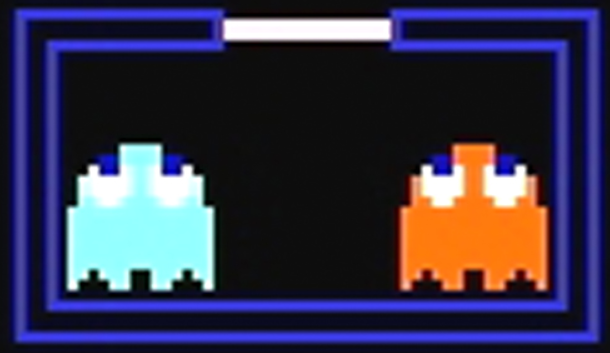
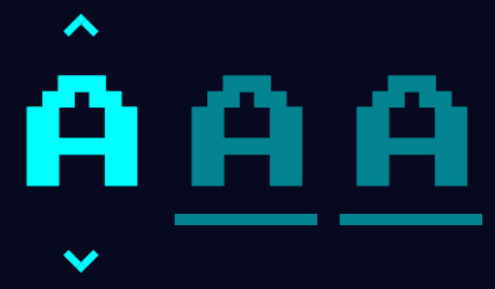
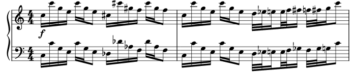

# Pac-Man
edited on : 07/11/2023 - by : Max BERNARD

## Overview

### Task and Objective
#### Task
<!--- Explain what we have to do -->
Our team was tasked with creating a Pac-Man clone, with the added restriction that it had to be coded in assembly and run on an x86 CPU architecture 16-bit system.

#### Goal and Vision
<!-- our end goal with this project -->
We are making a perfect Pac-Man clone. We will use the Original assets and copy exactly the game mechanics. 

### What is Pac-Man ?
<!-- Explain what is pacman + image to be pretty -->
Pac-Man is a maze arcade game created in 1980 in Japan. In the game, you play Pac-Man, who looks like: , and need to eat all the Gums in a maze to end the level.

 

In this picture, the smallest dots in the maze are Gums. To navigate the level, you can go up, down, left, or right, with no other input required.
Multi-coloured ghosts  are chasing Pac-Man through the level, and if one touches Pac-Man, he loses a life.
Pac-Man can eat a Super Gum (the slightly bigger dots). They give Pac-Man the ability to eat the ghosts for a period of time. When you complete a level, the ghosts get faster, and the Super Gum bonus gets shorter.
After a set amount of time, fruits appear in a level. Eating the fruits gives bonus points.

### Personas
<!--
Some stuff about persona

link to personas image
https://docs.google.com/presentation/d/1_mEMP8P38QoMadhjGEqS27iHCdO-DTESxNDUPH_uHMA/edit?usp=sharing

someone who never played 
someone who played the original pacman
someone an e-sport player of pacman 
-->
 
 

## Game
### Environment
<!-- Describe the walls and stuff. picture included
Describe the UI
when game end leaderboard -->
#### Unit of Measurement
<!-- all mesurment from this picture 
https://ww1.prweb.com/prfiles/2005/04/11/227666/pacmanhighresscreenshot300.jpg -->
We are using Pac-Man's diameter as a unit of reference throughout this section, referred to as "% Pac-Man," as we needed a constant that would not change. In the original game, Pac-Man has a 13px diameter, but we can't assume that this will be the case for us.

#### Level

##### Maze
We will use the original 1980 Pac-Man level layout. The picture below can be used as a reference to recreate the layout. Neither Pac-Man nor the ghosts can cross the blue lines.

 
The level's walls have a blue border and a transparent fill. They should be 61.5% as wide as Pac-Man. When walls are next to one another, the inner border should be removed so that it looks like there is no empty space. 
The outer walls of the level are as wide as 30.7% of Pac-Man. There should be a 30% rounded effect on every corner, similar to the border radius effect in CSS.
Every corridor in which the player and ghosts can move should be 115.3% wider than the player.

##### Grid
The level can be subdivided into a grid of 61.5% Pac-Man on each side. A single subdivision will be referred to as a 'grid box.' Walls use another grid; this is only valid for Gums and fruits.

##### Gums
a normal Gum is a square with 15.4% Pac-Man sides. The Gum should be at the centre of a Grid box  the Super Gums should be 61.5% Pac-Man diameter circles. The centre of the circle should also be at the centre of the Grid box.

##### Fruits
The fruits should be in the centre of a Grid box. Fruits Sprites should fit in a 92.3 by 92.3% Pac-Man square.

Fruits should be a more or less pixelated version of these design, with more or less simplified colours as the technical limitation dictates.

##### Ghost Spawning Box
The <em>Ghost Spawning Box</em> is the box at the centre of the maze from which the ghosts appear. This box uses the same thinner 30.7% Pac-Man walls as the maze's outer walls. The corners shouldn't be rounded on the box.

The box needs to be 246.1% Pac-Man high by 430.7% Pac-Man wide. The box has a white door in the middle of the top wall. This door is 15.4% Pac-Man in thickness and 123.1% Pac-Man wide. The player cannot cross the box, but the ghosts can.

#### User Interface
##### Font
The font is a monospace sans-serif and should be all uppercase. The characters are white to create a contrast against the black background. Every character is 53.8% Pac-Man high and wide. There should be a 7.7% Pac-Man wide gap between characters. A new line should have a 7.7% Pac-Man gap from the one above.

##### Game Score
At the top of the screen, "HIGH SCORE" should be aligned at the centre of the screen.  The number should be displayed below the text. The rightmost number in the high score should be under the "O" of "SCORE".   The current score should be displayed as "1UP", horizontally aligned with "HIGH SCORE". The "P" of "1UP" should be 4 characters to the left of the "H" of "HIGH SCORE".  The number should be displayed horizontally aligned with the numbers under "HIGH SCORE". The rightmost number should be offset 1 character to the right of the "P" in "1UP". The end result should look like this picture:

##### Game Ready
At the start of the game, "READY!" gets displayed on the corridor just under the Ghost Spawning Box, as seen in the image below.

This message should disappear when the game starts. This message should use the same font as the rest of the UI but be yellow.

##### Game Over
When the player loses all of his lives, a game over screen needs to appear. The words "GAME OVER" appear in the corridor under the <em>Ghost Spawning Box</em>, as seen in the image below.

This stays on display for 3 seconds until the game takes the player to the leaderboard. This message uses the same font as the rest of the UI but is red. The space between the "GAME" and the "OVER" is 123.1% Pac-Man.

#### Leaderboard
##### Enter Your Initials
Once a player reaches a score high enough to make it into the top 10 of players, they will be prompted to enter their initials on a screen that looks like the one below.

The player can use the Up and Down buttons to change the selected letter. Going up cycles from Z to A, and going down cycles from A to Z. It should loop once you try to go beyond Z or A. There should only be the 26 letters of the alphabet.
You can select which letters you are changing by using the Left and Right buttons. This does <b>not</b> loop when you reach either end. The selected letters should have arrows above and below them.
When the player presses the Right button while on the rightmost letter, the name is validated, and the High Score page is displayed.

##### High Scores 
"HIGH SCORES" should be displayed at the top and centre of the screen.  On the High Score page, the font will use a 38.5% Pac-Man height gap between each line. The font is otherwise unchanged from the normal UI font.

There should be a blank line between "HIGH SCORES" and the header of the score table. The table should contain 3 columns: "RANK", "SCORE", and "NAME" from left to right.

"RANK" contains the player ranks up to 10th. The "T" of "1ST" should be under the "N" of "RANK". This alignment should continue up to 9th. However, the "H" of "10TH" should be vertically aligned with the "K" of "RANK".

"SCORE" contains all the high scores. The rightmost digit of a score should be vertically aligned with the "E". The score cannot go higher than 99999. If it does, it shouldn't display the additional digits. For example, 100002 should display as 00002.

"NAME" should contain the 3-letter initials that were entered by the player who reached the high score.

When a player sets a new high score, it should push out the player that was previously in 10th place and make it so his name and score are no longer displayed. The new high score gets inserted between the two closest higher and lower numbers.

##### Leaving Leaderboard
There should be a button to press that leaves the leaderboard and starts a new game.

### Sound Design

#### Intro
This tune should play, when the game starts or restarts after a player's death.
[pacman_beginning.wav](./wav/pacman_beginning.wav)  If there is a need to recreate the music rather than use the file, this is the coresponding partition.

#### Other 
##### Waka Waka
The sound that plays when Pac-Man is eating normal gums.
[pacman_chomp.wav](./wav/pacman_chomp.wav)

##### Background sound
The background sound that plays once the game starts. A different sound plays when you eat a Super Gum.
[pacman_wewew.wav](./wav/pacman_wewew.wav)

##### Afraid Ghosts
This replaces the background sound when the Super Gum is active, and the ghosts are running from you.
[pacman_ghostrun.wav](./wav/pacman_ghostrun.wav)

##### Death
The sound that plays when Pac-Man dies.
[pacman_death.wav](./wav/pacman_death.wav)

##### Super Gum
The sound that plays when Pac-Man eats either a Fruit or a Super Gum.
[pacman_eatfruit.wav](./wav/pacman_eatfruit.wav)

##### Eat Ghost
The sound that plays when Pac-Man eats a ghost when in Super Gum mode.
[pacman_eatghost.wav](./wav/pacman_eatghost.wav)

##### Victory Sound
There is no victory sound in the original Pac-Man. Instead, at the end of each level there was a [short animated scene](https://www.youtube.com/watch?v=UGQ5sOWuzy8) featuring Pac-Man and the Red Ghost. This scene has music, but as we are not implementing this Level transition, we wont implement this music either.

### Player

Explain the player movement
Talk about eating pac-Gum talk about super pac-gum
Score 
Fruits ( cherry level 1, Strawberry level 2 , orange lv 3 and 4, Apple lv5 and lv6 , Melon lv7 et 8, Galaxian lv 9 et 10 , bell lv 11 et 12 key lv 13 and more)

Point reward fruit: 

|Fruit|Reward|
|---|---|
|Cherry|100|
|Strawberry|300|
|Orange|500|
|Apple|700|
|Melon|1000|
|Galaxian|2000|
|Bell|3000|
|Key|5000|

Lives(4) + what happens on death
Live + 1 if you kill all ghost

### Ghosts

Ghost kill the player
Ghost scramble at game start
Frightened, Normal and Chase
Personality
ghost can’t leave base if you eat super pac-gum

### increasing difficulty 
the game gets faster and faster when you finish a level

## Project Stages

### MVP

Walls for a single lv, Player sprites and movement, Ghost move at random, Pac-Gum and and score (not score display), game reset on death or once there are no more gums. playing on a computer with a keyboard 

### Priority 

## Glossaire

fruit : In the original Pac-Man, the fruits are located below the Ghost House and won't move at all. The fruit appears after 70 dots are eaten and again after 170 dots are eaten unless the first fruit is still there. They will disappear if they are not eaten after 9-10 seconds.
