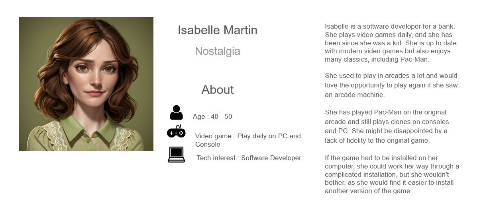

# Pac-Man
edited on : 07/11/2023 - by : Max BERNARD

## Overview

### Task and Objective
#### Task
<!--- Explain what we have to do -->
Our team was tasked with doing a Pac-Man clone. With the added restriction that it has to be coded in assembly and run on a x86 CPU architecture 16bit system. We are allowed to be creative with our implementation of Pac-Man.

#### Goal and Vision
<!-- our end goal with this project -->

### What is Pac-Man ?
<!-- Explain what is pacman + image to be pretty -->
Pac-Man is a maze arcade game created in 1980 in Japan. In the game you play Pac-Man who look like : , and need to eat all the Gums in a maze to end the level. 

 
In this picture, the smallest dot in the maze are Gums. To navigate the level you can go up, down, left or right, with no other input required 
Multi-coulored ghosts  are chassing Pac-Man through the level and if one touch Pac-Man, he lose a life.  Pac-Man can eat a Super Gum (The slightly bigger dots) they give Pac-Man the ability to eat the ghost for a period of time. When you compleet a level, the ghost get faster and the Super Gum bonus get shorter.   After a set amount of time, fruits appear in a level. Eating the fruits give bonus points.  

### Personas
<!--
Some stuff about persona

link to personas image
https://docs.google.com/presentation/d/1_mEMP8P38QoMadhjGEqS27iHCdO-DTESxNDUPH_uHMA/edit?usp=sharing

someone who never played 
someone who played the original pacman
someone an e-sport player of pacman 
-->
 
 

## Game
### Environment
Describe the walls and stuff. picture included
Describe the UI
when game end leaderboard 

Describe the colors use

### Player
Explain the player movement
Talk about eating pac-Gum talk about super pac-gum
Score 
Fruits ( cherry level 1, Strawberry level 2 , orange lv 3 and 4, Apple lv5 and lv6 , Melon lv7 et 8, Galaxian lv 9 et 10 , bell lv 11 et 12 key lv 13 and more)
Point reward fruit: 
      Cherry = 100
	      Strawberry = 300
	      Orange =  500
     	      Apple = 700
	      Melon = 1000
	      Galaxian = 2000
	      Bell = 3000
	      Key = 5000
Lives(4) + what happens on death
Live + 1 if you kill all ghost

### Ghost
Ghost kill the player
Ghost scramble at game start
Frightened, Normal and Chase
Personality
ghost can’t leave base if you eat super pac-gum

### increasing difficulty 
the game gets faster and faster when you finish a level

## Project Stages

### MVP

Walls for a single lv, Player sprites and movement, Ghost move at random, Pac-Gum and and score (not score display), game reset on death or once there are no more gums. playing on a computer with a keyboard 

### Priority 

## Glossaire

fruit : In the original Pac-Man, the fruits are located below the Ghost House and won't move at all. The fruit appears after 70 dots are eaten and again after 170 dots are eaten unless the first fruit is still there. They will disappear if they are not eaten after 9-10 seconds.