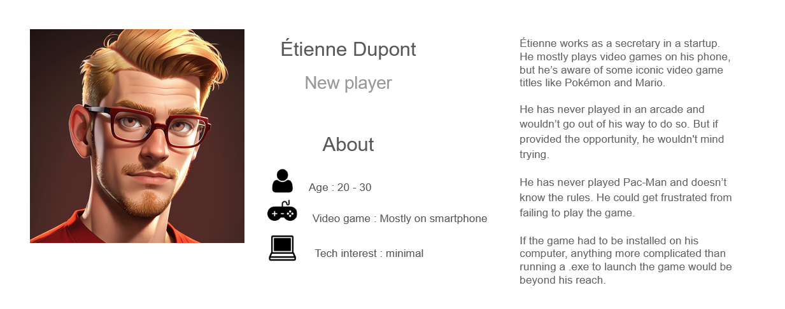

# Pac-Man
edited on : 07/11/2023 - by : Max BERNARD

## Overview

### Task and Objective
#### Task
<!--- Explain what we have to do -->
Our team was tasked with doing a Pac-Man clone. With the added restriction that it has to be coded in assembly and run on a x86 CPU architecture 16bit system.

#### Goal and Vision
<!-- our end goal with this project -->
We are making a perfect Pac-Man clone. We will use the Original assets and copy exactly the game mechanics. 

### What is Pac-Man ?
<!-- Explain what is pacman + image to be pretty -->
Pac-Man is a maze arcade game created in 1980 in Japan. In the game you play Pac-Man who look like : , and need to eat all the Gums in a maze to end the level. 

 
In this picture, the smallest dot in the maze are Gums. To navigate the level you can go up, down, left or right, with no other input required 
Multi-coulored ghosts  are chassing Pac-Man through the level and if one touch Pac-Man, he lose a life.   Pac-Man can eat a Super Gum (The slightly bigger dots) they give Pac-Man the ability to eat the ghost for a period of time. When you compleet a level, the ghost get faster and the Super Gum bonus get shorter.   After a set amount of time, fruits appear in a level. Eating the fruits give bonus points.  

### Personas
<!--
Some stuff about persona

link to personas image
https://docs.google.com/presentation/d/1_mEMP8P38QoMadhjGEqS27iHCdO-DTESxNDUPH_uHMA/edit?usp=sharing

someone who never played 
someone who played the original pacman
someone an e-sport player of pacman 
-->
 
 

## Game
### Environment
<!-- Describe the walls and stuff. picture included
Describe the UI
when game end leaderboard -->
#### Unit of Mesurment
We are using Pac-Man diameter as a unit of Reference through this section as we needed a constant that would not change. In the original Game Pac-Man has a 12px diameter but we can't assume that this will be the case for us.

#### Level
We will use the original 1980 Pac-Man level layout. The picture bellow can be used as a reference to recreate the layout. Neither Pac-Man nor the ghosts can cross the blue lines.

The Gum and Super-Gum should be placed on the exact same location. as in the picture. 
The levels walls have a blue border and a transparent fill. They should be 83.3% as wide as the Pac-Man. When wall are next to one an other, the iner border should be removed so that is looks like there is no empty space. 
The outer wall of the level are as wide as 41.6% of Pac-Man.
There should be a 30% rounded of effect to every corner similar to the border radius efect in CSS. 
The exeption to those rules is the Ghost spawning box at the center of the level who as the same wall as the outer wall of the level. 
Every coridor in which the player and ghosts can move should be 116.6% wider than the player.

#### User Interface
At the UI should be at the top of the screen. "HIGH SCORE" should be aligned at the center of the screen.  The Number should be displayed bellow the text with a 8.3% Pac-Man high gap between the top and bottom lines. The right most number in the high score should be under the "O" of "SCORE   The current Score should be displayed as "1UP", horizontaly aligned with "HIGH SCORE". the "P" of "1UP" should be 4 characters left of the "H" of "HIGH SCORE". The number should be displayed, horizontaly aligned with the numbers under "HIGH SCORE" 

The Font is a monospace and should be all Upercase. The characters are white to create a contrast against the black background. Every character is 58.3% Pac-Man high and and wide. There should be a 8.3% Pac-Man wide gap between characters.

### Player

Explain the player movement
Talk about eating pac-Gum talk about super pac-gum
Score 
Fruits ( cherry level 1, Strawberry level 2 , orange lv 3 and 4, Apple lv5 and lv6 , Melon lv7 et 8, Galaxian lv 9 et 10 , bell lv 11 et 12 key lv 13 and more)

Point reward fruit: 

|Fruit|Reward|
|---|---|
|Cherry|100|
|Strawberry|300|
|Orange|500|
|Apple|700|
|Melon|1000|
|Galaxian|2000|
|Bell|3000|
|Key|5000|

Lives(4) + what happens on death
Live + 1 if you kill all ghost

### Ghosts

Ghost kill the player
Ghost scramble at game start
Frightened, Normal and Chase
Personality
ghost can’t leave base if you eat super pac-gum

### increasing difficulty 
the game gets faster and faster when you finish a level

## Project Stages

### MVP

Walls for a single lv, Player sprites and movement, Ghost move at random, Pac-Gum and and score (not score display), game reset on death or once there are no more gums. playing on a computer with a keyboard 

### Priority 

## Glossaire

fruit : In the original Pac-Man, the fruits are located below the Ghost House and won't move at all. The fruit appears after 70 dots are eaten and again after 170 dots are eaten unless the first fruit is still there. They will disappear if they are not eaten after 9-10 seconds.
