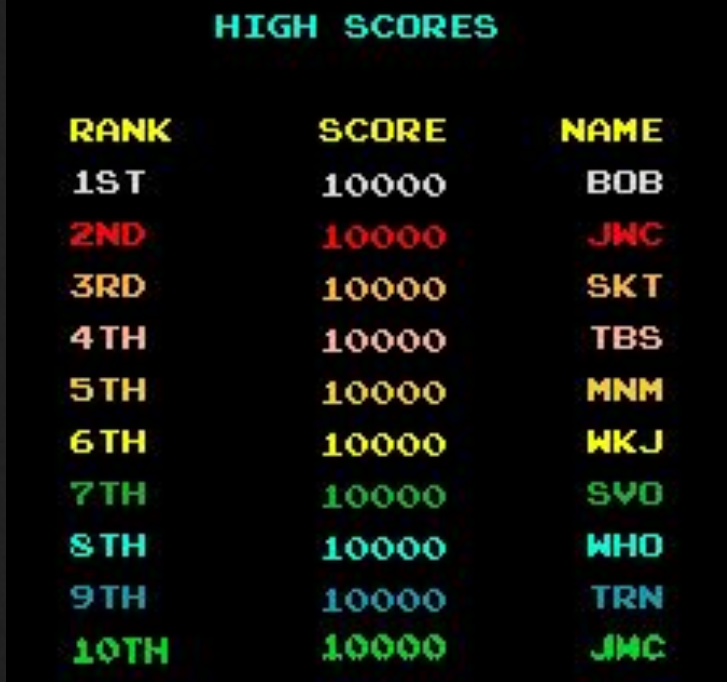
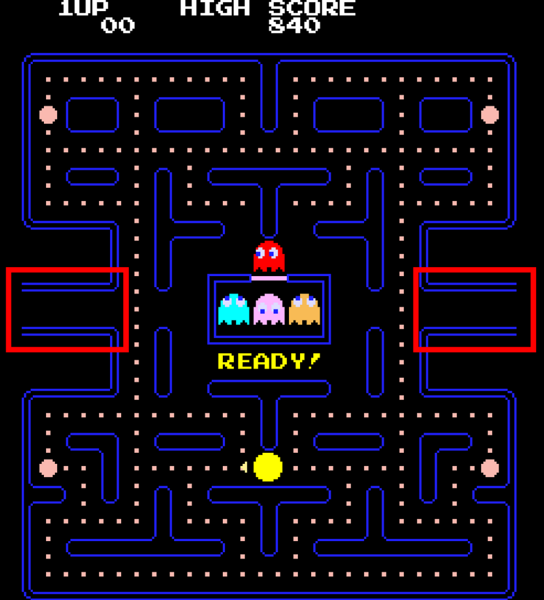
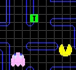

# Pac-Man
edited on : 10/11/2023 - by : Max BERNARD

## Table of Content
* [Overview](#overview)
    + [Task and Objective](#task-and-objective)
        - [Task](#task)
        - [Goal and Vision](#goal-and-vision)
    + [What is Pac-Man ?](#what-is-pac-man-)
    + [Personas](#personas)
* [Game](#game)
    + [Game Overview](#game-overview)
        - [Objectives and lose condition](#objectives-and-lose-condition)
        - [Evironment](#evironment)
        - [Player](#player)
        - [Score](#score)
        - [Ghosts](#ghosts)
    + [Environment](#environment)
        - [Unit of Measurement](#unit-of-measurement)
        - [Level](#level)
        - [User Interface](#user-interface)
        - [Leaderboard](#leaderboard)
    + [Player](#player-1)
        - [Movement](#movement)
        - [Eating Gums](#eating-gums)
        - [Fright Mode](#fright-mode)
        - [Speed](#speed)
        - [Fruits](#fruits)
        - [Player Lifes and Death](#player-lifes-and-death)
    + [Ghosts](#ghosts-1)
        - [General Behavior](#general-behavior)
        - [Personality](#personality)
    + [Sound Design](#sound-design)
        - [Intro](#intro)
        - [Other ](#other)
* [Project Stages](#project-stages)
    + [MVP](#mvp)
    + [Priority ](#priority)
* [Glossaire](#glossaire)

## Overview

### Task and Objective
#### Task
<!--- Explain what we have to do -->
Our team was tasked with creating a Pac-Man clone, with the added restriction that it had to be coded in assembly and run on an x86 CPU architecture 16-bit system.

#### Goal and Vision
<!-- our end goal with this project -->
We are making a perfect Pac-Man clone. We will use the Original assets and copy exactly the game mechanics. 

### What is Pac-Man ?
<!-- Explain what is pacman + image to be pretty -->
Pac-Man is a maze arcade game created in 1980 in Japan. In the game, you play Pac-Man, who looks like: , and need to eat all the Gums in a maze to end the level.

 

In this picture, the smallest dots in the maze are Gums. To navigate the level, you can go up, down, left, or right, with no other input required.
Multi-coloured ghosts  are chasing Pac-Man through the level, and if one touches Pac-Man, he loses a life.
Pac-Man can eat a Super Gum (the slightly bigger dots). They give Pac-Man the ability to eat the ghosts for a period of time. When you complete a level, the ghosts get faster, and the Super Gum bonus gets shorter.
After a set amount of time, fruits appear in a level. Eating the fruits gives bonus points.

### Personas
<!--
Some stuff about persona

link to personas image
https://docs.google.com/presentation/d/1_mEMP8P38QoMadhjGEqS27iHCdO-DTESxNDUPH_uHMA/edit?usp=sharing

someone who never played 
someone who played the original pacman
someone an e-sport player of pacman 
-->
 
 

## Game

### Game Overview
#### Objectives and lose condition
The game objectives are twofold :
* Eat all the Gums (244) in a maze. this will bring the player to the next level.
* Get the highest posible Score. Several action will let the player increase their score.
Eating all the Gums will increase the score, but is not the only way to do so.

There is a single lose condition : being touched by a ghost. The player can lose 4 times before getting a game over.

#### Evironment
The game is played in a maze with this exact layout.

Neither the player nor the ghost can cross the blue lines.
The maze does not change from one level to the other. When the player or ghost go through the gate at the left and right side of the maze, they reapear at the other end of the level.

#### Player
The player play as Pac-Man, a yellow ball with a mouth. It can move in 4 directions : Up, Down, Left, Right. The movement speed change from level to level. The player can eat Gums to gain points. The player can eat Super Gum (the bigger pink dots in the maze) to enter what is called Fright Mode.

##### fright mode
In Fright Mode the player can move faster and can now eat ghost without dieing. When in this state the objectives becomes to eat the ghost. at higher level Fright Mode get shorter and shorter.

##### Fruits 
Fruits can appear in the maze twice per game when the player eats a specific amount of Gums. fruits only stay on screen for a short period of time.

#### Score
This are all the way the player can get score :
* Eating Gums
* Eating Super Gums
* Eating Fruits
* Eating a ghost

once the player reach 10,000 points he gains an extra life.

#### Ghosts
##### Overview
* There are 4 ghost. 
* The player dies when touching one of the ghost.
* A ghost can be eaten by the player when the game is in fright mode
* If a ghost is eaten he goes back to the center of the maze
* At higher dificulty ghost get faster

##### Behavior
The ghost have three behaviors :
* Scater : the ghost are going for a corner of the maze
* Chase : Each ghost has a diferent chase behavior, but the idea is to hunt down the player.
* Frightened : The ghosts are runnig away from the player with random movement. this only activate when the game is in Fright Mode when the player eat a Super Gum.

The Ghost cycle between Scater and Chase. at higher level ghosts spend more time in Chase mode.

### Environment
<!-- Describe the walls and stuff. picture included
Describe the UI
when game end leaderboard -->
#### Unit of Measurement
<!-- all mesurment from this picture 
https://ww1.prweb.com/prfiles/2005/04/11/227666/pacmanhighresscreenshot300.jpg -->
We are using Pac-Man's diameter as a unit of reference throughout this section, referred to as "% Pac-Man," as we needed a constant that would not change. In the original game, Pac-Man has a 13px diameter, but we can't assume that this will be the case for us.

#### Level

##### Maze
We will use the original 1980 Pac-Man level layout. The picture below can be used as a reference to recreate the layout. Neither Pac-Man nor the ghosts can cross the blue lines.

 
The level's walls have a blue border and a transparent fill. They should be 61.5% as wide as Pac-Man. When walls are next to one another, the inner border should be removed so that it looks like there is no empty space. 
The outer walls of the level are as wide as 30.7% of Pac-Man. There should be a 30% rounded effect on every corner, similar to the border radius effect in CSS.
Every corridor in which the player and ghosts can move should be 115.3% wider than the player.

##### Grid
The level can be subdivided into a grid of 61.5% Pac-Man on each side. A single subdivision will be referred to as a 'grid box.' Walls use another grid; this is only valid for Gums and fruits.

##### Gums
a normal Gum is a square with 15.4% Pac-Man sides. The Gum should be at the centre of a Grid box  the Super Gums should be 61.5% Pac-Man diameter circles. The centre of the circle should also be at the centre of the Grid box.

##### Fruits
The fruits should be in the centre of a Grid box. Fruits Sprites should fit in a 92.3 by 92.3% Pac-Man square.

Fruits should be a more or less pixelated version of these design, with more or less simplified colours as the technical limitation dictates.

##### Ghost Spawning Box
The <em>Ghost Spawning Box</em> is the box at the centre of the maze from which the ghosts appear. This box uses the same thinner 30.7% Pac-Man walls as the maze's outer walls. The corners shouldn't be rounded on the box.

The box needs to be 246.1% Pac-Man high by 430.7% Pac-Man wide. The box has a white door in the middle of the top wall. This door is 15.4% Pac-Man in thickness and 123.1% Pac-Man wide. The player cannot cross the box, but the ghosts can.

#### User Interface
##### Font
The font is a monospace sans-serif and should be all uppercase. The characters are white to create a contrast against the black background. Every character is 53.8% Pac-Man high and wide. There should be a 7.7% Pac-Man wide gap between characters. A new line should have a 7.7% Pac-Man gap from the one above.

##### Game Score
At the top of the screen, "HIGH SCORE" should be aligned at the centre of the screen.  The number should be displayed below the text. The rightmost number in the high score should be under the "O" of "SCORE".   The current score should be displayed as "1UP", horizontally aligned with "HIGH SCORE". The "P" of "1UP" should be 4 characters to the left of the "H" of "HIGH SCORE".  The number should be displayed horizontally aligned with the numbers under "HIGH SCORE". The rightmost number should be offset 1 character to the right of the "P" in "1UP". The end result should look like this picture:

##### Game Ready
At the start of the game, "READY!" gets displayed on the corridor just under the Ghost Spawning Box, as seen in the image below.

This message should disappear when the game starts. This message should use the same font as the rest of the UI but be yellow.

##### Game Over
When the player loses all of his lives, a game over screen needs to appear. The words "GAME OVER" appear in the corridor under the <em>Ghost Spawning Box</em>, as seen in the image below.

This stays on display for 3 seconds until the game takes the player to the leaderboard. This message uses the same font as the rest of the UI but is red. The space between the "GAME" and the "OVER" is 123.1% Pac-Man.

#### Leaderboard
##### Enter Your Initials
Once a player reaches a score high enough to make it into the top 10 of players, they will be prompted to enter their initials on a screen that looks like the one below.

The player can use the Up and Down buttons to change the selected letter. Going up cycles from Z to A, and going down cycles from A to Z. It should loop once you try to go beyond Z or A. There should only be the 26 letters of the alphabet.
You can select which letters you are changing by using the Left and Right buttons. This does <b>not</b> loop when you reach either end. The selected letters should have arrows above and below them.
When the player presses the Right button while on the rightmost letter, the name is validated, and the High Score page is displayed.

##### High Scores 
"HIGH SCORES" should be displayed at the top and centre of the screen.  On the High Score page, the font will use a 38.5% Pac-Man height gap between each line. The font is otherwise unchanged from the normal UI font.

There should be a blank line between "HIGH SCORES" and the header of the score table. The table should contain 3 columns: "RANK", "SCORE", and "NAME" from left to right.

"RANK" contains the player ranks up to 10th. The "T" of "1ST" should be under the "N" of "RANK". This alignment should continue up to 9th. However, the "H" of "10TH" should be vertically aligned with the "K" of "RANK".

"SCORE" contains all the high scores. The rightmost digit of a score should be vertically aligned with the "E". The score cannot go higher than 99999. If it does, it shouldn't display the additional digits. For example, 100002 should display as 00002.

"NAME" should contain the 3-letter initials that were entered by the player who reached the high score.

When a player sets a new high score, it should push out the player that was previously in 10th place and make it so his name and score are no longer displayed. The new high score gets inserted between the two closest higher and lower numbers.

##### Leaving Leaderboard
There should be a button to press that leaves the leaderboard and starts a new game.

### Player
#### Movement
<!-- Explain the player movement -->
The Pac-Man can move in four directions: Up, Down, Left and Right. The Pac-Man can not Cros the wall of the Maze. He continues to move in a direction until it enconters a wall, at which point it stop moving, or the player gives an other direction. The Pac-Man can go through tunels, highlighted in red on the picture bellow. Going through a tunel transport you to the other tunel.

Pac-Man base speed is 676.9% Pac-Man per second.

##### Animation

Pac-Man close and oppen his mouth in a loop whenever he move. This GIF should be used as a reference for this animation. Pac-Man mouth should point in the direction of movment.

##### Turning
If the player intitiat the turn before the corner He can move 45° until he gets to the middle of the coridor as seen in the picture below.

The player move faster at this point as he is moving in both direction at the same time, making him twice as fast.
The if the turn is initiated earlier this efect last longer, but it can not be intitated before the Player is in the turning coridor. Otherwise The turn should be a 90° angle and gets no speed boost.

#### Eating Gums
Pac-Man can eat Gums, the small dots in the maze. When he eat he stop for 1/60th of a second. Eating a gum adds 10 points to the score.  Eating a Super Gum (the bigger dots) stop Pac-Man for 3/60th of a second. Once he eat this Super Gum he enter Fright modes and add 50 to the score.

#### Fright Mode
This speed up Pac-Man and Makes the ghost run away from the player. The player can now eat the ghosts. Each ghost give a certain amount of points.
_| points
---|---
1st ghost | 200
2nd ghost | 400
3rd ghost | 800
4th ghost | 1600

As the level increase, the time in Fright Mode varies up to level 19 when fright mode ends instantly.

Level | Fright. Time (in sec.)
--- | ---
1 | 6
2 | 5
3 | 4
4 | 3
5 | 2
6 | 5
7-8 | 2
9 | 1
10 | 5
11 | 2
12-13 | 1
14 | 3
15-16 | 1 
17 | 0
18 | 1
19+ | 0

#### Speed
When the level increase Pac-Man movement speed increase. This table give the % modifier over the Base Speed.

Level | Speed Modifier | Fright Mode
---|---|---
1 | 80% | 90%
2-4 | 90% | 95%
5-20 | 100% | 100%
21+ | 90% | 100%

#### Fruits

Fruits appear twice per level. When eaten  they give bonus points. However they don't stay on screen forever. They stay between 9 and 10 second. The exact time should be randomized each time.  The Fruit 1st appears after the player eat 70 gums and a 2nd Fruit appears after 170 have been eaten.  The bonus fruits are from left to right : Cherry, Strawberry, Orange, Apple, Galaxian, Melon, Bell, Key

Diferent fruits appear at diferent level and give diferent point reward : 

|Fruit|Reward| Level
|---|---| ---
|Cherry|100| 1
|Strawberry|300| 2
|Orange|500| 3
|Apple|700| 5-6
|Melon|1000| 7-8
|Galaxian|2000| 9-10
|Bell|3000| 11-12
|Key|5000| 13+

#### Player Lifes and Death
The player start with 3 extra life. He lose one whenver he get touched by a ghost when not in frightened mode. This reset the player and ghost to their starting position. once the player reach 10,000 point he gain an aditional life.

When pacman die an animation of the circle disapering and exploding plays as seen in the picture above.

### Ghosts

#### General Behavior
Ghost main features is to kill the player on contact. Except when the game is in Fright Mode.

##### Speed
As the level increase ghost get faster. When the Game is in Fright Mode, the ghosts get slower. Aditionaly when crossing a tunnel, unlike pac-man ghost are slowed. The slow down zone is highlighted in green in the picture below.

 This table give the numbers as % of Pac-Man's base speed (676.9% Pac-Man per second).

Level | Ghost speed | Fright Mode | Tunnel Speed
--- | --- | --- | --- 
1 | 75% | 50% | 40%
2-4 | 85% | 55% | 45%
5+ | 95% | 60% | 50%

##### Behavior
There are three modes for ghost. 
* Chase : In chase mode the ghost is hunting down Pac-Man each ghost has a unique chase behavior.
* Scatter : Each ghost has a home corner in the maze. In Scatter mode ghost will navigate toward that corner.  
* Frightened : When Pac-Man is in Fright Mode after eating a Super Gum, the ghosts move at random through the maze. they also turn blue and frown (see image). 

Ghost alternate between Scater and Chase at predeterminded intervals. The timer on thos interval stops when the ghost are in Fright mode. When level change so does this timing.   This table give the timeing in second :

Mode | Level 1 | Level 2-4 | Level 5+
--- | --- | --- | ---
Scatter | 7 | 7 | 5
Chase | 20 | 20 | 20
Scatter | 7 | 7 | 5
Chase | 20 | 20 | 20
Scatter | 5 | 5 | 5
Chase | 20 | 1033 | 1037
Scatter | 5 | 1/60 | 1/60
Chase | ∞ | ∞ | ∞

##### Game Start
Ghost should start in the <em>Ghost Spawning Box</em> exept Red who start in front of the door as seen in the image.

Red moves first. Pink once Red is clear of the door, then Orange when Pac-Man has eaten 30 Gums and finaly Cyan when Pac-Man has eaten 60 Gums. All the ghost start in Scatter mode and on the same timing.

##### Ghost death
When Pac-Man eat a ghost it takes a few second to reapear in the Ghost Spawning Box. The ghosts can't leave the box as long as the Fright Mode is active. Once the Fright Mode is over, ghosts go back to the behavior they were at before being eaten.

#### Personality
Each ghost has a slightly diferent personality and AI.

##### Red 
Red chase mode aim for the current player location. When the number of remain Gums drop bellow a certain threshold it speed up. when it drop again it accelerate a second time.  The number and aceleration figure change from level to level :

Level | Gum Threshold 1 | Speed up 1 | Gum Threshold 2 | Speed up 2
--- | --- | --- | --- | ---
1-2 | 30 | 90% | 15 | 95%
3-4 | 40 | 90% | 20 | 95%
5 | 40 | 100% | 20 | 105%
6-8 | 50 | 100% | 25 | 105%
9-11 | 60 | 100% | 30 | 105%
12-14 | 80 | 100% | 40 | 105%
15-18 | 100 | 100% | 50 | 105%
19+ | 120 | 100% | 60 | 105%

##### Pink
Pink chase mode aims 4 tile in front of the player. There is an exeption to that logic, when the player is looking up pinky aims 4 tiles up and 4 tile left of the player.

##### Orange
When this ghost is over 8 tiles away from Pac-Man he aims for Pac-Mans position. If he is closer than 8 tiles he goes into scater mode. This result in this ghost doing back and forth. Keep in mind that ghosts can not turn 180° on themself and this rule still applies when changing mode.

##### Cyan
Cyan has a complex targeting algorithm.  Step by Steps:
* Look 2 tiles ahead of Pac-Man. or 2 tiles up and 2 left when Pac-Man is looking up.
* Then draw a line from the Red Ghost to that target
* Then double that line. 

In this exemple above :
<ol>
<li>The red Arrow show is looking 2 tiles in front of Pac-Man into the green dashed tile.</li>
<li>In purple we draw a line from Red to that dashed tile</li>
<li>The yellow Arrow is a copy of the purple arrow but it is using the dashed tile as a point of origin. The yellow arrow points at Cyan's target tile</li>
</ol>

### Sound Design

#### Intro
This tune should play, when the game starts or restarts after a player's death.
[pacman_beginning.wav](./wav/pacman_beginning.wav)  If there is a need to recreate the music rather than use the file, this is the coresponding partition.

#### Other 
##### Waka Waka
The sound that plays when Pac-Man is eating normal gums.
[pacman_chomp.wav](./wav/pacman_chomp.wav)

##### Background sound
The background sound that plays once the game starts. A different sound plays when you eat a Super Gum.
[pacman_wewew.wav](./wav/pacman_wewew.wav)

##### Afraid Ghosts
This replaces the background sound when the Super Gum is active, and the ghosts are running from you.
[pacman_ghostrun.wav](./wav/pacman_ghostrun.wav)

##### Death
The sound that plays when Pac-Man dies.
[pacman_death.wav](./wav/pacman_death.wav)

##### Super Gum
The sound that plays when Pac-Man eats either a Fruit or a Super Gum.
[pacman_eatfruit.wav](./wav/pacman_eatfruit.wav)

##### Eat Ghost
The sound that plays when Pac-Man eats a ghost when in Super Gum mode.
[pacman_eatghost.wav](./wav/pacman_eatghost.wav)

##### Victory Sound
There is no victory sound in the original Pac-Man. Instead, at the end of each level there was a [short animated scene](https://www.youtube.com/watch?v=UGQ5sOWuzy8) featuring Pac-Man and the Red Ghost. This scene has music, but as we are not implementing this Level transition, we wont implement this music either.

## Project Stages

### MVP

Walls for a single lv, Player sprites and movement, Ghost move at random, Pac-Gum and and score (not score display), game reset on death or once there are no more gums. playing on a computer with a keyboard 

### Priority 

## Glossaire

fruit : In the original Pac-Man, the fruits are located below the Ghost House and won't move at all. The fruit appears after 70 dots are eaten and again after 170 dots are eaten unless the first fruit is still there. They will disappear if they are not eaten after 9-10 seconds.
