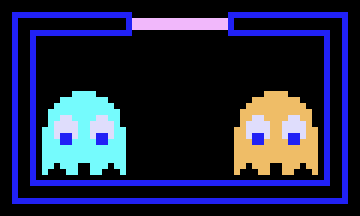
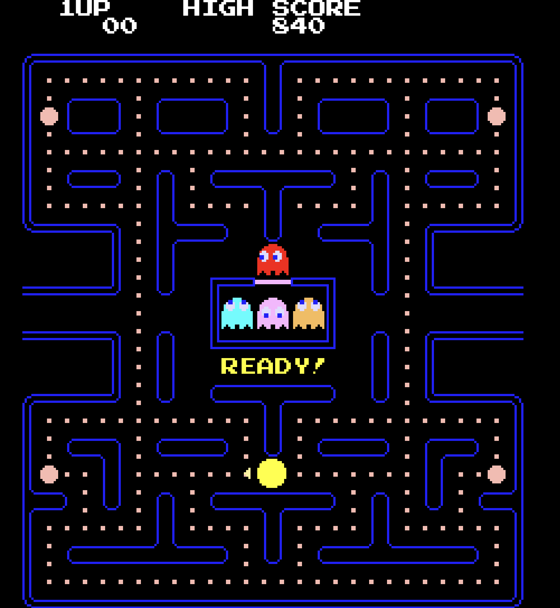

# Pac-Man
edited on : 07/11/2023 - by : Max BERNARD

## Overview

### Task and Objective
#### Task
<!--- Explain what we have to do -->
Our team was tasked with doing a Pac-Man clone. With the added restriction that it has to be coded in assembly and run on a x86 CPU architecture 16bit system.

#### Goal and Vision
<!-- our end goal with this project -->
We are making a perfect Pac-Man clone. We will use the Original assets and copy exactly the game mechanics. 

### What is Pac-Man ?
<!-- Explain what is pacman + image to be pretty -->
Pac-Man is a maze arcade game created in 1980 in Japan. In the game you play Pac-Man who look like : , and need to eat all the Gums in a maze to end the level. 

 
In this picture, the smallest dot in the maze are Gums. To navigate the level you can go up, down, left or right, with no other input required 
Multi-coulored ghosts  are chassing Pac-Man through the level and if one touch Pac-Man, he lose a life.   Pac-Man can eat a Super Gum (The slightly bigger dots) they give Pac-Man the ability to eat the ghost for a period of time. When you compleet a level, the ghost get faster and the Super Gum bonus get shorter.   After a set amount of time, fruits appear in a level. Eating the fruits give bonus points.  

### Personas
<!--
Some stuff about persona

link to personas image
https://docs.google.com/presentation/d/1_mEMP8P38QoMadhjGEqS27iHCdO-DTESxNDUPH_uHMA/edit?usp=sharing

someone who never played 
someone who played the original pacman
someone an e-sport player of pacman 
-->
 
 

## Game
### Environment
<!-- Describe the walls and stuff. picture included
Describe the UI
when game end leaderboard -->
#### Unit of Mesurment
<!-- all mesurment from this picture 
https://ww1.prweb.com/prfiles/2005/04/11/227666/pacmanhighresscreenshot300.jpg -->
We are using Pac-Man diameter as a unit of Reference through this section, refered to as "% Pac-Man" as we needed a constant that would not change. In the original Game Pac-Man has a 13px diameter but we can't assume that this will be the case for us.

#### Level

##### Maze
We will use the original 1980 Pac-Man level layout. The picture bellow can be used as a reference to recreate the layout. Neither Pac-Man nor the ghosts can cross the blue lines.

 
The levels walls have a blue border and a transparent fill. They should be 61.5% as wide as the Pac-Man. When wall are next to one an other, the iner border should be removed so that is looks like there is no empty space. 
The outer wall of the level are as wide as 30.7% of Pac-Man.
There should be a 30% rounded of effect to every corner similar to the border radius efect in CSS. Every coridor in which the player and ghosts can move should be 115.3% wider than the player. 

##### Grid
The level can be subdivided in a Grid of 61.5% Pac-Man on each side. a single subdivision will be refered as a Grid box. Walls use an other Grid, this is only valid for Gums and fruits.

##### Gums
a normal Gum is square with 15.4% Pac-Man sides. The Gum should be at the center of a Grid box  the Super Gums should be 61.5% Pac-Man diameter circles. The center of the circle should also be at the center of the Grid box.

##### Fruits
The fruits should be in the center of a Grid box. Fruits Sprites should fit in a 92.3 by 92.3% Pac-Man square.

Fruits should be a more or less pixelated version of these design, with more or less simplified colours as the technical limitation dictates.

##### Ghost Spawning Box
The <em>Ghost Spawning Box</em> is the box at the center of the maze from which the ghosts appear. This box uses the same thiner 30.7% Pac-Man walls as the maze's outer walls. 
The Corners shouldn't be roudned on the box.

The box needs to be 246.1% Pac-Man high by 430.7% Pac-Man wide.The Box has a white door on the middle of the top wall. This door is 15.4% Pac-Man in thickness and 123.1% Pac Man wide. The player can not cross the box. but the ghosts can 

#### User Interface
##### Font
The Font is a monospace sans-serif and should be all Upercase. The characters are white to create a contrast against the black background. Every character is 53.8% Pac-Man high and and wide. There should be a 7.7% Pac-Man wide gap between characters. A new line should have a 7.7% Pac-Man Gap from the one above.

##### Game Score
At the top of the screen, "HIGH SCORE" should be aligned at the center of the screen.  The Number should be displayed bellow the text with. The right most number in the high score should be under the "O" of "SCORE   The current Score should be displayed as "1UP", horizontaly aligned with "HIGH SCORE". the "P" of "1UP" should be 4 characters left of the "H" of "HIGH SCORE". The number should be displayed, horizontaly aligned with the numbers under "HIGH SCORE". The right most number should be ofset 1 character right of the "P" in "1UP". The end result should look like this picture :

##### Game Ready
At the start of the game "READY!" gets displayed on the coridor just under the Ghost Spawnig Box as seen on the image bellow.

This mesage should disapear when the game start. This message should use the Same font as the rest of the UI but yellow.

##### Game Over
When the player lose all of his lifes, a game over screen needs to appear. The words "GAME OVER" apears in the coridor under the <em>Ghost Spawning Box</em> as seen in the image bellow.

This stays on display for 3s until the game takes the player to the leaderboard. This mesage use the same font as the rest of the UI but red. The space between the "GAME" and the "OVER" is 123.1% Pac-Man

#### Leaderboard
##### Enter Your Initials
Once a player reached a score high enough to make it into the top 10 of player, he will be prompted to enter his initial on a screen that look like the one bellow.

The player can use the Up and Down buttons to change the selected letter. Up goes toward Z, down goes toward A. It should loop once you try to go beyond Z or A. There should only be the 26 leters of the alphabet. 
You can select which leters you are changing by using the Left and Right buttons. This does <b>not</b> loop when you reach the end. The selected leters should have Arow above and under it. When the Player press the Right button while on the right most letter, the name is validated and the High Score page is displayed.

##### High Scores 
"HIGH SCOREs" should be displayed at the top and center of the screen.  On the high Score page, the font will use a 38.5% Pac-Man high gap between each line. The font is otherwise unchanged from the normal UI font.

There should be a blank line between "HIGH SCORES" and the header of the score table. The Table should contain 3 columns. "RANK", "SCORE" and "NAME" from left to right.  RANK contains the player ranks up to 10th. The "T" of "1ST" should be under the "N" of "RANK". This alignment should continue up to 9th. However the "H" of "10TH" should be verticaly aligned with the "K" of "RANK". 
SCORE contain all the high scores. The right most digit of a score should be verticaly aligned with the E. The score can not go higher than 99999. If it does, it shouldn't display the aditional digits. for example, 100002 should display as 00002. NAME should contain the 3 leters initials that were entered by the player who reached the high score. 
When a player set a new high score, it should push out the player that was previously in 10th and make it so his name and score is no longer displayed. The new high score get inserted between the two closest higher and lower number.

### Sound Design

<audio controls>
  <source src="./wav/pacman_beginning.wav" type="audio/wav">
</audio>

### Player

Explain the player movement
Talk about eating pac-Gum talk about super pac-gum
Score 
Fruits ( cherry level 1, Strawberry level 2 , orange lv 3 and 4, Apple lv5 and lv6 , Melon lv7 et 8, Galaxian lv 9 et 10 , bell lv 11 et 12 key lv 13 and more)

Point reward fruit: 

|Fruit|Reward|
|---|---|
|Cherry|100|
|Strawberry|300|
|Orange|500|
|Apple|700|
|Melon|1000|
|Galaxian|2000|
|Bell|3000|
|Key|5000|

Lives(4) + what happens on death
Live + 1 if you kill all ghost

### Ghosts

Ghost kill the player
Ghost scramble at game start
Frightened, Normal and Chase
Personality
ghost can’t leave base if you eat super pac-gum

### increasing difficulty 
the game gets faster and faster when you finish a level

## Project Stages

### MVP

Walls for a single lv, Player sprites and movement, Ghost move at random, Pac-Gum and and score (not score display), game reset on death or once there are no more gums. playing on a computer with a keyboard 

### Priority 

## Glossaire

fruit : In the original Pac-Man, the fruits are located below the Ghost House and won't move at all. The fruit appears after 70 dots are eaten and again after 170 dots are eaten unless the first fruit is still there. They will disappear if they are not eaten after 9-10 seconds.
