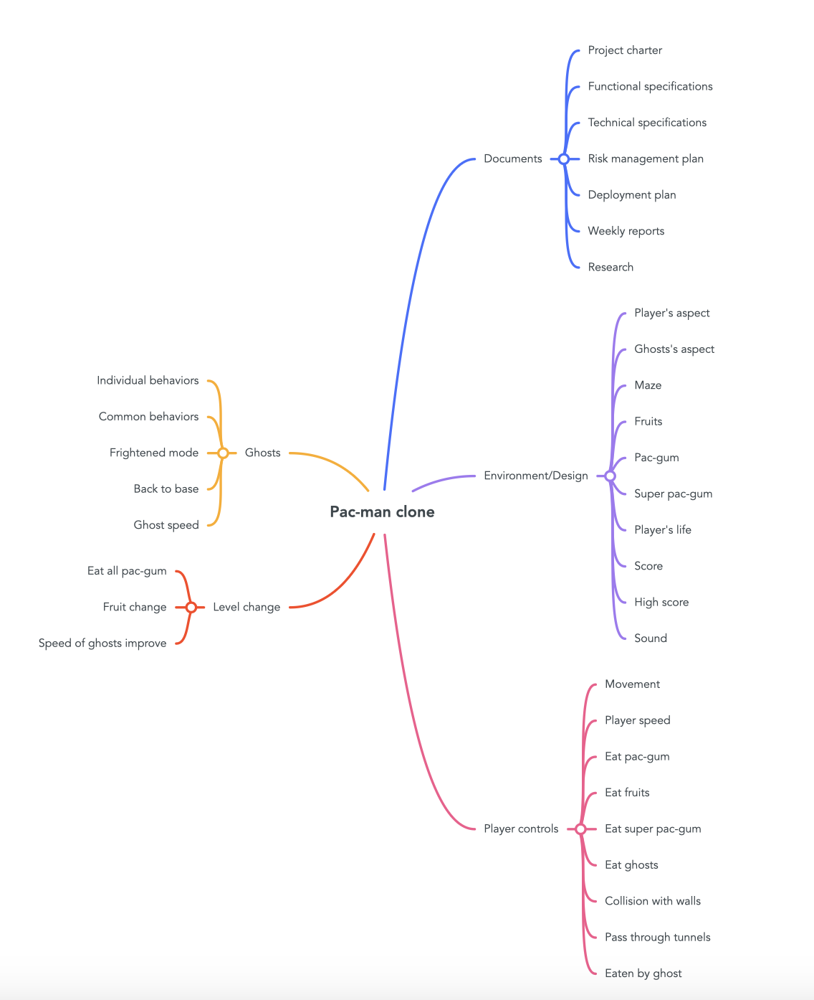

# Test plan document

|Author|Robin DEBRY and Quentin CLEMENT|
|---|---|
|Created|11/09/2023|
|Last Modified|11/09/2023|

## Table of Contents

- [Test plan document](#test-plan-document)
  - [Table of Contents](#table-of-contents)
  - [Analyse the product](#analyse-the-product)
    - [Who will use this pac-man game?](#who-will-use-this-pac-man-game)
    - [What is it used for?](#what-is-it-used-for)
    - [How will it work?](#how-will-it-work)
    - [What are software/ hardware the game uses?](#what-are-software-hardware-the-game-uses)
  - [Test strategy](#test-strategy)
    - [Testing scope](#testing-scope)
    - [Testing type](#testing-type)
    - [Document testing](#document-testing)
    - [Game testing](#game-testing)
  - [Test objectives](#test-objectives)
  - [Test criteria](#test-criteria)
  - [Ressource planning](#ressource-planning)
  - [Plan test environment](#plan-test-environment)
  - [Schedule estimation](#schedule-estimation)
  - [Test deliverables](#test-deliverables)

## Analyse the product

### Who will use this pac-man game?

This Pac-Man game is designed for nostalgic gamers who have a fondness for classic arcade experiences. It caters to those who remember the iconic Pac-Man of 1980 and want to relive the excitement of chomping pellets and evading ghosts. Whether you're a seasoned gamer who grew up with the original or a newcomer curious about gaming history, this clone appeals to a broad audience of all ages.

### What is it used for?

The Pac-Man game serves as a delightful escape into the past, offering a virtual time machine to the golden era of arcade gaming. It's a source of entertainment and nostalgia, allowing players to immerse themselves in the simple yet addictive gameplay that made Pac-Man a timeless classic. Additionally, it can be a great way to introduce younger generations to the joy of retro gaming, fostering a sense of appreciation for the roots of the gaming industry. Overall, it's a fun and engaging experience that transcends generations.

### How will it work?

Given that this is an exact clone of the 1980 Pac-Man, the gameplay mechanics will faithfully replicate the original experience. Players will navigate through a maze, controlling the iconic yellow character to consume pellets while avoiding colorful ghosts. The controls will mimic the simplicity of the arcade joystick, ensuring an authentic feel for players.

The graphics and audio will stay true to the retro charm, maintaining the pixelated aesthetic and classic sound effects that defined the original Pac-Man. The game will be designed to run smoothly on modern platforms while preserving the nostalgic elements that make Pac-Man a timeless favorite.

### What are software/ hardware the game uses?

The development of this Pac-Man clone involves a combination of software and hardware elements. The primary programming language utilized is Assembly, known for its efficiency and low-level control, making it well-suited for recreating the intricate details of the 1980 Pac-Man.

To facilitate the development process and recreate the vintage gaming environment, DosBox is employed as the emulator. DosBox allows the Pac-Man clone to run seamlessly on modern hardware and operating systems, emulating the DOS environment that was prevalent during the original Pac-Man era.

The choice of Assembly and DosBox ensures that the clone remains faithful to the programming languages and platforms of the 1980s, providing an authentic replication of the classic Pac-Man experience. This combination of software and emulation allows the game to bridge the gap between the past and the present, offering a nostalgic journey for players.

## Test strategy

### Testing scope

All the documents and features listed in the functional specifications will be sorted by priority and product areas. If 2 features are ready for testing at the same, the one with the highest priority will be tested first. Documents will be tested first so when they are fully completed, the whole will be able to focus on the product.

### Testing type

We will use an agile testing type. The goal is to make a overall test set each friday to test eveything that has been done during the week and provide feedbacks quickly so that the concerned team can rework the tested feature.

### Document testing

Documents are milestones in this project. They are an important way of communication within the team and between the team and the external world. Their quality and their pertinance is paramount so the whole way of thinking of the team can be transmitted. Moreover, each point has to be clear and precise so the final product is as close as possible to the specifications and ALGOSUP's requirements.
As the functional and technical specifications are the most important documents, they will be tested as a priority and published as soon as possible so that the teams can base their production work on them.

### Game testing

About the product in itself, all the features listed in the functional specifications will be tested to verify if they are corresponding to what was planned in the specifications.

## Test objectives

With this mindmap we can define the test objectives for this project.

- Check all documents to make sure they are in accordance with the customer's requirements.
- Check the environment and design to make sure that all aspects of the Pac-Man game are in our game.
- Check all the player controls to be sure that the controls are intuitive, work well without any bugs.
- Check the characteristic of the ghosts to make sure they are the same as the old Pac-Man with the same mechanism.
- Check the way to change the level of the game to be sure it will work as the way of Pac-Man of 1980.

## Test criteria

## Ressource planning

## Plan test environment

## Schedule estimation

## Test deliverables