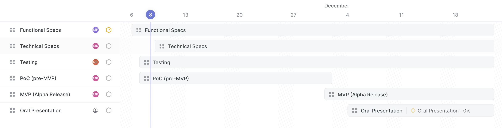
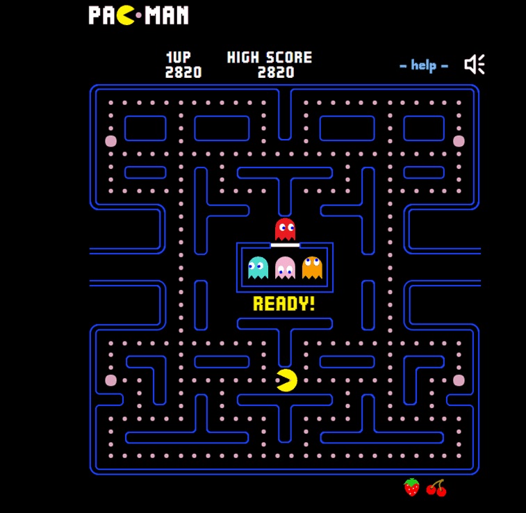
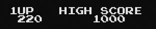
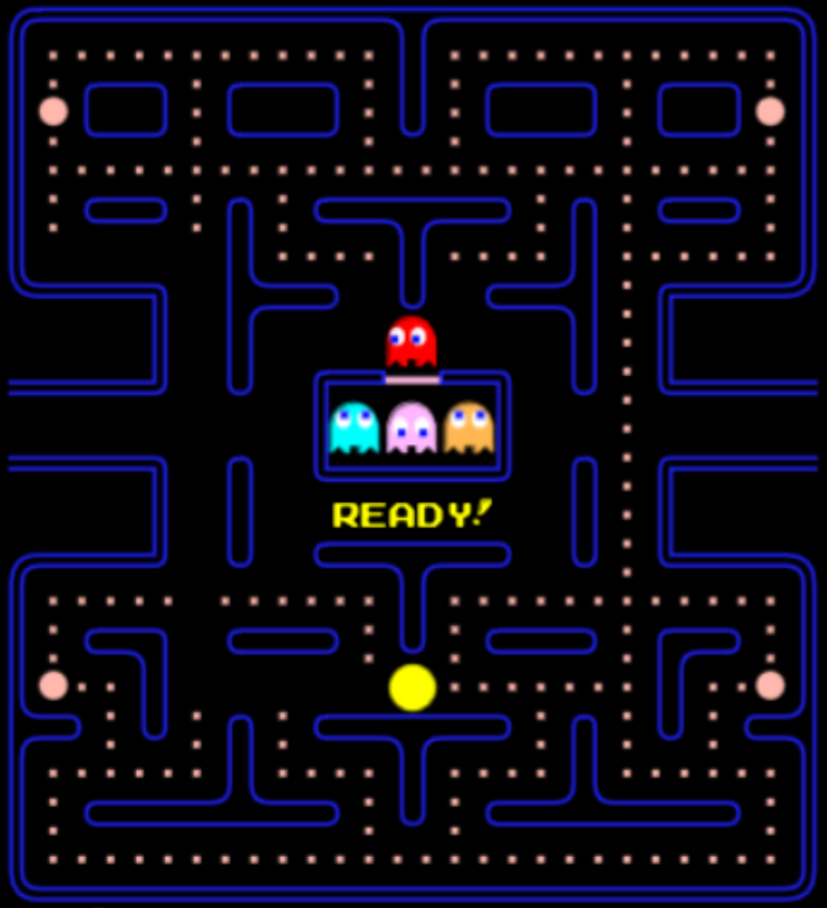
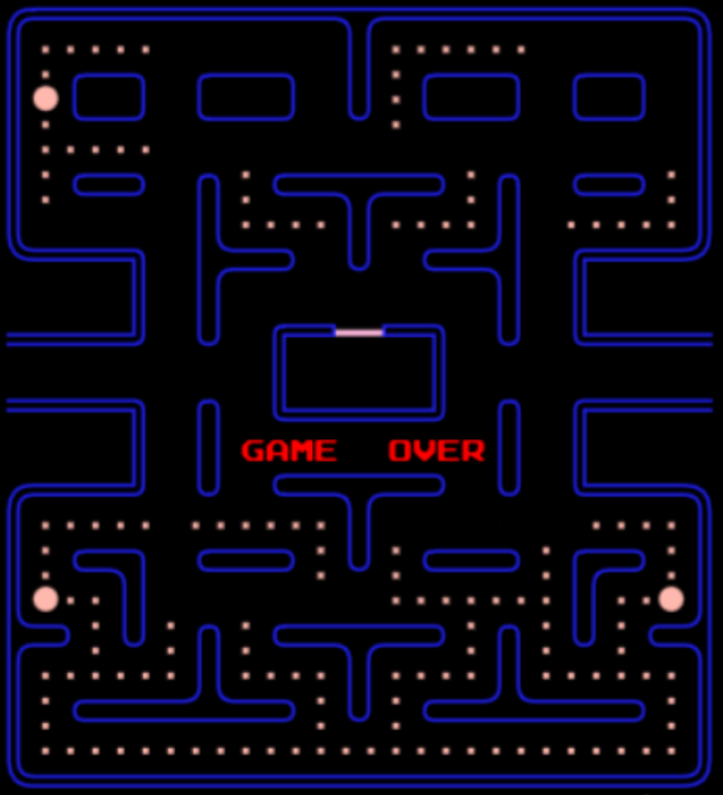
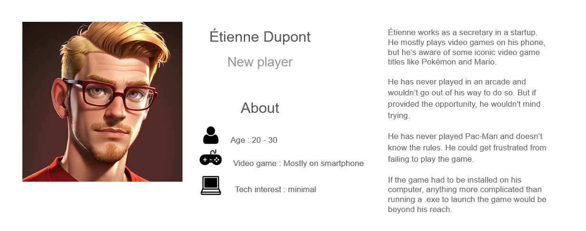
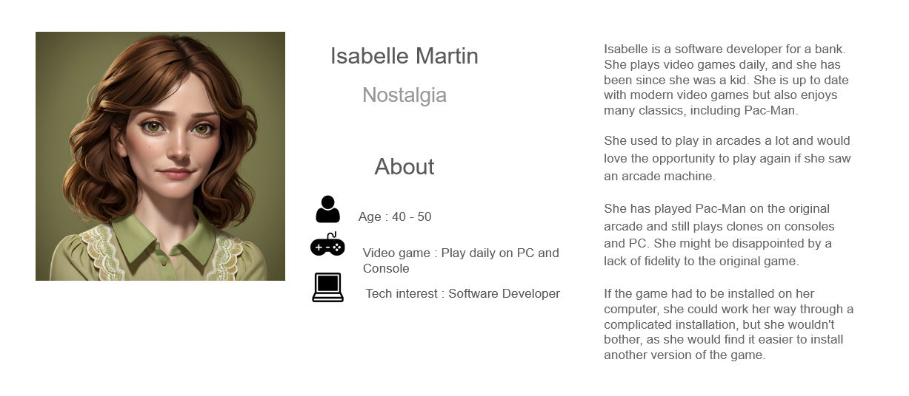
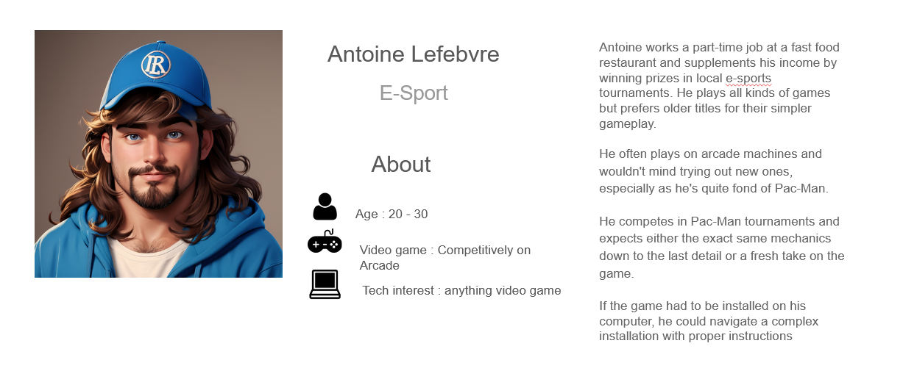

# Functional Specifications

<!-- TABLE OF CONTENTS -->
<h3 id="table-of-contents"> 📖 Table of Contents</h3>

    
...table of contents

<!-- Document Control -->

## A) Document Control

- ### ☛ 1) Document Information

| Document ID | Document # 01 |
|---|---|
| Document Owner | Max BERNARD |
| Issue date |  |
| Last Issue Date | |
| Document Name | |

- ### ☛ 2) Document History

| Version n° | Edits completed by | Date | Description of edit |
|---|---|---|---|
|01|Max BERNARD, Mathis KAKAL| 11/08/2023 | Initial Release (V.01) |

- ### ☛ 3) Document Approval

| Role | Name | Signature | Date |
|---|---|---|---|
| Project Manager | Arthur LEMOINE | | |
| Tech Lead | Mathis KAKAL | | |
| Software Developer | Pierre GORIN | | |
| Software Developer | Evan UHRLING | | |
| Quality Assurance | Quentin CLEMENT | | |
| Quality Assurance | Robin DEBRY | | |

<!-- Introduction  -->

## B) Introduction

- ### ☛ 1) Glossary

| Term used | Definition |
|---|---|
| "team" | ALGOSUP team 3 (2023-2024 - Project 2) |
| "player" | A person playing the game |

- ### ☛ 2) Project Overview

<!--- Explain what we have to do -->
Our team was tasked with creating a Pac-Man clone, with the added restriction that it had to be coded in assembly and run on an x86 CPU architecture 16-bit system.

- ### ☛ 3) Project Definition

    - #### ➭ <ins>Vision</ins>

    <!-- our end goal with this project -->
    We are making a perfect Pac-Man clone. We will use the Original assets and copy exactly the game mechanics. 

    - #### ➭ <ins>Objectives</ins>

    > Tell the objectives given by the customer and the objectives we gave ourselves (in simple bullet points)

    - #### ➭ <ins>Scope</ins>

    | In Scope |
    |---|
    | Delivering the project |
    | Delivering an open source clone of pacman |

    | Out of Scope |
    |---|
    | Delivering the actual DOS binaries of pacman |

    - #### ➭ <ins>Deliverables</ins>

    | Name | Type | Deadline | Goal | Link |
    |---|---|---|---|---|
    | Functional Specifications Document | Document (markdown) | | | |
    | Technical Specifications Document | Document (markdown) | | | |
    | Weekly Reports | Document ( | | | |
    | Test Plan | Document (markdown) | | | |
    | Test Cases | Spreadsheet (Google Sheets) | | | |

- ### ☛ 4) Project Organisation

    - #### ➭ <ins>Project Representatives</ins>

    |Project Owner|Represented by...|
    |---|---|
    |**Franck JEANNIN**|Represented by himself|
    |Arthur LEMOINE|Represented by Max BERNARD (Program Manager)|
    
    The project sponsors (highlighted in **bold**) are expected to be in charge of:

    - Defining the vision and high level objectives for the project
    - Approving the requirements, timetable, resources and budget (if necessary).
    - Authorising the provision of funds/resources (internal or external) (if necessary).
    - Approving the functional and technical specifications written by the team.
    - Ensuring that major business risks are identified and managed by the team
    - Approving any major changes in scope
    - Receiving Project Weekly Reports and taking action accordingly resolving issues escalated by the Project Manager.
    - Ensuring business/operational support arrangements are put in place
    - Ensuring the participation of a business resource (if required)
    - Providing final acceptance of the solution upon project completion.

    - #### ➭ <ins>Stakeholders</ins>

    | Stakeholder | Might have/find an interest in... |
    |---|---|
    | Franck JEANNIN | |
    | ALGOSUP Students | |
    | B3 ?? | |

    - #### ➭ <ins>Project Roles</ins>

    As defined by the project owner (ALGOSUP), the team is arranged in the following manner:

    | Role | Description | Name |
    |---|---|---|
    | Project Manager | | Arthur LEMOINE |
    | Program Manager | | Max BERNARD |
    | Tech Lead | | Mathis KAKAL |
    | Software Developer | | Pierre GORIN |
    | Software Developer | | Evan UHRLING |
    | Quality Assurance | | Quentin CLEMENT |
    | Quality Assurance | | Robin DEBRY |

    - #### ➭ <ins>Project Reviewers</ins>

    External project reviewers have been appointed by the project owner to review our specifications and provide us with feedback.

- ### ☛ 5) Project Plan

    - #### ➭ <ins>Retroplanning</ins>

    
    (do agile instead of waterfall) => use scrum methodology

    - #### ➭ <ins>Milestones</ins>

    | Milestone | Deadline |
    |---|---|
    | Functional Specifications V1 | Friday, November 10th 2023 |
    | Technical Specifications V1 | |
    | POC (pre MVP) | |
    | MVP (Alpha realease) | |
    | Oral Presentation (Beta Release) | |
    | ?? | |

    - #### ➭ <ins>Dependencies</ins>

    The POC requires some prior understanding of the target technologies before being developed, meaning that its development will probably start on week 2.

    The MVP requires the POC to be made first to estimate difficulty of tasks and viability of set objectives.

    The rest of the project depends on the first version of the functional specifications to be released and approved first.

    - #### ➭ <ins>Resources/Financial plan</ins>

    We have an estimated 55 hours total to complete this project
    => We have the team

    => Teachers

    => School's resources

    - #### ➭ <ins>Assumptions/Constraints</ins>

    | Assumptions |
    |---|
    | We assume that reality is real |
    |We assume to be alive in such reality|

    | Constraints |
    |---|
    | We only live once |

<!-- Functional Requirements -->

## C) Functional Requirements

- ### ☛ 1) Pac-Man's features

    - #### ➭ <ins>Brief History...</ins>

    <!-- Explain what is pacman + image to be pretty -->
    Pac-Man is a maze arcade game created in 1980 in Japan. In the game, you play Pac-Man, who looks like: , and need to eat all the Gums in a maze to end the level.
    

 

    In this picture, the smallest dots in the maze are Gums. To navigate the level, you can go up, down, left, or right, with no other input required.

    Multi-coloured ghosts  are chasing Pac-Man through the level, and if one touches Pac-Man, he loses a life.
    Pac-Man can eat a Super Gum (the slightly bigger dots). 
    
    They give Pac-Man the ability to eat the ghosts for a period of time. When you complete a level, the ghosts get faster, and the Super Gum bonus gets shorter.
    After a set amount of time, fruits appear in a level. Eating the fruits gives bonus points.

    - #### ➭ <ins>Objectives and lose condition</ins>

    The game objectives are twofold :
    - Eat all the Gums (244) in a maze. this will bring the player to the next level.
    - Get the highest posible Score. Several action will let the player increase their score.
    Eating all the Gums will increase the score, but is not the only way to do so.

    There is a single lose condition : being touched by a ghost. The player can lose 4 times before getting a game over.

    - #### ➭ <ins>Player</ins>
    The player play as Pac-Man, a yellow ball with a mouth. It can move in 4 directions : Up, Down, Left, Right. The movement speed change from level to level.
    
    The player can eat Gums to gain points. The player can eat Super Gum (the bigger pink dots in the maze) to enter what is called Fright Mode.

    - #### ➭ <ins>Fruits</ins>

    Fruits can appear in the maze twice per game when the player eats a specific amount of Gums. fruits only stay on screen for a short period of time.

    - #### ➭ <ins>Fright mode</ins>

    In Fright Mode the player can move faster and can now eat ghost without dieing. When in this state the objectives becomes to eat the ghost. at higher level Fright Mode get shorter and shorter.

    - #### ➭ <ins>Score</ins>

    This are all the way the player can get score :
    - Eating Gums
    - Eating Super Gums
    - Eating Fruits
    - Eating a ghost

    Oznce the player reach 10,000 points he gains an extra life.

    - #### ➭ <ins>Ghosts</ins>

    - There are 4 ghost. 
    - The player dies when touching one of the ghost.
    - A ghost can be eaten by the player when the game is in fright mode
    - If a ghost is eaten he goes back to the center of the maze
    - At higher dificulty ghost get faster

    The ghost have three behaviors :
        - Scater : the ghost are going for a corner of the maze
        - Chase : Each ghost has a diferent chase behavior, but the idea is to hunt down the player.
        - Frightened : The ghosts are runnig away from the player with random movement. this only activate when the game is in Fright Mode when the player eat a Super Gum.

    The Ghost cycle between Scater and Chase. at higher level ghosts spend more time in Chase mode.

    - #### ➭ <ins>Environment</ins>

    The game is played in a maze with this exact layout.
    

    Neither the player nor the ghost can cross the blue lines.
    The maze does not change from one level to the other. When the player or ghost go through the gate at the left and right side of the maze, they reapear at the other end of the level.

    - #### ➭ <ins>User Interface</ins>

        - ##### <ins>Font</ins>

        The font is a monospace sans-serif and should be all uppercase. The characters are white to create a contrast against the black background. Every character is 53.8% Pac-Man high and wide. There should be a 7.7% Pac-Man wide gap between characters. A new line should have a 7.7% Pac-Man gap from the one above.

        - ##### <ins>Game Score</ins>

        At the top of the screen, "HIGH SCORE" should be aligned at the centre of the screen.  The number should be displayed below the text. The rightmost number in the high score should be under the "O" of "SCORE".   The current score should be displayed as "1UP", horizontally aligned with "HIGH SCORE". The "P" of "1UP" should be 4 characters to the left of the "H" of "HIGH SCORE".  The number should be displayed horizontally aligned with the numbers under "HIGH SCORE". The rightmost number should be offset 1 character to the right of the "P" in "1UP". The end result should look like this picture:
        
        

        - ##### <ins>Game Ready</ins>

        At the start of the game, "READY!" gets displayed on the corridor just under the Ghost Spawning Box, as seen in the image below.
        

        This message should disappear when the game starts. This message should use the same font as the rest of the UI but be yellow.

        - ##### <ins>Game Over</ins>

        When the player loses all of his lives, a game over screen needs to appear. The words "GAME OVER" appear in the corridor under the <em>Ghost Spawning Box</em>, as seen in the image below.
        

        This stays on display for 3 seconds until the game takes the player to the leaderboard. This message uses the same font as the rest of the UI but is red.

- ### ☛ 2) Personas Definition

<!--
Some stuff about persona

link to personas image
https://docs.google.com/presentation/d/1_mEMP8P38QoMadhjGEqS27iHCdO-DTESxNDUPH_uHMA/edit?usp=sharing

someone who never played 
someone who played the original pacman
someone an e-sport player of pacman 
-->
 
 

- ### ☛ 3) Use Cases Analysis

| Use Case Number | Name | Description | Actor(s) | Pre-Conditions | Flow of Events | Post-Conditions | Exit Criteria | Notes & Issues |
|---|---|---|---|---|---|---|---|---|
| text | text | The player launches the game | the player | text | text | text | text | text |
| text | text | The player pauses the game | the player | text | text | text | text | text |

- ### ☛ 4) Functional Analysis

> Functional Diagrams each function addresses a use case

<!-- Non-Functional Requirements -->

## D) Non-Functional Requirements

	  *Add or remove sections as relevant*  
- ### ☛ Costs
    - #### <ins>I - Capital Expenditures</ins>
        - ##### <ins>Material</ins>
        - ##### <ins>Production Line</ins>
        - ##### <ins>Tools</ins>
        - ##### <ins>Software</ins>
        - ##### <ins>Time Spent/Wages</ins>
    - #### <ins>II - Operational Expenditures</ins>
        - ##### <ins>Server Costs</ins>
        - ##### <ins>Maintenance</ins>
        - ##### <ins>Salaries</ins>
        - ##### <ins>Energies</ins>
- ### ☛ Reliability
- ### ☛ Response/Performance
- ### ☛ Operability
- ### ☛ Recovery
- ### ☛ Delivery
- ### ☛ Maintainability
- ### ☛ Scalability
- ### ☛ Availability
- ### ☛ Security
- ### ☛ Transition Requirements

 