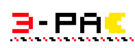
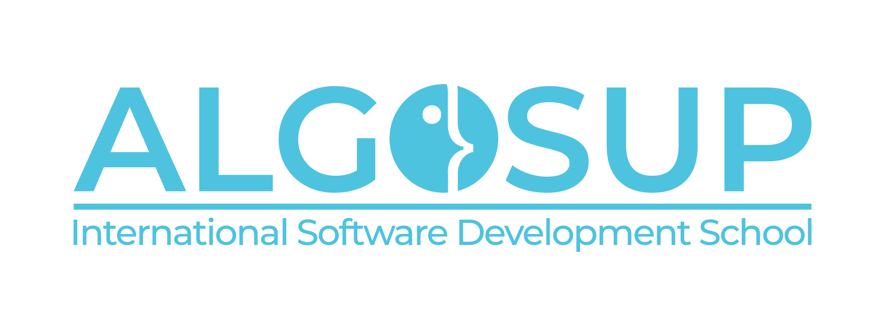

<div align="center">





</div>

# 📚 What is this project?

This project is a student project provided by ALGOSUP, based in Vierzon, it aims to do a replica of the original game "Pac-Man" released in 1980 by Namco, this version of Pac-Man is made in Assembly x86.

<hr>

# 👥 Who are we?

| Name            | Role              | Image | Link                               |
|-----------------|-------------------|-------|------------------------------------|
| Arthur LEMOINE  | Project Manager   |       | [Arthur\'s Github Profile](https://github.com/arthur-lemo1ne) |
| Max BERNARD     | Program Manager   |  | [Max\'s Github Profile](https://github.com/maxbernard3) |
| Mathis KAKAL    | Tech Lead         |  | [Mathis\' Github Profile](https://github.com/mathiskakal) |
| Pierre GORIN    | Software Engineer |  | [Pierre\'s Github Profile](https://github.com/Pierre2103) |
| Evan UHRING     | Software Engineer |  | [Evan\'s Github Profile](https://github.com/Evan-UHRING) |
| Robin DEBRY     | Quality Assurance |  | [Robin\'s Github Profile](https://github.com/robin-debry) |
| Quentin CLEMENT | Quality Assurance |  | [Quentin\'s Github Profile](https://github.com/Quentin-Clement) |

<hr>

# 📝 How to use it?

## 📥 Download

To download the project, you need to clone this github repository, you can do it by using the following command:

```bash
git clone https://github.com/algosup/2023-2024-project-2-x86-retrogaming-team-3
```

## 🏃‍♂️ Run

To run the project on your machine, you need to install the following software:

- [DOSBox](https://www.dosbox.com/download.php?main=1)
- [NASM](https://www.nasm.us/pub/nasm/releasebuilds/2.15.05/win64/)

### 🪟 Windows

Once you have installed the software, on windows, you need to double click on the `buildGame.cmd` or enter the following command in the project directory:

```bash
buildGame
```

### 🍎 MacOS

Once you have installed the software, on MacOS, you need to enter the following command in the project directory:

```bash
chmod +x pacMan/buildGame.sh

./pacMan/buildGame.sh
```

### 🐧 Linux

Once you have installed the software, on Linux, you need to enter the following command in the project directory:

```bash
chmod +x pacMan/buildGame.sh

./pacMan/buildGame.sh
```

<hr>

# 📚 Related documents

- [Functional specifications](https://github.com/algosup/2023-2024-project-2-x86-retrogaming-team-3/blob/main/documents/functionalSpecifications.md)
- [Technical specifications](https://github.com/algosup/2023-2024-project-2-x86-retrogaming-team-3/blob/main/documents/technicalSpecifications.md)
- [Test Plan](https://github.com/algosup/2023-2024-project-2-x86-retrogaming-team-3/blob/main/documents/qualityAssurance/testPlan.md)

<hr>

# 📜 License

This project is under the [Mit License](https://en.wikipedia.org/wiki/MIT_License).

<hr>

# 🙏 Thanks

We would like to thank the following people for their help and support:

- Garry for his code reviews and help.
- ALGOSUP to give us the chance to work on this project.
- Namco for the original game.
- Team 4 for the help on Quality Assurance.

<div align="center"">



</div>
