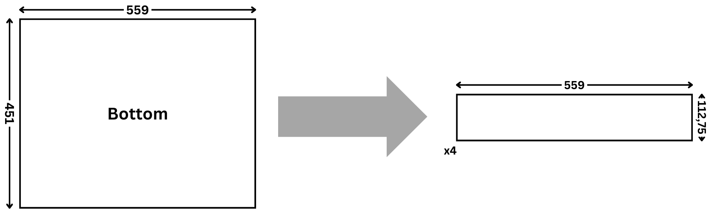
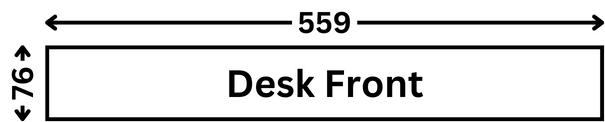
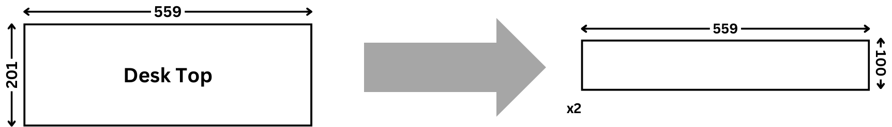
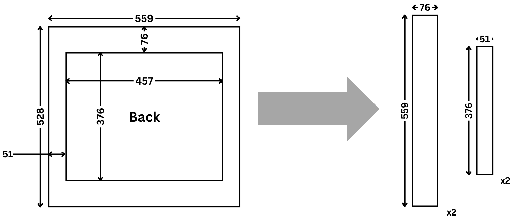
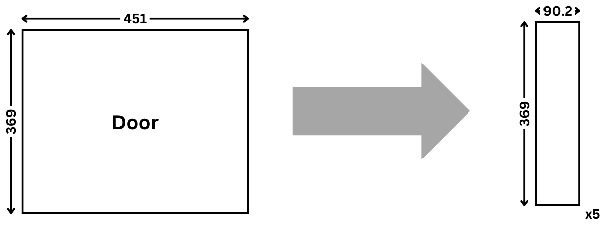
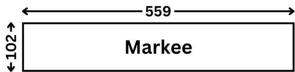
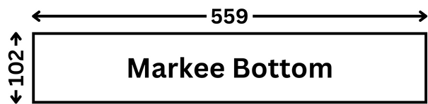
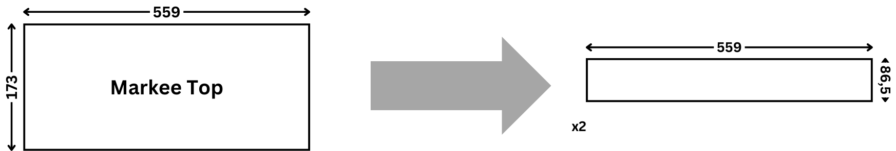
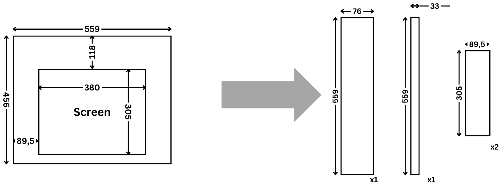
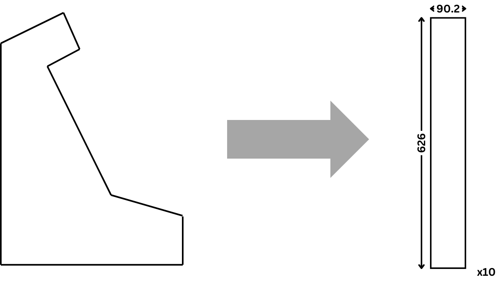

Project x86-retrogaming -- Team 3
---

<h2 align="center">Bar-Top Arcade</h2>

### Context

Within the project "x86-retrogaming" made for ALGOSUP, we thought as a team that it would be great to have a real arcade machine to complete the PAC-MAN clone. From this idea we thought of building one ourselves, this document regroups all information relative to the arcade machine.

### HardWare

For the hardware we decided to go with a Raspberry PI 3 as it was an easy-to-set-up and cheap solution combined with an old screen to keep the look retro.

### Dimensions

The Bar-Top Arcade will be built following "The Wood Whisperer" 's tutorial. He provided cutting plans and steps to follow which will help us save time on the building. 

### Materials

For the case materials we decided to go with wood as it is cheap  and easy to shape. It should also give a great look to the arcade.

### Cost

|Component                  |Category       |Price      |
|:-------------------------:|:-------------:|:---------:|
|Raspberry PI 3             |Hardware       |46,98€     |
|JoyStick & butons          |Hardware       |49,00€     |
|Alimentation RaspBerry     |Hardware       |09,99€     |
|Power strip                |Hardware       |00,00€     |
|Screen                     |Hardware       |00,00€     |
|HDMI cable                 |Hardware       |00,00€     |
|Wood                       |Materials      |80,00€     |
|Screws                     |Materials      |6,20€      |
|Screws                     |Materials      |33.30€     |
|**TOTAL**                  |/              |225,47€    |

Since we re-used some old components that members of the team owned, we were able to cut some costs mainly for the screen and cables.

### Sources

You can [click here](https://thewoodwhisperer.com/files/TWW-Arcade-Cabinet-V2-Metric.pdf) to access the document