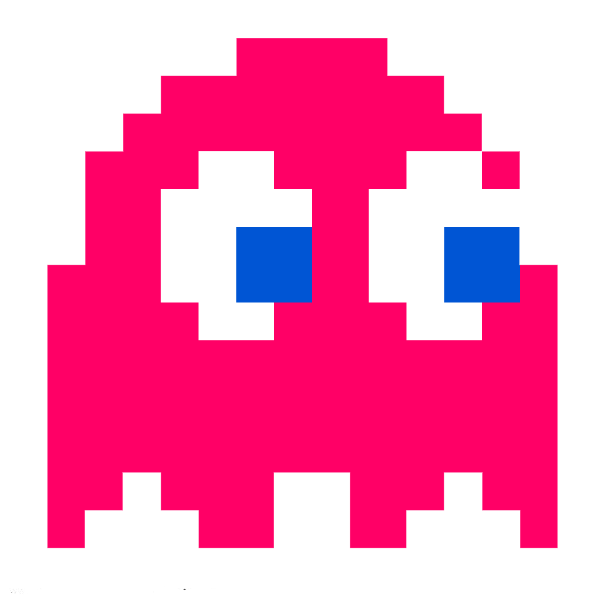
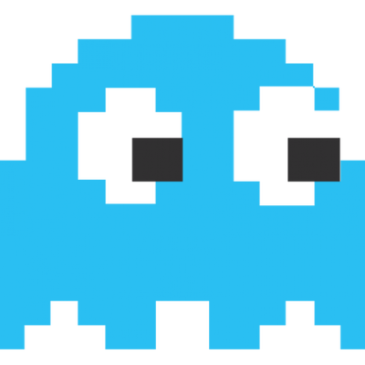
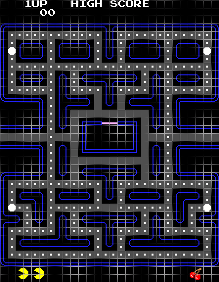
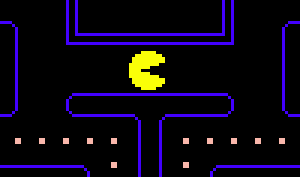
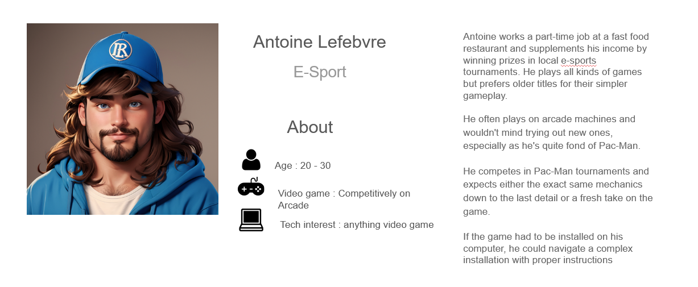

# Functional Specifications

## Table of content 

- [Functional Specifications](#functional-specifications)
  - [Table of content ](#table-of-content-)
  - [A) Document Control](#a-document-control)
    - [1) Document Information](#1-document-information)
    - [2) Document History](#2-document-history)
    - [3) Document Approval](#3-document-approval)
  - [B) Introduction](#b-introduction)
    - [1) Glossary](#1-glossary)
    - [2) Project Overview](#2-project-overview)
    - [3) Project Definition](#3-project-definition)
      - [➭ Vision](#-vision)
      - [➭ Objectives](#-objectives)
      - [➭ Scope](#-scope)
      - [➭ Deliverables](#-deliverables)
    - [4) Project Organisation](#4-project-organisation)
      - [➭ Project Representatives](#-project-representatives)
      - [➭ Stakeholders](#-stakeholders)
      - [➭ Project Roles](#-project-roles)
      - [➭ Project Reviewers](#-project-reviewers)
    - [5) Project Plan](#5-project-plan)
      - [➭ Retroplanning](#-retroplanning)
      - [➭ Milestones](#-milestones)
      - [➭ Dependencies](#-dependencies)
      - [➭ Resources/Financial plan](#-resourcesfinancial-plan)
      - [➭ Assumptions/Constraints](#-assumptionsconstraints)
  - [C) Functional Requirements](#c-functional-requirements)
    - [1.a) Pac-Man's Features Overview](#1a-pac-mans-features-overview)
      - [➭ Brief History...](#-brief-history)
      - [➭ Objectives and loss condition](#-objectives-and-loss-condition)
      - [➭ Player](#-player)
      - [➭ Fruits](#-fruits)
      - [➭ Fright mode](#-fright-mode)
      - [➭ Score](#-score)
      - [➭ Ghosts](#-ghosts)
      - [➭ Sound](#-sound)
    - [1.b) Pacman's Features Breakdown](#1b-pacmans-features-breakdown)
      - [➭ Level](#-level)
        - [Grid](#grid)
        - [Maze](#maze)
        - [Gums](#gums)
        - [Fruits](#fruits)
        - [Ghost Spawning Box](#ghost-spawning-box)
    - [➭ User Interface](#-user-interface)
      - [Font](#font)
        - [Game Score](#game-score)
        - [Game Ready](#game-ready)
        - [Game Over](#game-over)
      - [➭ Leaderboard](#-leaderboard)
        - [Enter Your Initials](#enter-your-initials)
        - [High Scores](#high-scores)
        - [Leaving Leaderboard](#leaving-leaderboard)
    - [➭ Player](#-player-1)
      - [➭ Movement](#-movement)
        - [Animation](#animation)
        - [Turning](#turning)
      - [➭ Eating Gums](#-eating-gums)
      - [➭ Fright Mode](#-fright-mode-1)
      - [➭ Speed](#-speed)
      - [➭ Fruits](#-fruits-1)
      - [➭ Player Lives and Death](#-player-lives-and-death)
    - [➭ Ghosts](#-ghosts-1)
      - [➭ General Information](#-general-information)
      - [➭ Speed](#-speed-1)
      - [➭ Behavior](#-behavior)
      - [➭ Game Start](#-game-start)
      - [➭ Ghost death](#-ghost-death)
      - [➭ Personality](#-personality)
      - [➭ Red](#-red)
      - [➭ Pink](#-pink)
      - [➭ Orange](#-orange)
      - [➭ Cyan](#-cyan)
    - [➭ Sound Design](#-sound-design)
      - [➭ Intro](#-intro)
      - [➭ Other](#-other)
    - [2) Personas Definition](#2-personas-definition)
    - [3) Use Cases Analysis](#3-use-cases-analysis)
    - [4) Functional Analysis](#4-functional-analysis)
  - [D) Non-Functional Requirements](#d-non-functional-requirements)
    - [Costs](#costs)
      - [I - Capital Expenditures](#i---capital-expenditures)
        - [Material](#material)
        - [Time Spent/Wages](#time-spentwages)
      - [II - Operational Expenditures](#ii---operational-expenditures)
        - [Energies](#energies)
    - [Reliability](#reliability)
    - [Response/Performance](#responseperformance)
    - [Operability](#operability)
    - [Recovery](#recovery)
    - [Delivery](#delivery)
    - [Maintainability](#maintainability)
    - [Security](#security)

<!-- Document Control -->

## A) Document Control

### 1) Document Information

| Document ID | Document # 01 |
|---|---|
| Document Owner | Max BERNARD |
| Issue date | 07/11/2023 |
| Last Issue Date | 10/11/2023 |
| Document Name | Functional-Specification|

### 2) Document History

| Version n° | Edits completed by | Date | Description of edit |
|---|---|---|---|
|01|Max BERNARD, Mathis KAKAL| 11/08/2023 | Initial Release (V.01) |

### 3) Document Approval

| Role | Name | Signature | Date |
|---|---|---|---|
| Project Manager | Arthur LEMOINE | ✅ | 11/13/2023 |
| Tech Lead | Mathis KAKAL | ✅ | 11/13/2023 |
| Software Developer | Pierre GORIN | ✅ | 11/13/2023 |
| Software Developer | Evan UHRLING |✅ | 11/13/2023|
| Quality Assurance | Quentin CLEMENT | ✅ | 11/13/2023 |
| Quality Assurance | Robin DEBRY |✅|11/13/2023|

<!-- Introduction  -->

## B) Introduction

### 1) Glossary

| Term used | Definition |
|---|---|
| "Team" | ALGOSUP team 3 (2023-2024 - Project 2) |
| "Player" | The person playing the game |
| "Pac-Man" the character | A yellow ball controlled by the player |
| "Ghost" | The game's enemy |
| "Gum" | The small dots in the Maze |
| "Super Gum" | The bigger dots in the Maze that trigger Fright Mode |
| "Fright Mode" | The state of the game in which pac-man can eat ghosts |
| "Ghost Spawning Box" or "GSB" | The box at the center of the screen from which a ghost appear |
| "Maze" | The game environment  |
| "User Interface" or "UI" | The visual and interactive elements through which users interact with the game |
| "x86 CPU" | x86 is a popular computer processor architecture |
| "Assembly" | A low-level programming language that is human-readable |
| "Leaderboard" | a ranked list that displays the scores or performance of players |

### 2) Project Overview

<!--- Explain what we have to do -->
Our team was tasked with creating a Pac-Man clone, with the added restriction that it had to be coded in assembly and run on an x86 CPU architecture 16-bit system.

### 3) Project Definition

#### ➭ <ins>Vision</ins>

<!-- our end goal with this project -->
We are making a perfect Pac-Man clone. We will use the original assets and copy the game mechanics as closely as possible. We want to make an arcade machine to play the game on.

#### ➭ <ins>Objectives</ins>

* Making a Pac-Man Clone
* Using assembly
* Has to work on an x86 CPU
* Delivering an arcade machine

#### ➭ <ins>Scope</ins>

| In Scope |
|---|
| Delivering an open source clone of pacman in assembly |
| Must run on a 1990s computer using x86 CPU |
| Must be programed in assembly |

| Out of Scope |
|---|
| Re-Doing the Pac-Man cutscenes |
| Multiplayer |
| Advanced Player Movement |
| Advanced Ghost Respawn Mechanic |
| Using a high level programing language to generate the assembly |

#### ➭ <ins>Deliverables</ins>

| Name | Type | Deadline | Link |
|---|---|---|---|
| Functional Specifications Document | Document (markdown) | 11/13/2023 | [Functional-Specifications.md](./functionalSpecifications.md) |
| Technical Specifications Document | Document (markdown) | 11/27/2023 | [Technical-Specifications.md](./technicalSpecifications.md)|
| Weekly Reports | Document (markdown) | Every Friday | [Weekly-Reports/](./weeklyReports/)|
| Test Plan | Document (markdown) | 12/08/2023 | [Test-Plan.md](./qualityAssurance/Test-Plan.md) |

### 4) Project Organisation

#### ➭ <ins>Project Representatives</ins>

|Project Owner|Represented by...|
|---|---|
|**Franck JEANNIN**|Represented by himself|
|Arthur LEMOINE|Represented by Max BERNARD (Program Manager)|

The project sponsors (highlighted in **bold**) are expected to be in charge of:

- Defining the vision and high-level objectives for the project.
- Approving the requirements, timetable, resources and budget (if necessary).
- Authorising the provision of funds/resources (internal or external) (if necessary).
- Approving the functional and technical specifications written by the team.
- Ensuring that major business risks are identified and managed by the team.
- Approving any major changes in scope.
- Received Project Weekly Reports and take action accordingly to resolve issues escalated by the Project Manager.
- Ensuring business/operational support arrangements are put in place.
- Ensuring the participation of a business resource (if required).
- Providing final acceptance of the solution upon project completion.

#### ➭ <ins>Stakeholders</ins>

| Stakeholder | Might have/find an interest in... |
|---|---|
| Franck JEANNIN | Having the student learn assembly  |
| ALGOSUP Students | Learning assembly and getting experience |
| B3 | Geting an arcade machnine in the breakroom |

#### ➭ <ins>Project Roles</ins>

As defined by the project owner (ALGOSUP), the team is arranged in the following manner:

| Role | Description | Name |
|---|---|---|
| Project Manager | Is in charge of organization, planing and budgeting. Keep the team motivated.  | Arthur LEMOINE |
| Program Manager | Makes sure the project meets expectation. Is in charge of design. Is responsible for writing the Functional Specifications | Max BERNARD |
| Tech Lead | Makes the technical decision in the project. Translates the Functional Specification into Technical Specifications.  Does code review. | Mathis KAKAL |
| Software Engineer | Writes the code. Writes documentation Participate in the technical design. | Pierre GORIN |
| Software Engineer | | Evan UHRLING |
| Quality Assurance |  Tests all the functionalities of a product to find bugs and issue. Document bugs and issues. Write the test plan. Check that issues have been fixed.| Quentin CLEMENT |
| Quality Assurance | | Robin DEBRY |

#### ➭ <ins>Project Reviewers</ins>

External project reviewers have been appointed by the project owner to review our specifications and provide us with feedback.

### 5) Project Plan

#### ➭ <ins>Retroplanning</ins>

#### ➭ <ins>Milestones</ins>

| Milestone | Deadline|
|---|---|
| Functional Specifications V1 | Monday, November 13th 2023 |
| Technical Specifications V1 | Monday, November 27th 2023 |
| POC (pre MVP) | Friday, December 1st 2023 |
| MVP (Alpha realease) | Monday, December 11th 2023 |
| Oral Presentation (Beta Release) | Thuesday, December 21st 2023 |

#### ➭ <ins>Dependencies</ins>

The POC requires some prior understanding of the target technologies before being developed, meaning that its development will probably start on week 2.

The MVP requires the POC to be made first to estimate task difficulty and set objectives' viability.

The rest of the project depends on the first version of the functional specifications to be released and approved first.

#### ➭ <ins>Resources/Financial plan</ins>

We have an estimated 385 man-hours total to complete this project
=> The team (7 people)

=> Teachers

=> 1 computer per team member

=> The book "PROGRAMING BOOT SECTOR GAMES"

=> ALGOSUP's library

#### ➭ <ins>Assumptions/Constraints</ins>

| Assumptions |
|---|
| We assume we will have no issue with the copyright of Pac-Man |
| DosBox is stable enough to not be a concern for reliability |
| DosBox can run the same program no pater the OS |

| Constraints |
|---|
| We have to code in Assembly |
| We have to run the program on a x86 CPU |
| We can not make a comercial use of the project |

<!-- Functional Requirements -->

## C) Functional Requirements

### 1.a) Pac-Man's Features Overview

#### ➭ <ins>Brief History...</ins>

Pac-Man is a maze arcade game created in 1980 in Japan. In the game, you play Pac-Man, who looks like: , and need to eat all the Gums in a maze to end the level.

 

In this picture, the smallest dots in the Maze are Gums. You can go up, down, left, or right to navigate the level, with no other input required.

Multi-coloured ghosts  are chasing Pac-Man through the level, and if one touches Pac-Man, he loses a life.
Pac-Man can eat a Super Gum (the slightly bigger dots).

They allow Pac-Man to eat the ghosts for a period of time. The ghosts get faster when you complete a level, and the Super Gum bonus gets shorter.
After a set amount of time, fruits appear in a level. Eating the fruits gives bonus points.

#### ➭ <ins>Objectives and loss condition</ins>

The game objectives are twofold :

- Eat all the Gums (244) in a maze. This will bring the player to the next level.

- Get the highest possible Score. Several actions will let the player increase their score.Eating all the Gums will increase the score, but is not the only way to do so.

There is a single loss conditions : being touched by a ghost. The player can lose 4 times before getting a game over.

#### ➭ <ins>Player</ins>

The player plays as Pac-Man, a yellow ball with a mouth.

It can move in 4 directions : Up, Down, Left and Right. The movement speed changes from level to level.

The player can eat Gums to gain points. The player can eat Super Gum (the bigger pink dots in the Maze) to enter what is called Fright Mode.

#### ➭ <ins>Fruits</ins>

Fruits can appear in the Maze twice per game when the player eats a specific amount of Gums. Fruits only stay on screen for a short time.
    

#### ➭ <ins>Fright mode</ins>

In Fright Mode, the player can move faster and can now eat ghosts without dying. When in this state, the objective becomes to eat the ghosts. At higher levels, Fright Mode gets shorter and shorter.

#### ➭ <ins>Score</ins>

These are all the ways the player can score points :

- Eating Gums
- Eating Super Gums
- Eating Fruits
- Eating a ghost

Once the player reaches 10,000 points, he gains an extra life.

#### ➭ <ins>Ghosts</ins>

There are 4 ghosts.

The player dies when touching one of the ghosts.

A ghost can be eaten by the player when the game is in fright mode.

If a ghost gets eaten, he goes back to the center of the Maze.

At higher difficulties, ghosts get faster

The ghosts have three behaviors:

- Scater : The ghosts are going for a corner of the Maze.
- Chase : Each ghost has a different chase behavior, but the idea is to hunt down the player.
- Frightened : The ghosts are running away from the player with random movement. This only activates when the game is in Fright Mode when the player eats a Super Gum.

The Ghosts cycle between Scater and Chase. At higher levels, ghosts spend more time in Chase mode.

#### ➭ <ins>Sound</ins>

There are sound effects for the following events:

- Start-Up
- Pac-Man Eating
- Pac-Man Eating Fruits
- Ghost Siren Sound
- Fright Mode
- Pac-Man Eating Ghost
- Pac-Man Get High Score (10,000 points)
- Pac-Man dying/Game Over

### 1.b) Pacman's Features Breakdown

#### ➭ <ins>Level</ins>

##### <ins>Grid</ins>

The level can be subdivided into a grid. In that grid, the Maze is made of 28 by 31 tiles. A single subdivision will be referred to as a 'Tile'.

##### <ins>Maze</ins>

We will use the original 1980 Pac-Man level layout. The picture below can be used as a reference to recreate the layout. Neither Pac-Man nor the ghosts can cross the blue lines.

The level's walls have a blue border and a transparent fill. They should be 1/2 Grid thick. When walls are next to one another, the inner border should be removed so that it looks like there is no empty space. 
There should be a 30% rounded effect on every corner, similar to the border-radius effect in CSS.

##### <ins>Gums</ins>

A normal Gum is a square with 1/4 the size of a tile. The Gum should be at the center of a tile.   The Super Gum should be a circle with the diameter of a tile. The center of this circle should also be at the center of the tile.

##### <ins>Fruits</ins>

The fruits should be in the center of a tile. Fruits Sprites should fit in a square with sides 5/4th that of a tile.

Fruits should be a more or less pixelated version of these designs, with more or less simplified colours as the technical limitation dictates.

##### <ins>Ghost Spawning Box</ins>

The <em>Ghost Spawning Box</em> or GSB is the box at the Maze's center from which the ghosts appear. This box's walls shouldn't be rounded, unlike the other walls in the maze.

The box's internal size is 6x3 tiles. The box has a white door in the middle of the top wall. This door is 2 tiles wide The player cannot cross the box, but the ghosts can.

### ➭ <ins>User Interface</ins>

#### <ins>Font</ins>

The font is a monospace sans-serif and should be all uppercase. The characters are white to create a contrast against the black background. Every character is 7/8th of a tile. The Character of the UI should also fit in the grid.

##### <ins>Game Score</ins>

At the top of the screen 2 Tiles above the Maze. "HIGH SCORE" should be aligned at the center of the screen.  The number should be displayed below the text. The rightmost number in the high score should be under the "O" of "SCORE".   The current score should be displayed as "1UP", horizontally aligned with "HIGH SCORE". The "P" of "1UP" should be 3 tiles to the left of the "H" of "HIGH SCORE".  The number should be displayed horizontally aligned with the numbers under "HIGH SCORE". The rightmost number should be offset 1 character to the right of the "P" in "1UP". The end result should look like this picture:
        

##### <ins>Game Ready</ins>

At the start of the game, "READY!" gets displayed on the corridor just under the Ghost Spawning Box, as seen in the image below.

This message should disappear when the game starts. This message should use the same font as the rest of the UI but be yellow.

##### <ins>Game Over</ins>

When the player loses all of his lives, a game-over screen needs to appear. The words "GAME OVER" appear in the corridor under the <em>Ghost Spawning Box</em>, as seen in the image below.

This stays on display for 3 seconds until the game takes the player to the leaderboard. This message uses the same font as the rest of the UI but is red. The space between the "GAME" and the "OVER" is 2 Tiles.

#### ➭ <ins>Leaderboard</ins>

##### <ins>Enter Your Initials</ins>

Once a player reaches a score high enough to make it into the top 10 of players, they will be prompted to enter their initials on a screen that looks like the one below.

The player can use the Up and Down buttons to change the selected letter. Going up cycles from Z to A, and going down cycles from A to Z. It should loop once you try to go beyond Z or A. There should only be the 26 letters of the alphabet.
You can select which letters you are changing by using the Left and Right buttons. This does <b>not</b> loop when you reach either end. The selected letters should have arrows above and below them.
When the player presses the Right button while on the rightmost letter, the name is validated, and the High Score page is displayed.

##### <ins>High Scores</ins>

"HIGH SCORES" should be displayed at the top and center of the screen.  On the High Score page, the font will have a 1 tile gap between each line. The font is otherwise unchanged from the normal UI font.

There should be a 3 tile gap between "HIGH SCORES" and the header of the score table. The table should contain 3 columns: "RANK", "SCORE", and "NAME" from left to right.

"RANK" contains the player ranks up to 10th. The "T" of "1ST" should be under the "N" of "RANK". This alignment should continue up to 9th. However, the "H" of "10TH" should be vertically aligned with the "K" of "RANK".

"SCORE" contains all the high scores. The rightmost digit of a score should be vertically aligned with the "E". The score cannot go higher than 99999. If it does, it shouldn't display the additional digits. For example, 100002 should be displayed as 00002.

"NAME" should contain the 3-letter initials that were entered by the player who reached the high score.

When a player sets a new high score, it should push out the player that was previously in 10th place and make it so his name and score are no longer displayed. The new high score gets inserted between the two closest higher and lower numbers.

##### <ins>Leaving Leaderboard</ins>
        
Pressing the start button should leave the leaderboard and start a new game.

### ➭ Player

#### ➭ <ins>Movement</ins>

The Pac-Man can move in four directions: Up, Down, Left and Right. The Pac-Man can not cross the wall of the Maze. It continues to move in a direction until it encounters a wall, at which point it stops moving, or the player gives another direction. The Pac-Man can go through tunnels, highlighted in red in the picture below. Going through a tunnel transports you to the other tunnel.

Pac-Man base speed is 9.47 tiles per second.

##### <ins>Animation</ins>

Pac-Man's diameter is 13/8 of a tile. It closes and opens his mouth in a loop whenever he moves. This GIF should be used as a reference for this animation. Pac-Man's mouth should point in the direction of movement.

##### <ins>Turning</ins>

If the player initiates the turn 1/2 tile before the corner, He can move 45° until he gets to the middle of the corridor, as seen in the picture below.

        The player moves faster during this phase as he is moving in both directions simultaneously, making him twice as fast.
        If the turn is initiated earlier, this effect lasts longer, but it can not be initiated earlier than 1/2 tile before the corner.   Otherwise, the turn is a 90° angle and gets no speed boost.

#### ➭ <ins>Eating Gums</ins>

        Pac-Man can eat Gums, the small dots in the Maze. When he eats, he stops for 1/60th of a second. Eating a Gum adds 10 points to the score.  Eating a Super Gum (the bigger dots) stops Pac-Man for 3/60th of a second. Once he eats this Super Gum, he enters Fright modes and adds 50 points to the score.

#### ➭ <ins>Fright Mode</ins>

This speeds up Pac-Man and Makes the ghost run away from the player. The player can now eat the ghosts. Each ghost gives a certain amount of points.

_| points
---|---
1st ghost | 200
2nd ghost | 400
3rd ghost | 800
4th ghost | 1600

As the level increases, the time in Fright Mode varies up to level 19, when Fright Mode ends instantly.

Level | Fright. Time (in sec.)
--- | ---
1 | 6
2 | 5
3 | 4
4 | 3
5 | 2
6 | 5
7-8 | 2
9 | 1
10 | 5
11 | 2
12-13 | 1
14 | 3
15-16 | 1
17 | 0
18 | 1
19+ | 0

#### ➭ <ins>Speed</ins>

When the level increases, Pac-Man's movement speed changes. This table gives the % modifier over the Base Speed of 9.47 tiles per second.

Level | Speed Modifier | Fright Mode
---|---|---
1 | 80% | 90%
2-4 | 90% | 95%
5-20 | 100% | 100%
21+ | 90% | 100%

#### ➭ <ins>Fruits</ins>

Fruits appear twice per level. When eaten, they give bonus points. However they don't stay on screen forever. They stay between 9 and 10 seconds. The exact time should be randomized each time.  The Fruit 1st appears after the player eats 70 gums. A 2nd Fruit appears after 170 gums have been eaten.    The bonus fruits are from left to right :  Cherry, Strawberry, Orange, Apple, Galaxian, Melon, Bell, Key

Different fruits appear at different levels and give different point rewards :

|Fruit|Reward| Level
|---|---| ---
|Cherry|100| 1
|Strawberry|300| 2
|Orange|500| 3
|Apple|700| 5-6
|Melon|1000| 7-8
|Galaxian|2000| 9-10
|Bell|3000| 11-12
|Key|5000| 13+

#### ➭ <ins>Player Lives and Death</ins>

The player starts with 3 extra lives. He loses one whenever he gets touched by a ghost when not in frightened mode. This resets the player and ghosts to their starting position.   Once the player reaches 10,000 points, he gains an additional life.

When Pac-Man dies, an animation of the circle disappearing and exploding plays, as seen in the picture above.

### ➭ Ghosts

#### ➭ <ins>General Information</ins>

Ghosts main feature is to kill the player on contact, except when the game is in Fright Mode.

#### ➭ <ins>Speed</ins>

As the level increases, ghosts get faster. When the Game is in Fright Mode, the ghosts get slower. Additionally, when crossing a tunnel, unlike Pac-Man, ghosts are slowed. The slow-down zone is highlighted in green in the picture below.

This table gives the numbers as % of Pac-Man's base speed (9.47 tiles per second).

Level | Ghost speed | Fright Mode | Tunnel Speed
--- | --- | --- | ---|
1 | 75% | 50% | 40%
2-4 | 85% | 55% | 45%
5+ | 95% | 60% | 50%

#### ➭ <ins>Behavior</ins>

There are three modes for ghosts:

- Chase : In chase mode, the ghost is hunting down Pac-Man. Each ghost has a unique chase behavior.
- Scatter : Each ghost has a home corner in the Maze. In Scatter mode, ghosts will navigate toward that corner.
- Frightened : When Pac-Man is in Fright Mode after eating a Super Gum, the ghosts randomly move through the Maze. They also turn blue and frown (see image).

Ghost alternates between Scater and Chase at predetermined intervals. The timer on those intervals stops when the ghosts are in Fright mode. When the level changes, so does this timing.   This table gives the timing in second :

Mode | Level 1 | Level 2-4 | Level 5+
--- | --- | --- | ---
Scatter | 7 | 7 | 5
Chase | 20 | 20 | 20
Scatter | 7 | 7 | 5
Chase | 20 | 20 | 20
Scatter | 5 | 5 | 5
Chase | 20 | 1033 | 1037
Scatter | 5 | 1/60 | 1/60
Chase | ∞ | ∞ | ∞

#### ➭ <ins>Game Start</ins>

Ghosts should start in the <em>Ghost Spawning Box</em> except Red, who starts in front of the door, as seen in the image.

Red moves first, then Pink once Red is clear of the door, Orange moves when Pac-Man has eaten 30 Gums and last, Cyan leaves once Pac-Man has eaten 60 Gums. All the ghosts start in Scatter mode and on the same timer.

#### ➭ <ins>Ghost death</ins>

When Pac-Man eats a ghost, it takes a few seconds for it to reappear in the Ghost Spawning Box. The ghosts can't leave the box while the Fright Mode is active. Once the Fright Mode is over, ghosts go back to the behavior they were at before being eaten.

#### ➭ <ins>Personality</ins>

Each ghost has a slightly different personality and AI.

#### ➭ <ins>Red</ins>

Red chase mode aims for the current player location. When the number of remaining Gums drops below a certain threshold, it speeds up. When it drops again, it accelerates a second time.  The number and acceleration figure change from level to level :

Level | Remaining Gums 1 | Speed Up 1 | Remaining Gums 2 | Speed Up 2
--- | --- | --- | --- | ---
1-2 | 30 | 90% | 15 | 95%
3-4 | 40 | 90% | 20 | 95%
5 | 40 | 100% | 20 | 105%
6-8 | 50 | 100% | 25 | 105%
9-11 | 60 | 100% | 30 | 105%
12-14 | 80 | 100% | 40 | 105%
15-18 | 100 | 100% | 50 | 105%
19+ | 120 | 100% | 60 | 105%

#### ➭ <ins>Pink</ins>

Pink chase mode aims 4 tiles in front of the player. There is an exception to that logic; when the player is looking up, pink aims 4 tiles above and 4 tiles to the left of the player.

#### ➭ <ins>Orange</ins>

When this ghost is over 8 tiles away from Pac-Man he aims for Pac-Man's position. If he is closer than 8 tiles, he goes into scatter mode. This results in Orange doing back and forth. Keep in mind that, unlike Pac-Man, ghosts can not turn 180° on themselves, and this rule still applies when changing mode.

#### ➭ <ins>Cyan</ins>

Cyan has a complex targeting algorithm.  Step by Steps:

- Look 2 tiles ahead of Pac-Man. or 2 tiles up and 2 left when Pac-Man is looking up.
- Then, draw a line from the Red Ghost to that target
- Then double that line.

In the example above :
        <ol>
        <li>The red Arrow show is looking 2 tiles in front of Pac-Man into the green dashed tile.</li>
        <li>In purple, we draw a line from Red to that dashed tile.</li>
        <li>The yellow Arrow is a copy of the purple arrow but uses the dashed tile as a point of origin. The yellow arrow points at Cyan's target tile.</li>
        </ol>

### ➭ Sound Design

#### ➭ <ins>Intro</ins>

This tune should play, when the game starts or restarts after a player's death.
[Intro.wav](./sound/intro.wav)  If there is a need to recreate the music rather than use the file, this is the coresponding partition.

#### ➭ <ins>Other</ins>

- [Waka.wav](./sound/waka.wav) : The sound that plays when Pac-Man is eating normal gums.

- [Fruits.wav](./sound/fruits.wav) : The sound that plays when Pac-Man eats a Fruits.

- [Ghost.wav](./sound/ghost.wav) : The sound that ghosts make. It is almost always present in the game's background.

- [Fright.wav](./sound/fright.wav) : The sound that ghosts make when in Fright Mode.

- [EatGhost.wav](./sound/eatGhost.wav) : The sound that plays when Pac-Man eats a ghost.

- [1UP.wav](./sound/1up.wav) : The sound that plays when the score reaches 10,000 and the player gains a life.

- [GameOver.wav](./sound/gameOver.wav) : The sound that plays on either Pac-Man's death or Game Over.

### 2) Personas Definition

<!--
link to personas image
https://docs.google.com/presentation/d/1_mEMP8P38QoMadhjGEqS27iHCdO-DTESxNDUPH_uHMA/edit?usp=sharing

someone who never played 
someone who played the original pacman
someone an e-sport player of pacman 
-->
 
 

### 3) Use Cases Analysis

| Use Case Number | Name | Description | Actor(s) | Pre-Conditions | Flow of Events | Post-Conditions | Exit Criteria | Notes & Issues |
|---|---|---|---|---|---|---|---|---|
| 1 | Start Game | A player starts a new game. | Player | The game is installed and launched. | -The Player press the start button. -The game initialises and loads the first level. | The game is in a playable state with the player controlling Pac-Man. | Game is now playable. |- |
| 2 | Navigating the Maze |The player's interaction with the game environment as they navigate the Maze. | Player | Game started, Pac-Man is alive. | -The player uses the joystick or keyboard arrows to move Pac-Man. -The system checks for collisions with walls, ghosts, or dots. -The game updates the Maze display in real-time based on the player's input. | Pac-Man moves as directed by player inputs. | Pac-Man hits a wall, is caught by a ghost, or level is completed. | - |
| 3 | Finishing a Level | Completing all objectives of a level. | Player | All pellets in the level are eaten by Pac-Man. | -Pac-Man eats the last pellet. -Sound indicating level completion. -Load next level. | New level starts with increased difficulty. | Transition to next level | - |
| 4 | Dying | The player's character loses a life. | Player | Game started, Pac-Man is alive. | -A ghost collides with Pac-Man. -The game pauses briefly and displays an animation of Pac-Man dying. -The system deducts a life from the player's total lives. -The game resets the level or Game Over if no lives remain. |  Pac-Man loses a life, and the game state is updated accordingly. | The level resets or the game over screen appears if no lives remain. | - |
| 5 |  Game Over | Ending the game after losing all lives. | Player | Pac-Man is caught by a ghost with no remaining lives. | -Display game over screen. -Option to enter initials for leaderboard. -Option to restart the game. | Player's score is recorded, if high enough, on the leaderboard. | Game resets to initial state. | - |
| 6 | Fright-Mode | Special mode where ghosts become vulnerable. | Player | Pac-Man eats a Super Gum. | -Ghosts turn blue and move slower. -Player can eat ghosts for extra points. -Fright mode lasts for a limited time. | Ghosts return to normal state after time elapses. | Fright mode timer expires. | - |
| 7 | Collecting Fruit | Collecting bonus fruits that appear in the Maze. | Player | Pac-Man ate enough gums to make the fruits appear. | -Player maneuvers Pac-Man to collect the fruit. -Additional points are awarded. | Fruit disappears after being collected or after a set time. |  Fruit is collected or disappears after time lapse. | - |

### 4) Functional Analysis

- Navigating the Maze :

- Dying and Game Over :

Fright-Mode and Ghosts :

- Finishing a Level and Collecting Fruit :

<!-- Non-Functional Requirements -->
## D) Non-Functional Requirements

### Costs

#### <ins>I - Capital Expenditures</ins>

##### <ins>Material</ins>

- Plywood
- Paint
- Raspberry Pie
- Arcade Joystick
- A 60 FPS Screen
  
- ##### <ins>Software</ins>

- DosBox 0.74-3-3
  
##### <ins>Time Spent/Wages</ins>

- 385 man-hours

#### <ins>II - Operational Expenditures</ins>

##### <ins>Energies</ins>

- Cost of electricity for the hardware

### Reliability

- Has to be bug-free up to 256 Level
- Should not crash
- Reliability is a core value of the videogame

### Response/Performance

- Should Run at 60 FPS
- Should respond in under 80ms

### Operability

- Should Run on all OS suported by DosBox
  
### Recovery

- Should Reset to default state in case of crash

- should be able to keep the leaderboard in memory

### Delivery

- As a free software with no commercial purpose, available to download from GitHub
- In the form of a free Arcade Machine in the B3 Building at ALGOSUP

### Maintainability

- Commented and Documented code

### Security

- No Network conection
- USB Port locked away on the arcade

