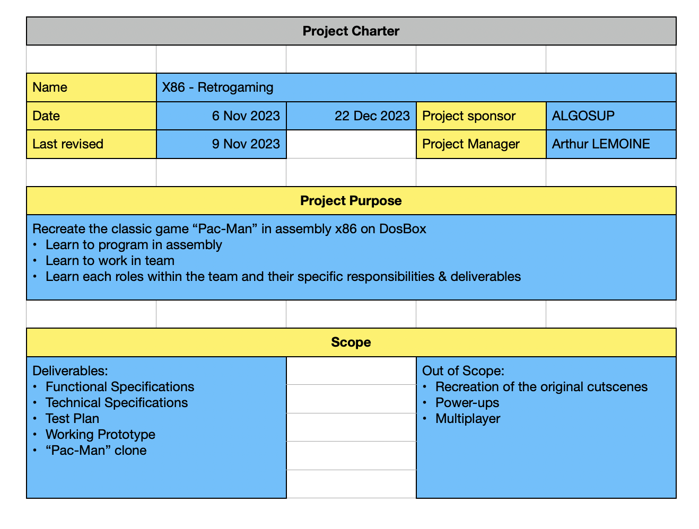
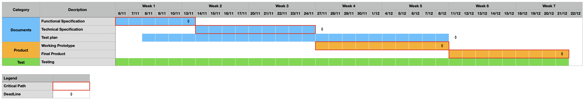
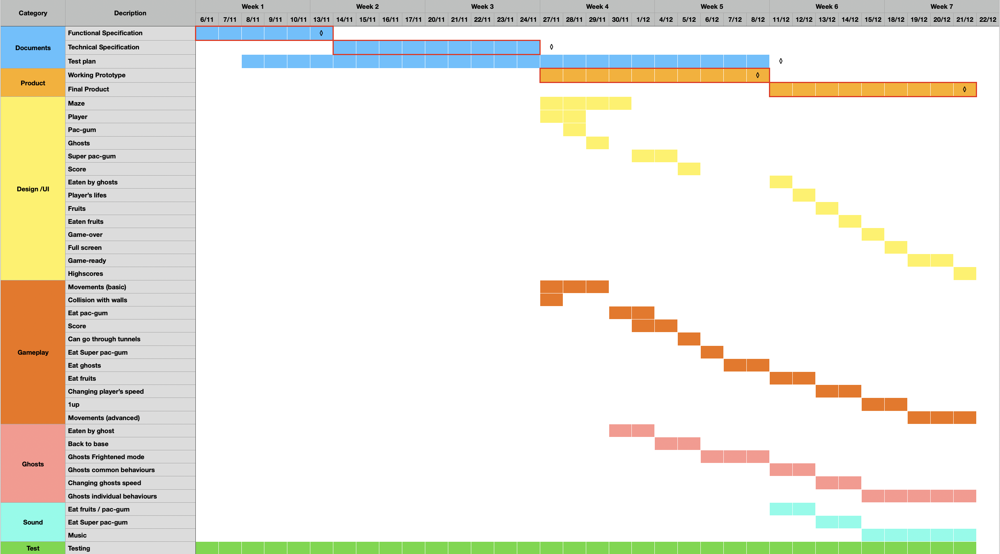

<h1 align="center">Management Documents</h1>

created : 9/11/2023 last modified : 9/11/2023

## Project Charter

## Gantt Diagram (Simplified)

## Gantt Diagram

## KPIs

To ensure the good planning and development of the project, we established different levels of KPIs which you can access by clicking [here](https://docs.google.com/spreadsheets/d/1MUhN09LY26xx3Y9Bf2SV9kg7pvHE6RO5z_qxr7fjH9M/edit?usp=sharing). These KPIs are used to determined the overall progression of the project and are divided in different categories or levels. Categories go from high level (Documents & Product) to low level (specific feature)