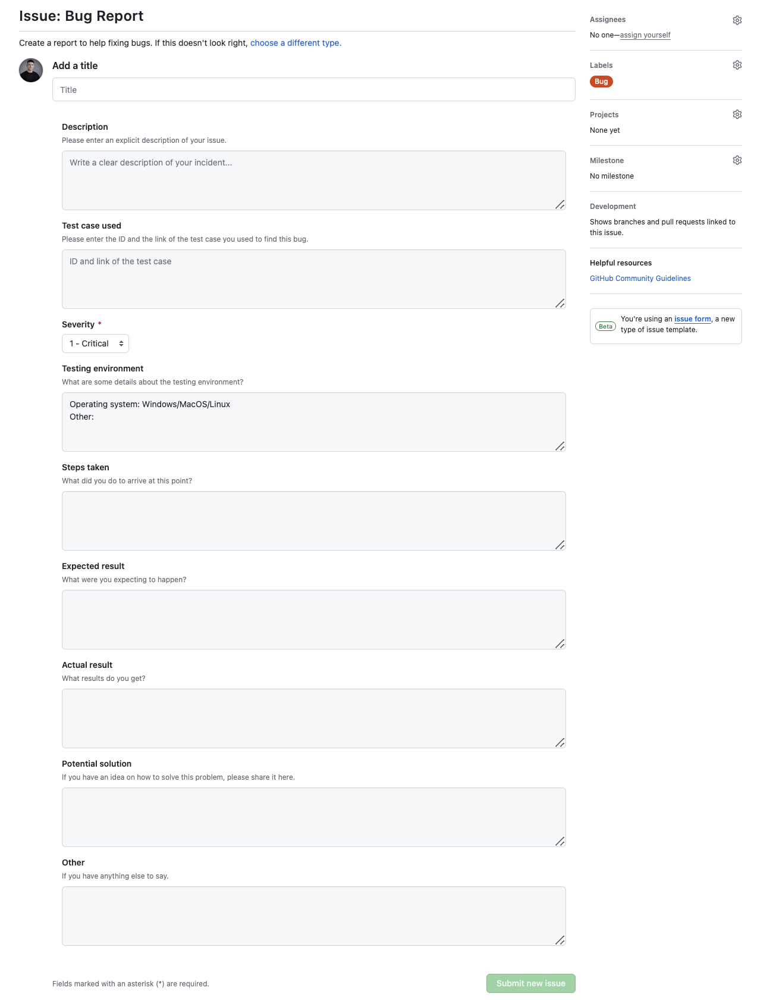

# Test Plan 

|Author|Robin DEBRY and Quentin CLÉMENT|
|---|---|
|Created|09/11/2023|
|Last Modified|08/12/2023|

## Test Plan approval

| Role | Name | Signature | Date |
|---|---|---|---|
| Project Manager | Arthur LEMOINE | | |
| Program Manager | Max BERNARD | | |
| Tech Lead | Mathis KAKAL | | |
| Software Developer | Pierre GORIN | | |
| Software Developer | Evan UHRLING | | |
| Quality Assurance | Robin DEBRY | | |
| Quality Assurance | Quentin CLEMENT | | |

## Table of Contents

- [Test Plan](#test-plan)
  - [Test Plan approval](#test-plan-approval)
  - [Table of Contents](#table-of-contents)
  - [1. Glossary](#1-glossary)
  - [2. Overview](#2-overview)
    - [a. Target audience](#a-target-audience)
      - [Former players](#former-players)
      - [New players](#new-players)
      - [Competitive players](#competitive-players)
    - [b. What is it used for?](#b-what-is-it-used-for)
    - [c. How will it work?](#c-how-will-it-work)
    - [d. What are the softwares/hardwares the game uses?](#d-what-are-the-softwareshardwares-the-game-uses)
      - [Assembly](#assembly)
      - [DOSBox](#dosbox)
      - [DOS](#dos)
      - [x86 CPU](#x86-cpu)
  - [3. Test strategy](#3-test-strategy)
    - [a. Quality assurance team](#a-quality-assurance-team)
    - [b. Testing scope](#b-testing-scope)
    - [c. Testing type](#c-testing-type)
      - [Agile testing](#agile-testing)
      - [Collaborative game-testing](#collaborative-game-testing)
    - [d. Define priorities](#d-define-priorities)
    - [e. Test tool](#e-test-tool)
      - [Operating system](#operating-system)
      - [GitHub](#github)
    - [f. Test cases](#f-test-cases)
    - [g. Bug reports](#g-bug-reports)
      - [By QA's](#by-qas)
      - [By users](#by-users)
  - [4. Test criteria](#4-test-criteria)
    - [a. Suspension criteria](#a-suspension-criteria)
      - [Environment issues](#environment-issues)
      - [Critical bugs](#critical-bugs)
    - [b. Entry criteria](#b-entry-criteria)
    - [c. Exit criteria](#c-exit-criteria)
  - [5. Plan test environment](#5-plan-test-environment)
    - [a. Test environment for Mac](#a-test-environment-for-mac)
    - [b. Test environment for Windows](#b-test-environment-for-windows)
  - [6. Schedule estimation](#6-schedule-estimation)
  - [7. Test deliverables](#7-test-deliverables)


## 1. Glossary

|Term|Definition|Source|
|---|---|---|
|Assembly|Assembly language is a low-level programming language for a computer, or other programmable device, in which there is a very strong (generally one-to-one) correspondence between the language and the architecture's machine code instructions. Each assembly language is specific to a particular computer architecture. In contrast, most high-level programming languages are generally portable across multiple architectures but require interpreting or compiling. Assembly language may also be called symbolic machine code.|[Wikipedia](https://en.wikipedia.org/wiki/Assembly_language)|
|DOSBox|DOSBox is an emulator program that emulates an IBM PC-compatible computer running a DOS operating system. Many IBM PC-compatible graphics and sound cards are also emulated. This means that original DOS programs (including PC games) are provided with an environment in which they can run correctly, even though modern computers have dropped support for that old environment. DOSBox is used by many retro gamers to run Doom on their modern computers or to play Quake while pretending it's still 1996. DOSBox-X is a fork of DOSBox. It has many new features, including support for Glide, PCI, and PCMCIA emulation.|[Wikipedia](https://en.wikipedia.org/wiki/DOSBox)|
|DOS|DOS is a platform-independent acronym for Disk Operating System which later became a common shorthand for disk-based operating systems on IBM PC-compatibles. DOS primarily consists of Microsoft's MS-DOS and a rebranded IBM version under the name PC DOS, both of which were introduced in 1981. Later compatible systems from other manufacturers are DR-DOS (1988), ROM-DOS (1989), PTS-DOS (1993), and FreeDOS (1998). MS-DOS dominated the IBM PC-compatible market between 1981 and 1995.|[Wikipedia](https://en.wikipedia.org/wiki/DOS)|
|CPU|A central processing unit (CPU), also called a central processor, main processor or just processor, is the electronic circuitry that executes instructions comprising a computer program. The CPU performs basic arithmetic, logic, controlling, and input/output (I/O) operations specified by the instructions in the program. This contrasts with external components such as main memory and I/O circuitry, and specialized processors such as graphics processing units (GPUs).|[Wikipedia](https://en.wikipedia.org/wiki/Central_processing_unit)|
|Open source|Open source is source code that is made freely available for possible modification and redistribution. Products include permission to use the source code, design documents, or content of the product. It most commonly refers to the open-source model, in which open-source software or other products are released under an open-source license as part of the open-source software movement. Use of the term originated with software, but has expanded beyond the software sector to cover other open content and forms of open collaboration.|[Wikipedia](https://en.wikipedia.org/wiki/Open_source)|

## 2. Overview

### a. Target audience

As testers, we will have to put ourselves in the shoes of the users. For this reason, we will have to determine all the possible different user types. By doing that, we will be able to test the product from different perspectives and make sure that it is suitable for all types of users.

#### Former players

The principal targetted audience is nostalgic gamers who have a fondness for classic arcade experiences. It's for those who remember the iconic Pac-Man of 1980 and want to relive the excitement of crunching pellets and escaping ghosts.

#### New players

The second targetted audience Pac-Man was really popular during the 80's and the 90's, afterwards it became less played and a lot of people never played the original Pac-Man game. This is why, newbies are also a targetted audience. They will be able to discover the game and the retro gaming world.

#### Competitive players

Competitive Pac-Man players are a tiny part of the target audience, but they do exist. These players will be aiming to beat their records, whether in terms of speed, score. But also to achieve the various challenges that are popular in this community.

### b. What is it used for?

The Pac-Man game serves as a delightful escape into the past, offering a virtual time machine to the golden era of arcade gaming. It's a source of entertainment and nostalgia, allowing players to immerse themselves in the simple yet addictive gameplay that made Pac-Man a timeless classic. Additionally, it can be a great way to introduce younger generations to the joy of retro gaming, fostering a sense of appreciation for the roots of the gaming industry. Overall, it's a fun and engaging experience that transcends generations.

### c. How will it work?

Given that this is an exact clone of the 1980 Pac-Man, the gameplay mechanics will faithfully replicate the original experience. Players will navigate through a maze, controlling the iconic yellow character to consume pellets while avoiding colourful ghosts. The controls will mimic the simplicity of the arcade joystick, ensuring an authentic feel for players. Here's a [link](https://www.nintendo.co.jp/clv/manuals/en/pdf/CLV-P-NABME.pdf) to the official instruction manual we'll be referring to.

The graphics and audio will stay true to the retro charm, maintaining the pixelated aesthetic and classic sound effects that defined the original Pac-Man. The game will be designed to run smoothly on modern platforms while preserving the nostalgic elements that make Pac-Man a timeless favourite.

### d. What are the softwares/hardwares the game uses?

The development of this Pac-Man clone involves a combination of software and hardware elements.

<!-- TODO -->

#### Assembly

We will use Assembly to develop the game. Assembly is a low-level programming language that is used to write programs that are directly executable by the computer's hardware.

#### DOSBox

DOSBox is a DOS emulator that uses the SDL library which makes DOSBox very easy to port to different platforms. We'll emulate the game on our computer to check, firstly, whether it can run in a real DOS environment with an x86 CPU. DOSBox has already been ported to many different platforms, such as Windows, BeOS, Linux, MacOS X...

#### DOS

DOSBox is just a DOS emulator but the real proof of the software working would be to test it in a DOS environment  . DOS is an acronym for Disk Operating System. It is a non-graphical command line operating system developed by Microsoft for IBM compatible computers.

#### x86 CPU

DOS 

## 3. Test strategy

### a. Quality assurance team

The testing team will be divided into 2 parts. The first half will be composed of team 3's QA's:

- Robin DEBRY (Mac OS)
- Quentin CLÉMENT (Mac OS)

The second half will be composed of team 4's QA's:

- Thomas PLANCHARD (Mac OS)
- Maxime CARON (Windows)

Sparing the testing team in 2 parts will allow us to test the game on 2 different OS (Windows and MAC) to be sure that the game works in each of them. As Thomas and Maxime are not part of our team and of the development of the project, their point of view will be completely different from ours and will allow us to have a more objective point of view on the quality of our product.

### b. Testing scope

The 2 main things to test during this project will be the documents and the game itself. 
\
About the documents, it's paramount to ensure their quality, so that communication with the client is clear and the whole team can work on the same basis. Not only will we check the documents for grammatical and typographical errors, but also the content itself, to ensure that no crucial points have been overlooked or erroneous elements introduced into the document.

As far as the game is concerned, we'll be testing all the features listed in the functional specifications to check that they correspond to what was originally intended. We will also be testing the game on different operating systems (Windows and MAC) to ensure that it works on all of them.

### c. Testing type

#### Agile testing

We are going to use an agile testing strategy so that as new features are released by the development team, and previous bugs are fixed, Team 3 QA's will have to be reactive and test them as soon as possible.

#### Collaborative game-testing

We'll also be doing game-testing sessions in collaboration with Team 4's QA team. The aim of having the game tested by another team is to have another approach to the game to find other bugs. As they have knowledge of the project and QA skills, we hope they will provide accurate and clear feedback to help us improve our own game.

On the other hand, we'll also be testing their game. We'll provide feedback to help them improve their game and find bugs they may not have noticed. It will also be interesting to see the things they could have done that we didn't think of.

The aim is to get two different and original end products, but of equal quality. \
They will open an issue and report the bugs they found on the game or the things they think could be improved. This issue will be named "Xth QA meeting with team 4 [dd/mm/yyyy]

### d. Define priorities

Priorities are a crucial point to determine which test has to be done first. It will be in corelation with priorities defined in the functional specifications.
There will be 4 explicit priorities:

- Critical
- High
- Medium
- Low

Priorities are not definitive, they can change during the development of the project. For example, if a high-priority feature is defined at the beginning of the project but seems too ambitious afterwards, it will be downgraded to a lower priority. <br>

### e. Test tool

#### Operating system

The different team members are working on different operating systems. Some are working on Windows, others on Mac OS. <br>
As the first step is to make it run on DOSBox, with our computer, we will have to test the game on different operating systems to be sure that it works on all of them. <br>
The final objective of this project is to run the game with DOS on a real x86 CPU. That's why the final tests will be done on a real x86 CPU with DOS. <br>

#### GitHub

As the project is hosted on GitHub, we will use the Issues feature to create tickets for test cases and bug reports. Thanks to that, when people look at our project, they will be able to see what has to be implemented and if they are bugs, what are they.

### f. Test cases

To be sure that all features and all possible bugs have been tested, test cases will be created via tickets on GitHub Issues. We will use this tool so that it is easy for QA's to see what has to be tested and what has already been tested. But also for the whole team to be aware of features that are not working yet or that haven't been implemented yet. That's why we've chosen to create tickets rather than a spreadsheet. <br>
A mention [TC] will be added to the title of each test case to make it easier to identify between all the issues. The creation date of the test case will also be added to the title. <br>
Each test case will be created on GitHub issues with the label "Test Case". <br>
The QA's and the people in charge of the feature will be set as assignees. <br>
A template for those tickets has been created and is stored in [testCase.yml](../../.github/ISSUE_TEMPLATE/testCase.yml). <br>


About the steps to reproduce, "launch the game" means launch DOSBox, run the executable file for the Pac-Man game on DOSBox and click on the single player button on the main menu. <br>

### g. Bug reports

#### By QA's

When a bug is found, a bug report will be created.
They will also be created via tickets on GitHub Issues so that it is easy for the development team to see when a bug has been found. <br>
When an update has been made to fix a bug, the QA will be notified via a comment on the ticket by the person who tried to resolve it. <br>
A mention [BR] will be added to the title of each bug report to make it easier to identify between all the issues. The date on which the bug was last reported will also be added to the title. <br>
Each bug report will be created on GitHub issues with the label "Bug". <br>
The people in charge of resolving the bug will be set as assignees. <br>
A template for those tickets has been created and is stored in [bugReport.yml](../../.github/ISSUE_TEMPLATE/bugReport.yml). <br>



#### By users

As the project is open source, everyone can access it and try it at every moment. <br>
It's paramount to receive the feedback of the users to improve the game. Non-stakeholders have a different point of view on the project and on the game itself. They will be able to see things that we didn't see and give us feedback on the game. <br>
Because of that, they might find bugs that we didn't see. If they find a bug they will be able to check on GitHub Issues if it has already been reported. If it has already been reported, they will be able to add a comment to the ticket to say that they also encountered the bug. If it hasn't been reported yet, they will be able to create a new ticket to report the bug. They could either use the bug report template with the "Bug" label or open a blank ticket to develop their bug report. <br>

## 4. Test criteria

### a. Suspension criteria

The objective of suspension criteria is to prevent wasted effort and resources. If testing cannot proceed effectively due to defects, environmental issues, or other roadblocks, it makes sense to pause testing activities until these issues are resolved. This allows for more efficient use of testing resources and can help ensure the accuracy and validity of test results.


If a suspension criterion is reached, the QA team will help the development team resolve the issue before restarting the test cycle.

#### Environment issues

If for some reason, we start to encounter problems due to DOSBox or another mandatory software/hardware, we will suspend the test cycle until the problem is resolved.

#### Critical bugs

Critical bugs are bugs that prevent the game from working properly and from implementing new features before resolving those bugs.
If we encounter a critical bug, we will suspend the test cycle until the bug is resolved.

### b. Entry criteria


As the name specifies, entry criteria are a set of conditions or requirements, which are required to be fulfilled or achieved to create a suitable & favourable condition for testing. Finalised & decided upon after a thorough analysis of software & business requirements, entry criteria ensure the accuracy of the testing process and neglecting it can impact its quality.

- Testable code is available.

- Verify if the unit tests are ready.

- Verify if the test environment is working: the computer, DOSBox and GitHub Issues (if GitHub Issues are not working, we will report bugs via a spreadsheet).
  
- Verify if the test cases have been written.

### c. Exit criteria

Exit criteria should specify the conditions and requirements that are required to be achieved or fulfilled before the end of the software testing process. With the assistance of exit criteria, we will be able to conclude the testing without compromising the quality and effectiveness of the software.
Here are the ones we will apply for this project:

- Verify if all tests planned have been run.

- Verify if the level of requirement coverage of 80% has been met.

- Verify if there are no critical or high-severity defects that are left outstanding.

- Verify if all high-risk areas are passing the tests.

- Verify if all medium and low-severity bugs have been reported via issues.

- Verify if the whole code has been commented.
  
## 5. Plan test environment

We want to test the game on different operating systems to be sure that it works on all of them. Because of that it is important to ensure that the set up of the test environment is the same for everyone. 

Changing DOSBox preferences is mandatory to have the best experience possible. This step is explained in the [technical specifications](../technicalSpecifications.md). 

### a. Test environment for Mac

To test the game on MacOS, we will use NASM to compile the game and DOSBox to run it. \
To install them, we will use Homebrew in the command line. ([install brew](https://brew.sh/) if it's not already installed on your computer) \
[Install NASM](https://formulae.brew.sh/formula/nasm) in the command line:

```bash
brew install nasm
```

[Install DOSBox](https://formulae.brew.sh/formula/dosbox) in the command line:

```bash
brew install dosbox
```

To compile the game and DOSBox we will use a bash file named [buildGame.sh](../../tools/main). Use this command to go the good folder (we assume you already are in the project folder):
```bash
cd tools
```

Then run this command to compile the game and DOSBox:
```bash
chmod +x buildGame.sh
```

Finally, run this command to build the game:

```bash
./buildGame.sh
```

### b. Test environment for Windows

To test the game on MacOS, we will use NASM to compile the game and DOSBox to run it. \
[Install NASM](https://www.nasm.us/pub/nasm/releasebuilds/?C=M;O=D) and [DOSBox](https://www.dosbox.com/wiki/Basic_Setup_and_Installation_of_DosBox) on your computer.

Now double click on buildGame.cmd to compile and build the game and DOSBox. You can also do it manually with the following commands (we assume you already are in the project folder):

```cmd
cd tools\buildGame.cmd
```

## 6. Schedule estimation

For this schedule we estimate the time needed to complete each task. We are 2 QA's working on this project.
We will work for 7 weeks on this project.

| Task | Subtask | Time estimation |
|------|---------|-------------|
|Analyse requirement specification| - Review functional specifications <br> - Review technical specification| - 8 hours <br> - 8 hours
| Create the test specification|  - Create the test plan <br> - Create test cases <br> - Review the test cases|- 48 hours <br> - 16 hours <br> - 4 hours
|Execute the test cases| - Build up the test environment <br> - Execute the test cases <br> - Update test cases status|- 4 hours <br> - 40 hours <br> - 16 hours
|Report the bug| - Create bug reports <br> - Create bug data report | - 24 hours <br> - 24 hours

At the end of the project with this estimation, we will have spent 192 hours on the QA's part for this project. <br>

## 7. Test deliverables

- **Test plan/test strategy:** define the testing strategy and how the tests will be done.
- **Test cases:** define all the test that will be done to be sure that the game works as intended.
- **Bug reports:** report all the bugs that have been found during the tests.
- **Bug data report:** to have a global view of the bugs that have been found during the tests.
