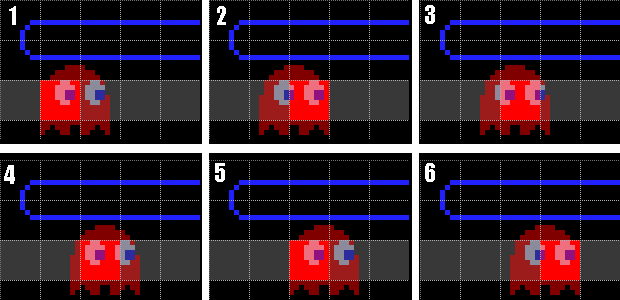
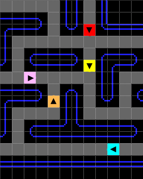
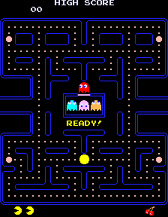
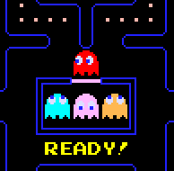
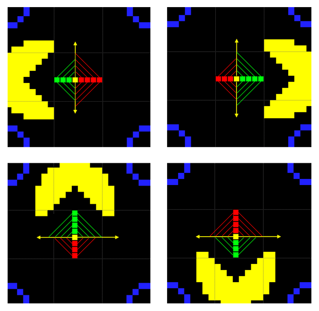

# Technical Specifications


| Role | Name | Signature | Date |
|---|---|---|---|
| Project Manager | Arthur LEMOINE | ✅ | 11/27/2023 |
| Program Manager | Max BERNARD | ✅ | 11/27/2023 |
| Tech Lead | Mathis KAKAL | ✅ | 11/27/2023 |
| Software Developer | Pierre GORIN | ✅ | 11/27/2023 |
| Software Developer | Evan UHRLING | ✅ | 11/27/2023 |
| Quality Assurance | Robin DEBRY | ✅ | 11/27/2023|
| Quality Assurance | Quentin CLEMENT | ✅ | 11/27/2023|


<details>

<summary>

## Table of Content

</summary>

- [1. Introduction](#1-introduction)
 	- [Document Purpose & Definition](#document-purpose--definition)
 	- [Glossary](#glossary)
 	- [Project Overview](#project-overview)
  		- [Project Brief](#project-brief)
  		- [Requirements](#requirements)
			- ➭ [Setting up the Development Environment](#setting-up-the-development-environment)
      				- [Hardware Requirements](#hardware-requirements)
      				- [Software Requirements](#software-requirements)
				- [Coding Methodology](#coding-methodology)
					- [Workflow](#-workflow)
					- [Coding Conventions](#-coding-conventions)
					- [Commenting Conventions](#-commenting-conventions)
					- [Documenting Conventions](#-documenting-conventions)
					- [Test-Driven Development](#-test-driven-development)
			- ➭ [Setting up the Game](#setting-up-the-game)
				- [Hardware requirements](#hardware-requirements-1)
				- [Software requirements](#software-requirements-1)
  		- [Assumptions & Constraints](#assumptions--constraints)
- [2. Technical Specification](#2-technical-specifications)
	- [Folder Structure](#folder-structure)
	- [Data Structures](#data-structures)
 		- [Maze Representation](#maze-representation)
 		- [Ghost Representation](#ghosts-representation)
 		- [Pac-Man Representation](#pac-man-representation)
 		- [Fruits Representation](#fruits-representation)
 		- [Game Representation](#game-state)
 		- [Score Representation](#score)
 		- [Lives Representation](#lives)
 		- [Colours Representation](#colours)
	- [Interaction](#interaction)
 		- [Movement/Direction](#movement-direction)
	- [Graphics](#graphics)
 		- [Orientation](#orientation)
 		- [Grid System](#grid-system)
 		- [User Interface](#user-interface)
  			- [Splash Screen](#-splash-screen)
  			- [Menu](#-menu)
  			- [Font](#-font)
  			- [Displaying the Score](#-displaying-the-score)
	- [Placement, Movement & Collision](#placement-movement--collision)
 		- [Placement](#placement)
   			- ➭ [Actor's tile positioning](#-actors-tile-positioning)
   			- ➭ [Pac-Man spawn](#-pacman-spawn)
   			- ➭ [Ghosts' spawn](#-ghost-spawn)
   			- ➭ [Gum & Super Gums spawn](#-gums--super-gums-spawn)
   			- ➭ [Fruits' spawn](#-how-fruits-spawn)
 		- [Movement](#movement)
			- ➭ [Player](#-player)
				- [Player Speed](#-player-speed)
				- [Eating Gum stops you](#-eating-gum-stops-you)
				- [Eating Super Gums stop you even more](#-eating-super-gum-stops-you-even-more)
				- [Cornering](#-cornering)
				- [Fright Mode](#-fright-mode)
				- [Side Teleporting](#-side-teleporting)
			- ➭ [Ghosts](#-ghosts)
				- [Picking Directions](#picking-directions)
				- [Intersections](#intersections)
				- [Scatter & Chase](#scatter--chase)
				- [Frightened Mode](#frightened-mode)
				- [Ghosts' Speed](#ghosts-speed)
				- [Ghosts' leaving mechanism](#ghosts-leaving-mechanism)
				- [Ghost's eaten back to base mode](#ghosts-eaten-back-to-base-mode)
				- [Ghost's target tiles](#ghosts-target-tiles)
				- [Red Ghost (Blinky)](#red-ghost-blinky)
				- [Pink Ghost (Pinky)](#pink-ghost-pinky)
				- [Blue Ghost (Inky)](#cyan-ghost-inky)
				- [Orange Ghost (Clyde)](#orange-ghost-clyde)
				- [Forbidden areas](#forbidden-areas)
		- [Collision](#collision)
	- [Scoring](#scoring)
 		- [Incrementing Score](#incrementing-score)
   			- ➭ [Eating a Gum](#eating-a-gum)
   			- ➭ [Eating a Super Gum](#eating-a-super-gum)
   			- ➭ [Eating Ghosts](#eating-ghosts)
   			- ➭ [Eating Fruits](#eating-fruits)
   			- ➭ [10k Extra Life](#10k-extra-life)
 		- [Saving Score in memory and leaderboard mechanics](#saving-score-in-memory-and-leaderboard-mechanics)
	- [Animation](#animation)
 		- [How Animations are Played](#defining-how-animations-are-played)
 		- [Defining the Different Animations and Their Triggers](#defining-the-different-animations-and-their-trigger)
- [3. Conclusion](#3-conclusion)
	- [Thanks](#thanks)
	- [Extras](#extras)
		- [All Value Tables](#all-value-tables)

</details>

# 1. Introduction

# Document Purpose & Definition

The goal of the Technical Specifications is to take the Functional Requirements which defines the features, scope and goals of the project, to dissect each requirement and turn it into instructions, as clear as possible, to guide the development team as well as the quality assurance team in the successful completion of their mission.

We therefore encourage thorough reading of the [Functional Specifications](https://github.com/algosup/2023-2024-project-2-x86-retrogaming-team-3/blob/main/documents/functionalSpecifications.md) before further reading.

The goal of the Technical Requirements is to clarify as many dark areas as possible to avoid the engineers making decisions
In a sense, while the Functional Requirements represent the "What/Why" aspect of the project, the Technical Requirements are supposed to represent the "How" of the project.

With that being said, we will try to cover as many functional and non-functional aspects of the project while making technological and architectural decisions, evaluating those decisions, measuring their associated risks and impact (providing mitigation) and compare those to other potential solutions.

The document should also benefit other stakeholders and project owners by giving insight into our methodology and may serve as a future reference for maintenance or simple documentation purposes.

# Glossary

- 16-32 bits processor architecture: 32-bit or 16-bit, in computer systems, refers to the number of bits that can be transmitted or processed in parallel. In other words, 32-bits the number of bits that compose a data element. A bit is the fundamental unit of storage that can only be equal to one or zero. Therefore, if compared to water plumbing, a 32-bit wide pipe will be able to carry twice as much water as a 16-bit wide one.
- 486 or 586 (pentium) instruction sets refers to families of intel processors, that started in 1989 and that was succeeded by the 586 (Pentium) family, which started in 1993. Those processors have specific instructions that we must use for our project.
- MS-DOS: Is a flavor of DOS, an operating system bought by Microsoft before they had the opportunity to develop their own OS foundation, known as NT (New Technology)
- Emulator: In computing, an emulator is hardware or software that enables one computer system to behave like another computer system. An emulator typically enables the host system to run software or use peripheral devices designed for the guest system. In our case, most of our operating systems don't allow to run programs developed for architectures as old as x86 COM programs. We therefore use an emulator to simulate this old school environment and make the process less cumbersome.

# Project Overview

## Project Brief

As stated in the Functional Requirements, the goal of the Project is to make a Pac-Man clone that should be functional on an x86 processor architecture, In Assembly.  

We have been given 7 weeks to complete this project 
Upon dissecting the game we have discovered that Pac-Man has more complexity than it might seem on the surface and you will see later on that we have willingly cut some features off for the project to be completed in the given timeframe. 

## Requirements

Even though this document attempts to be as exhaustive and demonstrative as possible, it is expected that its reader possesses some basic knowledge of game design and x86 Assembly as well as using a command-line utility.

As stated in the FRD the target platform for the game is any computer compatible with an x86 processor, preferably 16 to 32 bits  and using either the 486 or 586 instruction sets.

This makes the development a slightly tedious since those a outdated specs for today's standards.
This is why we are using DOSBOX, a DOS emulator to facilitate the development process.

As a MS-DOS emulator, DOSBOX allows us to to run our x86 DOS programs easily and in a portable fashion, meaning that both PC and Mac team members will be able to run and test the program, which will prove useful during the development process.

## Setting up the development environment

The first step is to set up the development environment, which we can define as follows:

### Hardware Requirements

- A working computer
- An input method e.g. a keyboard, mouse, screen.
- Joystick

### Software Requirements

- Supposedly, any OS that supports DOSBOX
- Any text editor ( [VSCodium](https://vscodium.com) or [VSCode](https://code.visualstudio.com/) are recommended) [x86 NASM 2.16.01/](https://www.nasm.us/pub/nasm/releasebuilds/2.16.01/)
- The Netwide assembler, which we will use to assemble our code.
[DOSBOX 0.74-3](https://www.dosbox.com/download.php?main=1) or above (latest stable release is recommended although compatibility is only guaranteed for version 0.74-3)
- Recommended: x86 syntax highlighting extension [https://marketplace.visualstudio.com/items?itemName=13xforever.language-x86-64-assembly](x86 syntax highlighting extension)
- Recommended: Turbo Debugger [Turbo Debugger](https://github.com/mathiskakal/algosup-workshop/tree/master/tools/8086) for debugging our program in DOSBOX
- Github or any other source control management, [Github](https://github.com/) GitHub is recommended for this task.
[Linear.io](https://linear.app/) (app or web app) (the Dev management tool that syncs well with Github issues)

### Coding Methodology

#### ➭ <ins>Workflow</ins>

The development team started to work on the basic features of the project such as rendering sprites, handling collisions, adding score etc. before the specifications were fully understood and laid out.

Once the Functional Specifications are dissected in the Technical Specifications, the functions and features of the game are all mirrored in Linear as "Issues" which we prefer to call "tickets" internally to remove the negative meaning from them.
Each of those tickets are then sent to triage, assigned to team members and prioritised by either the Project Manager or the Tech Lead, depending on the task.

Each ticket represents a chunk of work, a bug found, a feature request, an update. This abstraction allows to keep track of many types of tasks, break them down even more and allows to move forward swiftly.
We will touch more on that at the end of this document.

#### ➭ <ins>Coding conventions</ins>

camel case, all sprites and variables declared at the same place (in the beginning)
section data above and section text below
explicit functions naming convention

#### ➭ <ins>Commenting Conventions</ins>

Comment near 100% of the Functions in the code

#### ➭ <ins>Documenting Conventions</ins>

We will generate documentation automatically for this project, along with the other deliverables provided in this repository.
A user manual will also be included.

#### ➭ <ins>Test-Driven Development</ins>

We have defined that the following functions are the most important to be tested:
- Movement
- Collision
- Scoring
- AI
  
Due to the complex nature of Assembly, a higher level language like C++ will be used to perform the tests.

## Setting up the game

### Hardware Requirements

- Processor: Any processor capable of running an OS, itself capable of running DOSBOX and later x86 processor for stage 2 of the Project.
- Input devices: Keyboard, Mouse and/or Joystick
- Memory Requirements: 512MB RAM
- Sound Output Device
- Screen List minimal resolution 320x200 is the minimal resolution for running the game, and is DOSBOX's standard resolution
  
### Software Requirements

- Any Operating system supported by DOSBOX (DOSBOX is supposedly fully portable, although we haven't tested it yet)
DOSBOX version 0.74-3
- Programming language (NASM version 2.16.01)
  
## Assumptions & Constraints

| Assumptions | Constraints |
|---|---|
| We assume that DOSBOX is fully portable on all the platforms specified on their website, as we have 3 OSes (MacOS, Windows 11 and Debian (Linux). | Pac-Man has a lot of features, some of which we will have to scope out. |
| We assume that DOSBOX is well maintained and is reliable and will remain in the near future. | The game has to be exclusively developed in Assembly. |
| As this is a university project that is not intended to generate profits, we assume that copyrights will not be an issue. | We need to develop the sotfware for an x86 processor from the 486 or 586 generations. We must therefore use the instruction sets related to those processors. |

# 2. Technical Specifications

The technical Specifications will attempt to go through the development process of the game.

## Folder Structure

The folder structure of the x86 assembly project dedicated to the creation of a Pac-Man clone is defined as follows, according to the requirements of assembly language programming and the multiple facets of game development:

`/src`: This principal directory houses all the source code in assembly language. The contents include:

`main.asm`: Core game logic and initialization code.

`rendering.asm`: Graphics rendering routines for drawing the game environment.

`inputHandling.asm`: Input processing routines for player and system inputs.

`gameLogic.asm`: Game state management and gameplay rules implementation.

`ghostsAI.asm`: Artificial intelligence routines for ghost behavior.

`audioManagement.asm`: Audio processing routines for sound effects and music.

`mainMenu.asm`: Code for the main menu interface and navigation.

`sprites.asm`: Sprite data and metadata for the game’s visual assets.

`/bin`: This directory is allocated for the compiled output of the source code, consisting of:

`game.com`: The primary executable file of the game ready for distribution and execution.

`/docs`: Documentation related to the project is maintained here, formatted in Markdown for ease of access and editing. It includes:

`FunctionalSpecifications.md`: Describes the game’s intended functionality and user interaction.`

`TechnicalSpecifications.md`: Details the technical approach, including algorithms, data structures, and system design.

`TestPlan.md`: Outlines the testing procedures, criteria, and benchmarks for quality assurance.

*__Inside the /docs directory, there is a /management subdirectory, which further contains:__*

`/docs/management/WeeklyReport.md`: A log of weekly progress reports detailing development updates (there is one document like this for each weeks).

`/docs/management/management.md`: Documents related to project management, including task assignments and milestones.

*__Additionally in the /docs directory, there is also a /src subdirectory, which stores all media assets used in the documentation, such as images and audio files, each document type within the /docs directory has its corresponding subdirectory to organize related media assets:__*

`/docs/src/technicalSpecifications`: Contains images and audio pertinent to the technical specifications.

`/docs/src/functionalSpecifications`: Houses media related to functional specifications.

`/docs/src/QA`: Stores quality assurance related media.

`/docs/src/management`: Organizes media for management documentation.

`/docs/src/readme`: Contains assets for the README documentation.

`/tools`: This directory includes auxiliary tools and utilities that facilitate development, such as:

`NASM.exe`: The Netwide Assembler used for compiling assembly code.

`DOSBox.exe`: An x86 emulator with DOS compatibility for testing and running the game in a controlled environment.

`buildGame.sh`: A shell script for automating the build process on Unix-like systems.

`buildGame.cmd`: A command script for automating the build process on Windows systems.

`/tests`: Dedicated to the testing phase, this directory contains:

`testScript.asm`: Assembly test scripts designed to validate individual units of game code and integrated subsystems.

`.github/ISSUE_TEMPLATE/`: This folder contains issue templates to standardize the submission of bug reports (`bugReport.yml`) and test cases (`testCase.yml`) on GitHub.

`.gitignore`: A configuration file that tells Git which files or directories to ignore in the project.

`readme.md`: This file serves as the project's README, offering an overview and essential information for anyone interacting with the repository.

This structure is crafted to promote ease of navigation, efficient workflow, and effective version control management, ensuring a streamlined development process and facilitating collaboration among team members.

The following diagram visualises the directory and file structure for the Pac-Man clone project, highlighting the organisation of source code, compiled binaries, documentation, development tools and tests.


## Data Structures

### Maze Representation

To represent the maze it's important to do a sprite for each part of the maze including different rotations parts: the simple wall, the double wall, the simple angle, and the double angle as well as a double angle wall. The size of the maze is 28x31.

### Ghosts Representation

To represent the ghosts, we will do two different parts one for the ghost in himself and 4 others for each direction of the eyes.

```asm
blinkyR  db 0x00, 0x00, 0x00, 0x00, 0x00, 0x28, 0x28, 0x28, 0x00, 0x00, 0x00, 0x00, 0x00, 0x00
db 0x00, 0x00, 0x00, 0x28, 0x28, 0x28, 0x28, 0x28, 0x28, 0x28, 0x00, 0x00, 0x00, 0x00
db 0x00, 0x00, 0x28, 0x28, 0x28, 0x28, 0x28, 0x28, 0x28, 0x28, 0x28, 0x00, 0x00, 0x00
db 0x00, 0x28, 0x0f, 0x0f, 0x28, 0x28, 0x28, 0x28, 0x0f, 0x0f, 0x28, 0x28, 0x28, 0x00
db 0x00, 0x0f, 0x0f, 0x0f, 0x0f, 0x28, 0x28, 0x0f, 0x0f, 0x0f, 0x0f, 0x28, 0x28, 0x00
db 0x00, 0x0f, 0x0f, 0x20, 0x20, 0x28, 0x28, 0x0f, 0x0f, 0x20, 0x20, 0x28, 0x28, 0x00
db 0x28, 0x0f, 0x0f, 0x20, 0x20, 0x28, 0x28, 0x0f, 0x0f, 0x20, 0x20, 0x28, 0x28, 0x28
db 0x28, 0x28, 0x0f, 0x0f, 0x28, 0x28, 0x28, 0x0f, 0x0f, 0x0f, 0x28, 0x28, 0x28, 0x28
db 0x28, 0x28, 0x28, 0x28, 0x28, 0x28, 0x28, 0x28, 0x28, 0x28, 0x28, 0x28, 0x28, 0x28
db 0x28, 0x28, 0x28, 0x28, 0x28, 0x28, 0x28, 0x28, 0x28, 0x28, 0x28, 0x28, 0x28, 0x28
db 0x28, 0x28, 0x28, 0x28, 0x28, 0x28, 0x28, 0x28, 0x28, 0x28, 0x28, 0x28, 0x28, 0x28
db 0x28, 0x28, 0x28, 0x28, 0x28, 0x28, 0x28, 0x28, 0x28, 0x28, 0x28, 0x28, 0x28, 0x28
db 0x28, 0x28, 0x00, 0x28, 0x28, 0x28, 0x00, 0x00, 0x28, 0x28, 0x28, 0x00, 0x28, 0x28
db 0x28, 0x00, 0x00, 0x00, 0x28, 0x28, 0x00, 0x00, 0x28, 0x28, 0x00, 0x00, 0x00, 0x28
```

That it is an example for the red ghost. The size needed to create the ghost is 14x14.

### Pac-man Representation

To represent Pac-man we will use the same system with the colours of Pac-man but the size of Pac-man is 13x13.
```asm
pacManStart  db 0x00, 0x00, 0x00, 0x00, 0x2C, 0x2C, 0x2C, 0x2C, 0x2C, 0x00, 0x00, 0x00, 0x00,
	   db 0x00, 0x00, 0x2C, 0x2C, 0x2C, 0x2C, 0x2C, 0x2C, 0x2C, 0x2C, 0x2C, 0x00, 0x00,
	   db 0x00, 0x2C, 0x2C, 0x2C, 0x2C, 0x2C, 0x2C, 0x2C, 0x2C, 0x2C, 0x2C, 0x2C, 0x00,
	   db 0x00, 0x2C, 0x2C, 0x2C, 0x2C, 0x2C, 0x2C, 0x2C, 0x2C, 0x2C, 0x2C, 0x2C, 0x00,
	   db 0x2C, 0x2C, 0x2C, 0x2C, 0x2C, 0x2C, 0x2C, 0x2C, 0x2C, 0x2C, 0x2C, 0x2C, 0x2C,
	   db 0x2C, 0x2C, 0x2C, 0x2C, 0x2C, 0x2C, 0x2C, 0x2C, 0x2C, 0x2C, 0x2C, 0x2C, 0x2C,
	   db 0x2C, 0x2C, 0x2C, 0x2C, 0x2C, 0x2C, 0x2C, 0x2C, 0x2C, 0x2C, 0x2C, 0x2C, 0x2C,
	   db 0x2C, 0x2C, 0x2C, 0x2C, 0x2C, 0x2C, 0x2C, 0x2C, 0x2C, 0x2C, 0x2C, 0x2C, 0x2C,
	   db 0x2C, 0x2C, 0x2C, 0x2C, 0x2C, 0x2C, 0x2C, 0x2C, 0x2C, 0x2C, 0x2C, 0x2C, 0x2C,
	   db 0x00, 0x2C, 0x2C, 0x2C, 0x2C, 0x2C, 0x2C, 0x2C, 0x2C, 0x2C, 0x2C, 0x2C, 0x00,
	   db 0x00, 0x2C, 0x2C, 0x2C, 0x2C, 0x2C, 0x2C, 0x2C, 0x2C, 0x2C, 0x2C, 0x2C, 0x00,
	   db 0x00, 0x00, 0x2C, 0x2C, 0x2C, 0x2C, 0x2C, 0x2C, 0x2C, 0x2C, 0x2C, 0x00, 0x00,
	   db 0x00, 0x00, 0x00, 0x00, 0x2C, 0x2C, 0x2C, 0x2C, 0x2C, 0x00, 0x00, 0x00, 0x00,
```

We will need each sprites for each animations of the Pac-man

### Fruits Representation

To represent each fruits we will use the same system use before with the colours of each fruits. The size of each fruits is 12x12.

```asm
strawberry db 0x00, 0x00, 0x00, 0x00, 0x00, 0x0F, 0x00, 0x00, 0x00, 0x00, 0x00, 0x00
     db 0x00, 0x00, 0x30, 0x30, 0x30, 0x0F, 0x30, 0x30, 0x30, 0x00, 0x00, 0x00
     db 0x00, 0x28, 0x28, 0x30, 0x30, 0x30, 0x30, 0x30, 0x28, 0x28, 0x00, 0x00 
     db 0x28, 0x28, 0x28, 0x28, 0x28, 0x30, 0x28, 0x28, 0x28, 0x0F, 0x28, 0x00
     db 0x28, 0x0F, 0x28, 0x28, 0x28, 0x28, 0x28, 0x0F, 0x28, 0x28, 0x28, 0x00
     db 0x28, 0x28, 0x28, 0x0F, 0x28, 0x0F, 0x28, 0x28, 0x28, 0x28, 0x28, 0x00
     db 0x28, 0x28, 0x28, 0x28, 0x28, 0x28, 0x28, 0x28, 0x0F, 0x28, 0x28, 0x00
     db 0x00, 0x28, 0x0F, 0x28, 0x28, 0x0F, 0x28, 0x28, 0x28, 0x28, 0x00, 0x00
     db 0x00, 0x28, 0x28, 0x28, 0x28, 0x28, 0x28, 0x28, 0x28, 0x28, 0x00, 0x00
     db 0x00, 0x00, 0x28, 0x28, 0x0F, 0x28, 0x28, 0x0F, 0x00, 0x00, 0x00, 0x00
     db 0x00, 0x00, 0x00, 0x28, 0x28, 0x28, 0x28, 0x28, 0x00, 0x00, 0x00, 0x00
     db 0x00, 0x00, 0x00, 0x00, 0x00, 0x28, 0x00, 0x00, 0x00, 0x00, 0x00, 0x00
```

### Game State

You need a variable to know the game state at any given time to implement to win or loss states.

### Score

You need a variable to know the score, to display it and to update it when you eat gum, eat super gum and when you eat a ghost.

### Lives

You need a variable to display the number of lives you have at the beginning you have 4 lives, you lose 1 life when a ghost hits you, and you earn 1 extra life when you reach 10,000 points.

### Colours

- The colours 0x0F is a white colour so you need to use it for the cherry, the strawberry, the apple, the melon, the bell, the key, the gum, the super-gum and the eyes of the ghosts.
- The colours 0x28 is a red colour so you need to use it for the cherry, the strawberry, the apple, the galaxian and is the colours of Blinky(the red ghost).
- The colours 0x2C is a yellow colour so you need to use it for the galaxian, the bell and the Pac-Man.
- The colours 0x42 is a orange colour so you need to use it for the orange and Clyde(the orange ghost).
- The colours 0x20 is a blue colour so you need to use it for the eyes of each ghosts, for each ghost when they are in the frightened mode and the walls of the maze.
- The colours 0x34 is a cyan colour so you need to use it for the bell, the key and Inky(the cyan ghost).
- The colours 0x40 is a green colour so you need to use it for the orange and the melon
- The colours 0x54 is a pink colour so you need to use it for Pinky(the pink ghost.
  
## Interaction

### Movement Direction

> [!NOTE]
> Tell more about the final choices made.

For the movement, we need at the beginning 4 different functions for each direction but before that, you need to tell the program you will use the keyboard for that you need to implement this.

```asm
mov ah, 01h
int 16h
jz gameLoop ; If no key was pressed, jump back to the top of the loop
mov ah, 00h
int 16h     ; Read the key
cmp ah, 48h ; Up arrow key
je moveUp
cmp ah, 4Bh ; Left arrow key
je moveLeft
cmp ah, 4Dh ; Right arrow key
je moveRight
cmp ah, 50h ; Down arrow key
je moveDown
```

After that you will create each function moveUp,moveLeft,moveRight and moveDown in these functions you will implement the movement when you press a key.

## Graphics

### Orientation

We will preserve Pac-Man's default orientation (Portrait) and use DOSBOX's scaling abilities to improve game playability and visibility.

### Grid System

The visible game screen should be thought of as a regular grid of tiles, each eight pixels square. The actual pixel dimensions of the screen are 320 x 200. We will be downscaling the assets to 6x6 vs 8x8 in the original game to make it fit vertically.

The maze is 28x31 in tile dimensions which leave us with a 168x186 maze, while the left and right of the screens will be used for displaying the score, lives and other UI elemements originally located on above and below the maze.

The different data for each tile are explained both in the data structures and collision sections a little more extensively.

> [!NOTE]
> Paste the new grid here.


### User Interface

#### ➭ <ins>Splash Screen</ins>

> [!NOTE]
> Paste the screen here.

The splash screen for our Pac-Man-like game on x86 assembly will be displayed by setting the graphics mode and copying the splash screen image directly into video memory. This involves using basic assembly instructions to place the image data at the correct location in memory where the graphics hardware will read it and show it on the screen. 

We'll also set the colour palette to match the vibrant colours of the game. The process is orchestrated by the CPU until the splash screen is fully rendered and ready for player interaction.

#### ➭ <ins>Menu</ins>

> [!NOTE]
> Paste the image here.

For the menu in our Pac-Man-like game, the display will be simplified to show four options: "Single Player," "Multi-Player" (which will appear inactive or "greyed out"), "Credits," and "Exit." In assembly language on the x86 architecture, we will use a series of instructions to draw text on the screen for each menu item. 

The "Single Player" option will be selectable, while "Multi-Player" will be visually distinguished to indicate it is not selectable. Menu navigation can be implemented through keyboard interrupts, allowing the user to use the arrow keys to select an option and the enter key to confirm their choice. 

"Credits" will lead to a screen detailing the game's creators, and "Exit" will terminate the game.

The menu options will be strategically placed vertically on the screen, with "Single Player" at the top followed by the "Multi-Player" option, which will be visually distinguished to show it's not available. "Credits" and "Exit" will be listed below, each spaced evenly for clear selection using keyboard inputs.

#### ➭ <ins>Font</ins>

The font of the original Pac-Man video game in 1980, was made of 7 pixels in width and the same height, knowing each cell of the grid is composed of 8 pixels in width and height and we put one letter by cell each letter is spaced by 1 pixel.


In the image below, we can clearly see each pixel and its spacing.

</img>


We have chosen a 5x5 font that looks like the original game's one and added padding to the bottom and left sides to match the original font's spacing making it a 6x6 font. 

This is the font we will use in our game

> [!NOTE]
> Paste the font here.

#### ➭ <ins>Displaying the score</ins>

In the original game, the player's current score appears in the top left, with each digit occupying a single cell, while the high score is centrally displayed at the top of the screen. The current score is updated instantaneously as players collect pellets and overcome ghosts.

> In our version, the score has been moved to the left, while the maze and the game in itself is aligned to the right border of the screen

> [!NOTE]
> Paste the new render here.


## Placement, Movement & Collision

### Placement

#### ➭ <ins>Actors Tile Positioning</ins>

As the actors progress through the maze, the game keeps track of the tile each one occupies.

An actor is only associated with a single tile at a time, although its graphics will overlap with the surrounding tiles. The location of the actor's center point is what determines the tile it occupies at any given time. As the actors can move at pixel-level precision, they are often not centered directly on top of the tile they are in.

Consider the following example:



The underlying concept of tiles is essential for understanding the ghosts' pathfinding logic as it only cares about the tile an actor occupies—not its per-pixel location within that tile. To the logic routines, the five actors look very much like the picture below.

Each actor is defined by the tile it presently occupies along with its current direction of travel. Distances between actors are also measured in tiles (the pink ghost is five tiles away from Pac-Man horizontally and one tile away vertically, for example).




#### ➭ <ins>Pacman Spawn</ins>

Whether it is at the beginning of a game, at the beginning of a new level, or after a death, Pac-Man always (re)spawns at the same point in the maze, at the intersection of the tiles 14 and 15 (from left to right) and tile 28 from the top.




It is worth noting that Pac-Man's direction is set to "left" by default if left unattended.

#### ➭ <ins>Ghost Spawn</ins>

> [!NOTE]
> FIx ghost image with new sprites.

</img>

> From left to right and top to bottom: Pinky, Blinky, Clyde and Inky



> At the beginning of the Game, Inky, Pinky and Clyde appear in the ghost house.  
This area is off-limits for Pac-Man

Whenever a level is completed or a life is lost, the ghosts are returned to their starting positions in and around the ghost house before play continues. Blinky is always located just above and outside, while the other three are placed inside: Inky on the left, Pinky in the middle, and Clyde on the right (we'll introduce them later).

The pink door on top is used by the ghosts to enter or exit the house.

Since Blinky is already on the outside after a level is completed or a life is lost, the only time he can get inside the ghost house is after Pac-Man captures him, and he immediately turns around to leave once revived.

#### ➭ <ins>Gums & Super Gums Spawn</ins>

The 244 Gums should be placed on every single non-solid tile of the Maze apart from the two spawn tiles, the center square, its connectors to other sections as well as the two horizontal corridors, as seen in the image below, represented by the white Gums:


The 4 Super Gums can also be seen on this image, one per corner of the map (represented by the large white Gums).

Both Gums and super Gums respawn every new game or new level.

#### ➭ <ins>How Fruits spawn</ins>

Fruits are one of the features of the game that allows the player to score points.

Fruits always spawn right below the ghost house on one of the two tiles and are level dependent.

The first fruit appears after 70 gums have been cleared from the maze; the second one appears after 170 gums are cleared. Each fruit is worth anywhere from 100 to 5,000 points, depending on what level the player is currently on.

Whenever a fruit appears, the amount of time it stays on the screen before disappearing is always between nine and ten seconds, we will define it as 9,5 seconds to make things easier.

Fruits/Level:

| Level | Bonus Symbol | Bonus Points |
|---|---|---|
| 1 | Cherries | 100 |
| 2 | Strawberry | 300 |
| 3 | Peach | 500 |
| 4 | Peach | 500 |
| 5 | Apple | 700 |
| 6 | Apple | 700 |
| 7 | Grapes | 1000 |
| 8 | Grapes | 1000 |
| 9 | Galaxian | 2000 |
| 10 | Galaxian | 2000 |
| 11 | Bell | 3000 |
| 12 | Bell | 3000 |
| 13 | Key | 5000 |
| 14 | Key | 5000 |
| 15 | Key | 5000 |
| 16 | Key | 5000 |
| 17 | Key | 5000 |
| 18 | Key | 5000 |
| 19 | Key | 5000 |
| 20 | Key | 5000 |
| 21+ | Key | 5000 |

### Movement

#### ➭ <ins>Player</ins>

#### ➭ <ins>Player Speed</ins>

> [!NOTE]
> False information?.

Pac-Man moves exactly 80 pixels per second, or 10 tiles per second. All the other movement speeds in the game are computed from this speed.

The game starts with Pac-Man at 80% of his maximum speed. By the fifth level, Pac-Man is moving at full speed and will continue to do so until the 21st level. At that point, he slows back down to 90% and holds this speed for the remainder of the game.


| | PAC-MAN SPEED | | | |
|---|---|---|---|---|
| LEVEL | NORM | NORM Gums | FRIGHT | FRIGHT Gums |
| 1 | 80% | ~71% | 90% | ~79% |
| 2 – 4 | 90% | ~79% | 95% | ~83% |
| 5 – 20 | 100% | ~87% | 100% | ~87% |
| 21+ | 90% | ~79% | – | – |

#### ➭ <ins>Eating Gum stops you</ins>

Every time Pac-Man eats a regular gum, he stops moving for one frame (1/60th of a second), slowing his progress by roughly ten percent—just enough for a following ghost to overtake him.


#### ➭ <ins>Eating Super Gum stops you even more</ins>

Eating an energizer gum causes Pac-Man to stop moving for three frames.

#### ➭ <ins>Cornering</ins>

Pac-Man is able to navigate the turns in the maze faster than his enemies. He does not have to wait until he reaches the middle of a turn to change direction as the ghosts do (see picture below)


Whenever Pac-Man makes a pre-turn or post-turn, his orientation changes, and he starts to move one pixel in his new direction for every pixel traveled in his old direction, effectively doubling his speed as he moves at a 45 degree angle.

Once he reaches the centerline of the new direction's path, he starts moving purely in that direction and his speed returns to normal. The greatest distance advantage is thereby gained by making the earliest pre-turn possible. The illustration below shows the layout of pre-turn pixels (shown in green), center point pixels (shown in yellow), and post-turn pixels (shown in red) for each of the four possible directions a turn can be approached.



Basically, it pays to move the joystick well before reaching a turn to maximize your speed.

#### ➭ <ins>Fright Mode</ins>

Please refer to the Level Specifications in the extras to know how fright mode speed is affected throughout the different levels.

#### ➭ <ins>Side Teleporting</ins>

By default Pac Man and Ghosts can teleport from side to side of the map by crossing the border of it. However, they can only do it in the center of the map where the two corridors are placed, since the rest of the map is walled off.

The expected behaviour when entering either side of the corridors is to be teleported to the other side with Pac-Man's direction preserved.

#### ➭ <ins>Ghosts</ins>

##### <ins>Picking Directions</ins>

Ghosts are always thinking one step into the future as they move through the maze. Whenever a ghost enters a new tile, it looks ahead to the next tile along its current direction of travel and decides which way it will go when it gets there. When it eventually reaches that tile, it will change its direction of travel to whatever it had decided on a tile beforehand.

The process is then repeated, looking ahead into the next tile along its new direction of travel and making its next decision on which way to go.

When a ghost looks ahead into the upcoming tile, it must examine the possible exits from that tile to determine a way to proceed. In the picture below, the red ghost has just arrived at tile A and is moving right-to-left. It immediately looks ahead to tile B (the next tile along its direction of travel).

Each tile has four potential exits to be considered: right, left, up, and down. In the case of tile B, the up and down exits are blocked by walls and must be discarded as potential candidates. The right exit is also discounted because it would only take the ghost back to tile A again, and ghosts never voluntarily reverse direction.

With three of the four possible exits eliminated from tile B, moving left is the only remaining choice


##### <ins>Intersections</ins>

When a ghost arrives one tile away from an upcoming intersection, it must choose between several possible directions in which to proceed.


In the first picture, the red ghost has just reached tile A and is seeking its target (shown as the green tile). It immediately looks ahead to the subsequent tile along its present direction of travel (up). In this case, that tile is a four-way intersection.
As this intersection tile has no walls blocking off any of the exits, the ghost can only discard his reverse direction (down), leaving three exits open for travel. It looks one tile beyond the intersection in each of the three remaining directions, collecting “test tiles” (shown as the tiles with dashed, white lines).


In the middle picture, the ghost triangulates the distance from each of these test tiles to its target tile. Whichever direction's test tile has the shortest distance to the target becomes the direction the ghost will take upon reaching the intersection tile.
In this case, the right test tile has the shortest distance to the target, and the ghost updates its chosen direction for the intersection tile accordingly.

Sometimes, however, a ghost is presented with two or more test tiles that have the same distance to the target tile. In the example below, the red ghost must choose between moving down or left at the upcoming intersection tile. Unfortunately, both test tiles have the same distance to the target (bottom left).

To break the tie, the ghost prefers directions in this order: *up, left, down, right*. Up is the most preferred direction; right is the least. Therefore, the ghost chooses to go left at the intersection because left precedes down in the preference list.


##### <ins>Scatter & Chase</ins>

Ghosts alternate between scatter and chase modes during gameplay at predetermined intervals.

Scatter modes happen four times per level before the ghosts stay in chase mode indefinitely.

The scatter/chase timer gets reset whenever a life is lost or a level is completed. At the start of a level or after losing a life, ghosts emerge from the ghost pen already in the first of the four scatter modes.

This information is summarized in the following table (all values are in seconds):

| Mode | Level 1 | Level 2-4 | Level 5+ |
|---|---|---|---|
| Scatter | 7 | 7 | 5 |
| Chase | 20 | 20 | 20 |
| Scatter | 7 | 7 | 5 |
| Chase | 20 | 20 | 20 |
| Scatter | 5 | 5 | 5 |
| Chase | 20 | 1033 | 1037 |
| Scatter | 5 | 1/60 | 1/60 |
| Chase | ∞ | ∞ | ∞ |

##### <ins>Frightened mode</ins>

For levels 1 to 20, when Pac-Man eats a Super Gum, ghosts will enter a "frightened" mode, causing them to slow down, and to flash (see animations) and reverse direction. Starting from level 21, only the reversal of direction is the only effect that is still effective (the rest no longer applies).

When in this "frightened" mode, ghosts will act if scared and the game will use a PRNG generator to pick their next direction.
The PRNG generates an pseudo-random memory address to read the last few bits from.

These bits are translated into the direction a frightened ghost must first try. If the selected direction is not blocked by a wall or opposite the ghost's current direction of travel, it is accepted.

Otherwise, the code proceeds in a clockwise fashion to the next possible direction and tries again, repeating this test until an acceptable direction is found. The PRNG gets reset with the same intial seed value at the start of each new level and whenever a life is lost.

This results in frightened ghosts always choosing the same paths when executing patterns during play. As the levels progress, the time ghosts spend in frightened mode grows shorter until eventually they no longer turn blue at all (they still reverse direction, however).

| Level | Bonus Symbol | Bonus Points | Pac-Man Speed | Pac-Man Gums Speed | Ghost Speed | Ghost Tunnel Speed | Elroy 1 Gums Left | Elroy 1 Speed | Elroy 2 Gums Left | Elroy 2 Speed | Fright. Pac-Man Speed | Fright Pac-Man Gums Speed | Fright Ghost Speed | Fright. Time (in sec.) | # of Flashes |
|---|---|---|---|---|---|---|---|---|---|---|---|---|---|---|---|
| 1 | Cherries | 100 | 80% | ~71% | 75% | 40% | 20 | 80% | 10 | 85% | 90% | ~79% | 50% | 6 | 5 |
| 2 | Strawberry | 300 | 90% | ~79% | 85% | 45% | 30 | 90% | 15 | 95% | 95% | ~83% | 55% | 5 | 5 |
| 3 | Peach | 500 | 90% | ~79% | 85% | 45% | 40 | 90% | 20 | 95% | 95% | ~83% | 55% | 4 | 5 |
| 4 | Peach | 500 | 90% | ~79% | 85% | 45% | 40 | 90% | 20 | 95% | 95% | ~83% | 55% | 3 | 5 |
| 5 | Apple | 700 | 100% | ~87% | 95% | 50% | 40 | 100% | 20 | 105% | 100% | ~87% | 60% | 2 | 5 |
| 6 | Apple | 700 | 100% | ~87% | 95% | 50% | 50 | 100% | 25 | 105% | 100% | ~87% | 60% | 5 | 5 |
| 7 | Grapes | 1000 | 100% | ~87% | 95% | 50% | 50 | 100% | 25 | 105% | 100% | ~87% | 60% | 2 | 5 |
| 8 | Grapes | 1000 | 100% | ~87% | 95% | 50% | 50 | 100% | 25 | 105% | 100% | ~87% | 60% | 2 | 5 |
| 9 | Galaxian | 2000 | 100% | ~87% | 95% | 50% | 60 | 100% | 30 | 105% | 100% | ~87% | 60% | 1 | 3 |
| 10 | Galaxian | 2000 | 100% | ~87% | 95% | 50% | 60 | 100% | 30 | 105% | 100% | ~87% | 60% | 5 | 5 |
| 11 | Bell | 3000 | 100% | ~87% | 95% | 50% | 60 | 100% | 30 | 105% | 100% | ~87% | 60% | 2 | 5 |
| 12 | Bell | 3000 | 100% | ~87% | 95% | 50% | 80 | 100% | 40 | 105% | 100% | ~87% | 60% | 1 | 3 |
| 13 | Key | 5000 | 100% | ~87% | 95% | 50% | 80 | 100% | 40 | 105% | 100% | ~87% | 60% | 1 | 3 |
| 14 | Key | 5000 | 100% | ~87% | 95% | 50% | 80 | 100% | 40 | 105% | 100% | ~87% | 60% | 3 | 5 |
| 15 | Key | 5000 | 100% | ~87% | 95% | 50% | 100 | 100% | 50 | 105% | 100% | ~87% | 60% | 1 | 3 |
| 16 | Key | 5000 | 100% | ~87% | 95% | 50% | 100 | 100% | 50 | 105% | 100% | ~87% | 60% | 1 | 3 |
| 17 | Key | 5000 | 100% | ~87% | 95% | 50% | 100 | 100% | 50 | 105% | – | – | – | – | – |
| 18 | Key | 5000 | 100% | ~87% | 95% | 50% | 100 | 100% | 50 | 105% | 100% | ~87% | 60% | 1 | 3 |
| 19 | Key | 5000 | 100% | ~87% | 95% | 50% | 120 | 100% | 60 | 105% | – | – | – | – | – |
| 20 | Key | 5000 | 100% | ~87% | 95% | 50% | 120 | 100% | 60 | 105% | – | – | – | – | – |
| 21+ | Key | 5000 | 90% | ~79% | 95% | 50% | 120 | 100% | 60 | 105% | – | – | – | – | – |

##### <ins>Ghosts Speed</ins>

Ghost speeds throughout the levels can be seen in this table (they are expressed in % of Pac-Man's speed, which was described previously):

| | GHOST SPEED | | |
|---|---|---|---|
| LEVEL | NORM | FRIGHT | TUNNEL |
| 1 | 75% | 50% | 40% |
| 2 – 4 | 85% | 55% | 45% |
| 5 – 20 | 95% | 60% | 50% |
| 21+ | 95% | – | 50% |

##### <ins>Ghosts leaving mechanism</ins>

There are two scenarios for the mechanism which ghosts follow to know when to leave the ghost house:
- The first one is the default one, when a new game or level starts which makes use of a specific counter per ghost.
- The second one, after Pac-Man loses a life, and which makes use of a global counter.


In the first scenario (new game, new level):

The ghosts who are still in the house each have a counter. This counter is for tracking how many gums Pac-Man eats. Each gum counter is reset to zero when a level begins and can only be active when inside the ghost house house.

Only one ghost counter can be active at any given time regardless of how many ghosts are inside. The order of preference for choosing which ghost counter to activate is: Pinky, then Inky, then Clyde.

For every gum Pac-Man eats, the preferred Ghost in the house (if any) gets its gum counter increased by one. Each ghost has its gum limit associated with his counter, per level. If the most-preferred ghost  reaches or exceeds his gum limit, he immediately exits the house and its gum counter is deactivated but not reset.

The most preferred ghost still waiting inside the house (if any) proceeds to activate its timer at this point and begins counting gums.


The actual limit for each counter is determined by the level, while Pinky's counter is always set to zero, ultimately making him leave right after Blinky every time.
  
Here is the table defining those values:

  | Gum Limit | Ghost |
  |---|---|
  | Always zero | Pinky |
  | L1: 30; L2: zero; L3+: zero | Inky |
  | L1: 60; L2: 50; L3+: zero | Clyde |

In the second scenario (after life lost):

Whenever a life is lost, the system disables (but does not reset) the ghosts' individual gum counters and uses a global gum counter instead. This counter is enabled and reset to zero after a life is lost, counting the number of Gums eaten from that point forward. The three ghosts inside the house must wait for this special counter to tell them when to leave. Pinky is released when the counter value is equal to 7 and Inky is released when it equals 17.

The only way to deactivate the counter is for Clyde to be inside the house when the counter equals 32; otherwise, it will keep counting gums even after the ghost house is empty. If Clyde *is* present at the appropriate time, the global counter is reset to zero and deactivated, and the ghosts' personal gum limits are re-enabled and used as before for determining when to leave the house (including Clyde who is still in the house at this time). If gum counters were the only control, Pac-Man could simply stop eating gums early on and keep the ghosts trapped inside the house forever.

Once out of the box the Ghosts still have to choose whether they go left or right.

Ghosts will typically go left but if the game has changed modes while they were inside, they will go right upon leaving the house


</img>


##### <ins>Ghosts eaten back to base mode</ins>

Once ghosts are eaten by Pac-Man in fright mode, they will transform into the disembodied eyes and aim for going back to the base defined by the Green square, then aim for 3 blocks below, once they have reached it.

Once the tile is reached, the ghost reverts to its previous shape after being frozen for 3 frames and may exit again following the previously described sequence.

Once a ghost leaves, it cannot reenter unless it is first captured by Pac-Man.

The disembodied eyes can then return home to be revived.

Disembodied travel at three times Pac-Man's 100% speed


##### <ins>Ghosts' target tiles</ins>


Whenever a ghost is in chase or scatter mode, it is trying to reach a target tile somewhere on (or off) the screen.

A target tile is merely a way to describe the tile a ghost would like to occupy at any given moment. This tile can be fixed in place or change location frequently. Whenever the ghosts scatter to the corners of the maze, for example, each ghost is striving to reach a fixed target tile located somewhere near its home corner.


In chase mode, the target tile is usually (but not always) related to Pac-Man's current tile which changes often.

Although it may not be obvious at first, the only difference between chase and scatter mode to a ghost is where its target tile is located. The same pathfinding logic applies in either case.

##### <ins>Red Ghost (Blinky)</ins>


He is by far the most aggressive of the four and will pursue Pac-Man once behind him.


Of all the ghosts' targeting schemes for chase mode, Blinky's is the most simple and direct, using Pac-Man's current tile as his target. In the pictures above, we can see Blinky's target tile is the same as Pac-Man's currently occupied tile.

All ghosts move at the same rate of speed when a level begins, but Blinky will increase his rate of speed twice each round based on the number of Gums remaining in the maze. While in this accelerated state, Blinky is called “*Cruise Elroy*”.

On the first level, for example, Blinky becomes Elroy when there are 20 Gums remaining in the maze, accelerating to be as fast as Pac-Man. More importantly, his scatter mode behavior is also modified at this time to keep targeting Pac-Man's current tile in lieu of his typical fixed target tile for any remaining scatter periods in the level (he will still reverse direction when entering/exiting a scatter period).


This results in Elroy continuing to chase Pac-Man while the other three ghosts head for their corners as normal. As if that weren't bad enough, when only 10 Gums remain, Elroy speeds up *again* to the point where he is now moving faster than Pac-Man. As the levels progress, Blinky will turn into Elroy with more Gums remaining in the maze than in previous rounds.
Refer to the level specifications in the extras section for gum counts and speeds for both Elroy changes, per level.

##### <ins>Pink Ghost (Pinky)</ins>


In chase mode, Pinky behaves as he does because he does not target Pac-Man's tile directly. Instead, he selects an offset four tiles away from Pac-Man in the direction Pac-Man is currently moving (with one exception).
The pictures below illustrate the four possible offsets Pinky will use to determine his target tile based on Pac-Man's orientation:

If Pac-Man is moving left, Pinky's target tile will be four game tiles to the left of Pac-Man's current tile. If Pac-Man is moving right, Pinky's tile will be four tiles to the right. If Pac-Man is moving down, Pinky's target is four tiles below. Finally, if Pac-Man is moving up, Pinky's target tile will be four tiles up **and** four tiles to the left.


##### <ins>Cyan Ghost (Inky)</ins>


Inky uses the most complex targeting scheme of the four ghosts in chase mode. He needs Pac-Man's current tile/orientation **and** Blinky's current tile to calculate his final target.


To determine Inky's target, we must first establish an intermediate offset two tiles in front of Pac-Man in the direction he is moving (represented by the tile bracketed in green above). Now imagine drawing a vector from the center of the red ghost's current tile to the center of the offset tile, then double the vector length by extending it out just as far again beyond the offset tile. The tile this new, extended vector points to is Inky's actual target as shown above.

Inky's targeting logic will keep him away from Pac-Man when Blinky is far away from Pac-Man, but as Blinky draws closer, so will Inky's target tile.

##### <ins>Orange Ghost (Clyde)</ins>


Clyde is the last ghost to leave the pen and tends to separate himself from the other ghosts by shying away from Pac-Man and doing his own thing when he isn't patrolling his corner of the maze. Although not nearly as dangerous as the other three ghosts, his behavior can seem unpredictable at times and should still be considered a threat.


During chase mode, Clyde's targeting logic changes based on his proximity to Pac-Man (represented by the green target tile above). He first calculates the Euclidean distance between his tile and Pac-Man's tile.

If the distance between them is eight tiles or more, Clyde targets Pac-Man directly just as Blinky does. If the distance between them is less than eight tiles, however, Clyde switches his target to the tile he normally uses during scatter mode and heads for his corner until he gets far enough away to start targeting Pac-Man again.

In the picture above, Clyde is stuck in an endless loop (as long as Pac-Man stays where he is) thanks to this scheme. While occupying any tile completely outside the dashed perimeter, Clyde's target is Pac-Man. Upon entering the area, Clyde changes his mind and heads for his scatter target instead. Once he exits the perimeter, his target will change *back* to Pac-Man's current tile again. The end result is Clyde circling around and around until Pac-Man moves elsewhere or a mode change occurs.

##### <ins>"Forbidden" Areas</ins>


The marked in pink are areas where ghosts are forbidden to make upward turns during both scatter and chase modes, but are ignored during fright mode, While the red areas are always enforced.

### Collision

> [!NOTE]
> Remake this section with Evan's new info.

At any point in the game, the game must check for collisions from Pac-Man with the following elements:
- Walls
- Ghost Door
- Gums
- Super Gums
- Ghosts
- Frightened Ghosts
- Fruits

This will be done with a tileset (list) which will serve as an abstraction of the map and which will make the comparison easier for the game logic.

With this taken into consideration, a value should be given to each cell in this "collision map":
- 0: the cell is empty
- 1: the cell contains a ghost
- 2: the cell contains a frightened ghost
- 4: the cell contains a wall
- 5: the cell contains a Gum
- 6: the cell contains a Super-Gum
- 7: the cell contains a fruit
- 8: the cell contains Pac-Man
- To verify collisions we will compare the cell Pac-Mac collided with with previous values.

Character collisions:

If there is a collision between Pac-Man and a ghost it means there are both on the same cell. It will be represented with a result on the sum that is equal to 9 (1+9). If a cell value is equal to 9, the death event will be triggered.If there is a collision between Pac-Man and a frightened ghost, it means the sum is equal to 10 (2+8). If a cell value is equal to 10, the Pac-Man eating a ghost event will be triggered.

Environment collisions:

If there is a collision between Pac-Man and a wall, it means the sum is equal to 12 (4+8).

If a cell value is equal to 12, Pac-Man will not be able to go to the next cell in the same direction because it means that there is a wall.

If there is a collision between Pac-Man and a Gum, it means the sum is equal to 13 (5+8).

If a cell value is equal to 13, the Pac-Man eating a Gum event will be triggered.

If there is a collision between Pac-Man and a Super-Gum, it means the sum is equal to 14 (6+8). If a cell value is equal to 13, the Pac-Man eating a Super-Gum event will be triggered.If there is a collision between Pac-Man and a fruit, it means the sum is equal to 5 (7+8).

If a cell value is equal to 14, the Pac-Man eating a fruit event will be triggered.

## Scoring

### Incrementing Score

#### <ins>Eating a Gum</ins>

The score is incremented by 10 for eating one gum

#### <ins>Eating a Super Gum</ins>

The score is incremented by 50 for eating one super gum

#### <ins>Eating Ghosts</ins>

Eating ghosts give increasingly more points if done during one fright mode period.`

Here is the table describing bonus points you get for each consecutive ghost.

| Ghosts amount | points |
|---|---|
| 1st ghost | 200 |
| 2nd ghost | 400 |
| 3rd ghost | 800 |
| 4th ghost | 1600 |
#### <ins>Eating Fruits</ins>

Fruits, described earlier in "Placement" chapter, yield the following points to the player

| Fruit | Reward | Level |
|---|---|---|
| Cherry | 100 | 1 |
| Strawberry | 300 | 2 |
| Orange | 500 | 3 |
| Apple | 700 | 5-6 |
| Melon | 1000 | 7-8 |
| Galaxian | 2000 | 9-10 |
| Bell | 3000 | 11-12 |
| Key | 5000 | 13+ |

#### <ins>10k Extra life</ins>

An extra life is granted to the player every 10000 points earned.

The player starts with 3 lives.

The player cannot have more than 5 lives maximum.

### Saving Score in Memory and leaderboard mechanics

At the end of the game, the score must be saved into persistent memory and compared to a list of the ten best scores.

Upon first boot, the list is initialized with 0 entries

The current score is compared to the list starting from the bottom and inserted into it above a lower score and below a higher score as should be.

The previous last score of the list should disappear naturally.

If the current score isn't worthy of being in the leaderboard, the leaderboard isn't even shown. (more on leaderboard mechanics in User Interface section)

## Animation

### Defining how animations are played

We refresh and render the game assets at each iteration of the main game loop.

Assets are directly hardcoded in assembly in VGA for performance purposes.

In order to optimise assets even more, we will use superimposition to divide the number of assets we need to implement for the game. (e.g. we don't need to have a variant of the ghost with each direction and eyes looking in all directions since we can just separate the two and combine them at render time.)

### Defining the different animations and their trigger

> [!NOTE]  
> Will be defined in version Technical V2.0

# 3. Conclusion

## Thanks

Huge thanks to Jamey Pittman for compiling Pac-Man dossier, which we used as a solid basis for the mechanics of the game and without which the first (analysis) phase of the project would have taken too long!

Oscar Toledo for his wonderful books on assembly and boot sector games

Garry Iglesias for his assembly lessons

ALGOSUP and its staff for the opportunity to work on this compelling project.

## Extras

### All Value tables

Ghost Speeds:

| | PAC-MAN SPEED | | | | GHOST SPEED | | |
|---|---|---|---|---|---|---|---|
| LEVEL | NORM | NORM Gums | FRIGHT | FRIGHT Gums | NORM | FRIGHT | TUNNEL |
| 1 | 80% | ~71% | 90% | ~79% | 75% | 50% | 40% |
| 2 – 4 | 90% | ~79% | 95% | ~83% | 85% | 55% | 45% |
| 5 – 20 | 100% | ~87% | 100% | ~87% | 95% | 60% | 50% |
| 21+ | 90% | ~79% | – | – | 95% | – | 50% |

Chase/Scatter Sequence:

| Mode | Level 1 | Levels 2–4 | Levels 5+ |
|---|---|---|---|
| Scatter | 7 | 7 | 5 |
| Chase | 20 | 20 | 20 |
| Scatter | 7 | 7 | 5 |
| Chase | 20 | 20 | 20 |
| Scatter | 5 | 5 | 5 |
| Chase | 20 | 1033 | 1037 |
| Scatter | 5 | 1/60 | 1/60 |
| Chase | indefinite | indefinite | indefinite |

Level Specifications:

| Level | Bonus Symbol | Bonus Points | Pac-Man Speed | Pac-Man Gums Speed | Ghost Speed | Ghost Tunnel Speed | Elroy 1 Gums Left | Elroy 1 Speed | Elroy 2 Gums Left | Elroy 2 Speed | Fright. Pac-Man Speed | Fright Pac-Man Gums Speed | Fright Ghost Speed | Fright. Time (in sec.) | # of Flashes |
|---|---|---|---|---|---|---|---|---|---|---|---|---|---|---|---|
| 1 | Cherries | 100 | 80% | ~71% | 75% | 40% | 20 | 80% | 10 | 85% | 90% | ~79% | 50% | 6 | 5 |
| 2 | Strawberry | 300 | 90% | ~79% | 85% | 45% | 30 | 90% | 15 | 95% | 95% | ~83% | 55% | 5 | 5 |
| 3 | Peach | 500 | 90% | ~79% | 85% | 45% | 40 | 90% | 20 | 95% | 95% | ~83% | 55% | 4 | 5 |
| 4 | Peach | 500 | 90% | ~79% | 85% | 45% | 40 | 90% | 20 | 95% | 95% | ~83% | 55% | 3 | 5 |
| 5 | Apple | 700 | 100% | ~87% | 95% | 50% | 40 | 100% | 20 | 105% | 100% | ~87% | 60% | 2 | 5 |
| 6 | Apple | 700 | 100% | ~87% | 95% | 50% | 50 | 100% | 25 | 105% | 100% | ~87% | 60% | 5 | 5 |
| 7 | Grapes | 1000 | 100% | ~87% | 95% | 50% | 50 | 100% | 25 | 105% | 100% | ~87% | 60% | 2 | 5 |
| 8 | Grapes | 1000 | 100% | ~87% | 95% | 50% | 50 | 100% | 25 | 105% | 100% | ~87% | 60% | 2 | 5 |
| 9 | Galaxian | 2000 | 100% | ~87% | 95% | 50% | 60 | 100% | 30 | 105% | 100% | ~87% | 60% | 1 | 3 |
| 10 | Galaxian | 2000 | 100% | ~87% | 95% | 50% | 60 | 100% | 30 | 105% | 100% | ~87% | 60% | 5 | 5 |
| 11 | Bell | 3000 | 100% | ~87% | 95% | 50% | 60 | 100% | 30 | 105% | 100% | ~87% | 60% | 2 | 5 |
| 12 | Bell | 3000 | 100% | ~87% | 95% | 50% | 80 | 100% | 40 | 105% | 100% | ~87% | 60% | 1 | 3 |
| 13 | Key | 5000 | 100% | ~87% | 95% | 50% | 80 | 100% | 40 | 105% | 100% | ~87% | 60% | 1 | 3 |
| 14 | Key | 5000 | 100% | ~87% | 95% | 50% | 80 | 100% | 40 | 105% | 100% | ~87% | 60% | 3 | 5 |
| 15 | Key | 5000 | 100% | ~87% | 95% | 50% | 100 | 100% | 50 | 105% | 100% | ~87% | 60% | 1 | 3 |
| 16 | Key | 5000 | 100% | ~87% | 95% | 50% | 100 | 100% | 50 | 105% | 100% | ~87% | 60% | 1 | 3 |
| 17 | Key | 5000 | 100% | ~87% | 95% | 50% | 100 | 100% | 50 | 105% | – | – | – | – | – |
| 18 | Key | 5000 | 100% | ~87% | 95% | 50% | 100 | 100% | 50 | 105% | 100% | ~87% | 60% | 1 | 3 |
| 19 | Key | 5000 | 100% | ~87% | 95% | 50% | 120 | 100% | 60 | 105% | – | – | – | – | – |
| 20 | Key | 5000 | 100% | ~87% | 95% | 50% | 120 | 100% | 60 | 105% | – | – | – | – | – |
| 21+ | Key | 5000 | 90% | ~79% | 95% | 50% | 120 | 100% | 60 | 105% | – | – | – | – | – |

Difficulty Specifications:

| **Normal** | **Normal Bonus** | **Hard** | **Hard Bonus** |
|---|---|---|---|
| 1 | Cherries | – | – |
| 2 | Strawberry | 2 | Cherries |
| 3 | Peach 1 | – | – |
| 4 | Peach 2 | 4 | Strawberry |
| 5 | Apple 1 | 5 | Peach 1 |
| 6 | Apple 2 | – | – |
| 7 | Grapes 1 | 7 | Peach 2 |
| 8 | Grapes 2 | 8 | Apple 1 |
| 9 | Galaxian 1 | 9 | Apple 2 |
| 10 | Galaxian 2 | 10 | Grapes 1 |
| 11 | Bell 1 | 11 | Grapes 2 |
| 12 | Bell 2 | 12 | Galaxian 1 |
| 13 | Key 1 | 13 | Galaxian 2 |
| 14 | Key 2 | 14 | Bell 1 |
| 15 | Key 3 | 15 | Bell 2 |
| 16 | Key 4 | 16 | Key 1 |
| 17 | Key 5 | 17 | Key 2 |
| 18 | Key 6 | 18 | Key 3 |
| 19 | Key 7 | – | – |
| 20 | Key 8 | – | – |
| 21+ | Key 9 | 21+ | Key 4 |
