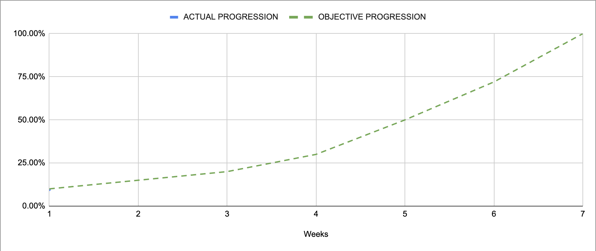

Project x86-retrogaming -- Team 3
---

<h2 align="center">Weekly Report 1</h2>

<h4 align="center">6/11/2023 to 10/11/2023</h4>

last modified : 10/11/2023

### Ongoing tasks

|           Task            |   Member Assigned   |   Progression   |   End Of Week objective   |   Start Date  |
|:-------------------------:|:-------------------:|:---------------:|:-------------------------:|:-------------:|
|Functionnal Specification  |Max & Mathis         |80%              |95%                        |6/11/2023      |
|Test Plan                  |Quentin & Robin      |40%              |35%                        |6/11/2023      |
|Research                   |Pierre & Evan        |/                |/                          |6/11/2023      |

### Finished tasks

|           Task            |   Member Assigned     |  Start Date   |   End Date  |
|:-------------------------:|:---------------------:|:-------------:|:-----------:|
|Gantt Diagram Simplified   |Arthur                 |6/11/2023      |9/11/2023    |
|Project Charter            |Arthur                 |8/11/2023      |10/11/2023   |
|Defining KPIs              |Team                   |9/11/2023      |10/11/2023   |

### Week Feedback

The overall feeling of the team is that we struggled a bit to get started but we are now on the right path. Everyone has a pretty good feeling about the theme of the project and our current progression. We tackled task assignments and did a detailed analysis of the requirements along with our own objectives for this project.

Even if we are a bit late on the schedule compared to what our objective was for this week, the team and I think that we should be able to catch up to it and get back on track as soon as next week.

### Progression Overview

This progression is calculated using done and remaining KPIs. The coefficient of each KPI was discussed and set by the team after deliberation.

