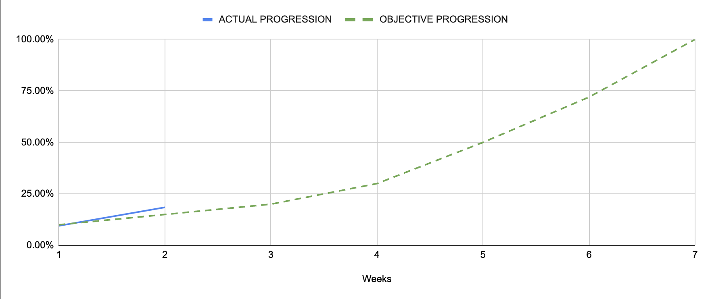

Project x86-retrogaming -- Team 3
---

<h2 align="center">Weekly Report 2</h2>

<h4 align="center">13/11/2023 to 17/11/2023</h4>

last modified : 17/11/2023

### Ongoing tasks

|           Task            |   Member Assigned   |   Progression   |   End Of Week objective   |   Start Date  |
|:-------------------------:|:-------------------:|:---------------:|:-------------------------:|:-------------:|
|Test Plan                  |Quentin & Robin      |40%              |75%                        |6/11/2023      |
|Test cases creation        |Quentin & Robin      |50%              |75%                        |13/11/2023     |
|Technical Specifications   |Mathis               |0%               |/                          |13/11/2023     |
|Ghost Sprite               |Pierre               |75%              |/                          |13/11/2023     |
|Pac-Man Sprite             |Max                  |50%              |/                          |17/11/2023     |
|Fruits Sprites             |Quentin              |20%              |/                          |17/11/2023     |
|Level Sprites              |Evan                 |5%               |/                          |13/11/2023     |

### Finished tasks

|           Task            |   Member Assigned     |  Start Date   |   End Date  |
|:-------------------------:|:---------------------:|:-------------:|:-----------:|
|Gantt Diagram Simplified   |Arthur                 |6/11/2023      |9/11/2023    |
|Project Charter            |Arthur                 |8/11/2023      |10/11/2023   |
|Defining KPIs              |Team                   |9/11/2023      |10/11/2023   |
|Functional Specifications  |Max                    |6/11/2023      |13/11/2023   |
|Gantt Diagram              |Arthur                 |13/11/2023     |17/11/2023   |

### Week Feedback

This week, we all felt like we could have benefited from a little bit more project time, even though we did make good progress with the limited amount we had. We managed to catch up to our objectives and even get over it.

We are still facing some difficulties but our understanding of the theme and tools as greatly inproved during the last few days. Even if some of us were a bit sceptic about what would be coming next, we are now all quite confident and excited for the next steps.

### Progression Overview

This progression is calculated using done and remaining KPIs. The coefficient of each KPI was discussed and set by the team after deliberation.

