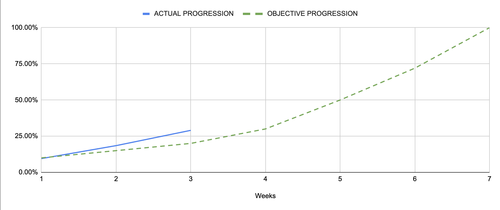

Project x86-retrogaming -- Team 3
---

<h2 align="center">Weekly Report 3</h2>

<h4 align="center">20/11/2023 to 24/11/2023</h4>

last modified : 27/11/2023

### Ongoing tasks

|           Task            |   Member Assigned   |   Progression   |   End Of Week objective   |   Start Date  |
|:-------------------------:|:-------------------:|:---------------:|:-------------------------:|:-------------:|
|Test Plan                  |Quentin & Robin      |75%              |75%                        |6/11/2023      |
|Test cases creation        |Quentin & Robin      |75%              |75%                        |13/11/2023     |
|Technical Specifications   |Mathis               |70%              |70%                        |13/11/2023     |
|Ghost Sprite               |Pierre               |90%              |/                          |13/11/2023     |
|Pac-Man Sprite             |Max                  |90%              |/                          |17/11/2023     |
|Fruits Sprites             |Quentin              |90%              |/                          |17/11/2023     |
|Level Sprites              |Evan                 |50%              |/                          |13/11/2023     |
|Basic Movement             |Max & Robin          |10%              |/                          |23/11/2023     |

### Finished tasks

|           Task            |   Member Assigned     |  Start Date   |   End Date  |
|:-------------------------:|:---------------------:|:-------------:|:-----------:|
|Gantt Diagram Simplified   |Arthur                 |6/11/2023      |9/11/2023    |
|Project Charter            |Arthur                 |8/11/2023      |10/11/2023   |
|Defining KPIs              |Team                   |9/11/2023      |10/11/2023   |
|Functional Specifications  |Max                    |6/11/2023      |13/11/2023   |
|Gantt Diagram              |Arthur                 |13/11/2023     |17/11/2023   |

### Week Feedback

The team's opinion is quite uniform, we all think we are making good progress. We are all keeping a good working rythm and I everyone is satisfied with our current progression.

### Progression Overview

This progression is calculated using done and remaining KPIs. The coefficient of each KPI was discussed and set by the team after deliberation.

