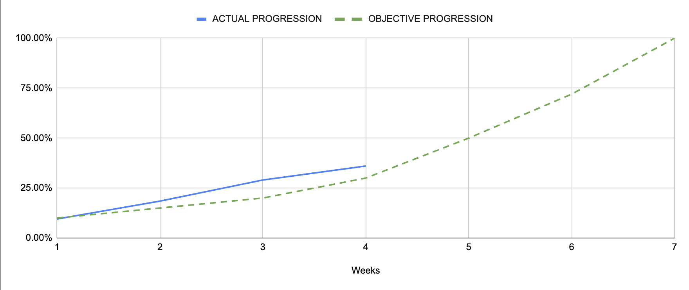

Project x86-retrogaming -- Team 3
---

<h2 align="center">Weekly Report 4</h2>

<h4 align="center">27/11/2023 to 01/12/2023</h4>

last modified : 01/12/2023

### Ongoing tasks

|           Task            |   Member Assigned   |   Progression   |   End Of Week objective   |   Start Date  |
|:-------------------------:|:-------------------:|:---------------:|:-------------------------:|:-------------:|
|Test Plan                  |Quentin & Robin      |80%              |80%                        |6/11/2023      |
|Test cases creation        |Quentin & Robin      |75%              |80%                        |13/11/2023     |
|Technical Specifications   |Mathis               |95%              |100%                       |13/11/2023     |
|Fruits Sprites             |Quentin              |90%              |/                          |17/11/2023     |
|Research and Developement  |Evan & Max & Arthur  |/                |/                          |27/11/2023     |

### Finished tasks

|           Task            |   Member Assigned     |  Start Date   |   End Date  |
|:-------------------------:|:---------------------:|:-------------:|:-----------:|
|Gantt Diagram Simplified   |Arthur                 |6/11/2023      |9/11/2023    |
|Project Charter            |Arthur                 |8/11/2023      |10/11/2023   |
|Defining KPIs              |Team                   |9/11/2023      |10/11/2023   |
|Functional Specifications  |Max                    |6/11/2023      |13/11/2023   |
|Gantt Diagram              |Arthur                 |13/11/2023     |17/11/2023   |
|Ghost Sprite               |Pierre                 |13/11/2023     |01/12/2023   |
|Pac-Man Sprite             |Max                    |17/11/2023     |01/12/2023   |
|Level Sprites              |Evan                   |13/11/2023     |01/12/2023   |
|Basic Movement             |Max & Robin            |23/11/2023     |01/12/2023   |

### Week Feedback

The team's feeling is geting a bit down as we don't think we are making as much progress as we were during the last weeks. The facts the we didn't had much project time and the some members were absent isn't helping.

### Progression Overview

This progression is calculated using done and remaining KPIs. The coefficient of each KPI was discussed and set by the team after deliberation.

