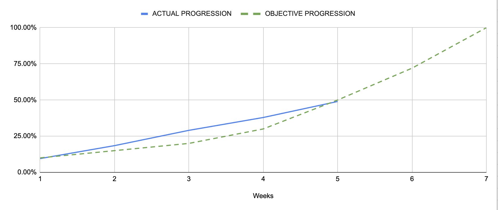

Project x86-retrogaming -- Team 3
---

<h2 align="center">Weekly Report 5</h2>

<h4 align="center">04/12/2023 to 08/12/2023</h4>

last modified : 08/12/2023

### Ongoing tasks

|           Task            |   Member Assigned   |   Progression   |   End Of Week objective   |   Start Date  |
|:-------------------------:|:-------------------:|:---------------:|:-------------------------:|:-------------:|
|Test cases creation        |Quentin & Robin      |85%              |100%                       |13/11/2023     |
|Video Memory Buffer        |Mathis               |60%              |50%                        |04/12/2023     |
|Bartop Arcade              |Arthur               |5%               |20%                        |04/12/2023     |

### Finished tasks

|           Task            |   Member Assigned     |  Start Date   |   End Date  |
|:-------------------------:|:---------------------:|:-------------:|:-----------:|
|Gantt Diagram Simplified   |Arthur                 |06/11/2023     |09/11/2023   |
|Project Charter            |Arthur                 |08/11/2023     |10/11/2023   |
|Defining KPIs              |Team                   |09/11/2023     |10/11/2023   |
|Functional Specifications  |Max                    |06/11/2023     |13/11/2023   |
|Gantt Diagram              |Arthur                 |13/11/2023     |17/11/2023   |
|Ghost Sprite               |Pierre                 |13/11/2023     |01/12/2023   |
|Pac-Man Sprite             |Max                    |17/11/2023     |01/12/2023   |
|Level Sprites              |Evan                   |13/11/2023     |01/12/2023   |
|Basic Movement             |Max & Robin            |23/11/2023     |01/12/2023   |
|Technical Specifications   |Mathis                 |13/11/2023     |04/12/2023   |
|Fruits Sprites             |Quentin                |17/11/2023     |04/12/2023   |
|Test Plan                  |Quentin & Robin        |06/11/2023     |08/12/2023   |
|Merge current Features     |Max                    |04/12/2023     |07/12/2023   |
|Tilemap & collisions       |Evan                   |04/12/2023     |08/12/2023   |
|Resize sprites             |Pierre                 |04/12/2023     |08/12/2023   |

### Week Feedback

This week, we've made many changes and did a complete review of the repository on git, allowing us to do feature branches. We also changed a bit our KPIs and objectives and realigned them to fit our current progression and deadlines.

Overall we are just behind schedule but we are all confident about the project and we should be able to get back on track.

Considering the team's feeling, we feel like we are making much more progress than last week where we were our progress stagnated for a bit.

### Progression Overview

This progression is calculated using done and remaining KPIs. The coefficient of each KPI was discussed and set by the team after deliberation.

