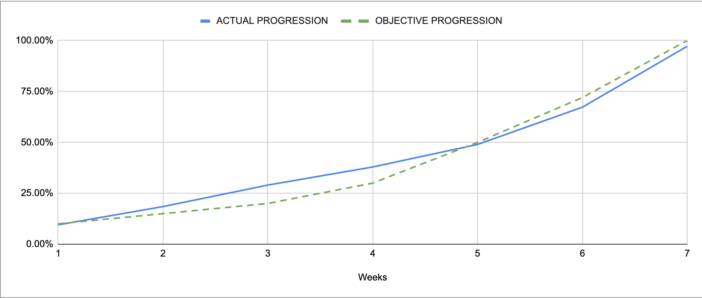

Project x86-retrogaming -- Team 3
---

<h2 align="center">Weekly Report 6</h2>

<h4 align="center">11/12/2023 to 15/12/2023</h4>

last modified : 14/12/2023

### Ongoing tasks

|           Task            |   Member Assigned   |   Progression   |   End Of Week objective   |   Start Date  |
|:-------------------------:|:-------------------:|:---------------:|:-------------------------:|:-------------:|

### Finished tasks

|           Task            |   Member Assigned     |  Start Date   |   End Date  |
|:-------------------------:|:---------------------:|:-------------:|:-----------:|
|Gantt Diagram Simplified   |Arthur                 |06/11/2023     |09/11/2023   |
|Project Charter            |Arthur                 |08/11/2023     |10/11/2023   |
|Defining KPIs              |Team                   |09/11/2023     |10/11/2023   |
|Functional Specifications  |Max                    |06/11/2023     |13/11/2023   |
|Gantt Diagram              |Arthur                 |13/11/2023     |17/11/2023   |
|Ghost Sprite               |Pierre                 |13/11/2023     |01/12/2023   |
|Pac-Man Sprite             |Max                    |17/11/2023     |01/12/2023   |
|Level Sprites              |Evan                   |13/11/2023     |01/12/2023   |
|Basic Movement             |Max & Robin            |23/11/2023     |01/12/2023   |
|Technical Specifications   |Mathis                 |13/11/2023     |04/12/2023   |
|Fruits Sprites             |Quentin                |17/11/2023     |04/12/2023   |
|Test Plan                  |Quentin & Robin        |06/11/2023     |08/12/2023   |
|Merge current Features     |Max                    |04/12/2023     |07/12/2023   |
|Tilemap & collisions       |Evan                   |04/12/2023     |08/12/2023   |
|Resize sprites             |Pierre                 |04/12/2023     |08/12/2023   |
|Change Ghosts Sprites      |Pierre                 |14/12/2023     |15/12/2023   |
|Test cases creation        |Quentin & Robin        |13/11/2023     |15/12/2023   |
|Score (logic)              |Mathis                 |11/12/2023     |19/12/2023   |
|Bartop Arcade              |Arthur                 |04/12/2023     |21/12/2023   |
|Ghosts common behaviour    |Robin                  |14/12/2023     |20/12/2023   |
|Score (UI)                 |Evan                   |14/12/2023     |19/12/2023   |
|Movement advanced          |Max                    |14/12/2023     |18/12/2023   |
|Presentation               |Pierre                 |15/12/2023     |21/12/2023   |

### Week Feedback

For the final week, we are all proud of the work we managed to acheived in what little time we had left.

### Progression Overview

This progression is calculated using done and remaining KPIs. The coefficient of each KPI was discussed and set by the team after deliberation.

